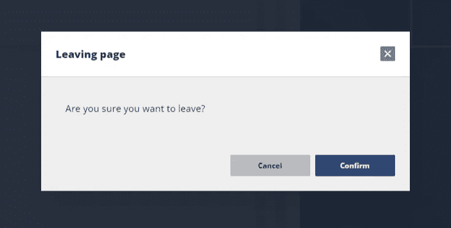
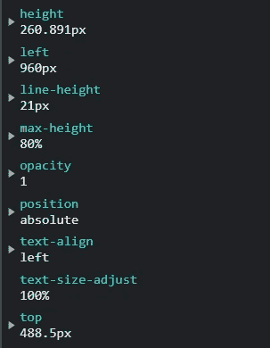

# 如何修复具有“位置:已修复”的模糊元素

> 原文：<https://javascript.plainenglish.io/how-to-fix-blurry-elements-that-have-position-fixed-934c707b4e19?source=collection_archive---------17----------------------->

## 位置固定时，修复模糊元素的解决方案。

Photo by [Tim Rüßmann](https://unsplash.com/@timaesthetic?utm_source=medium&utm_medium=referral) on [Unsplash](https://unsplash.com?utm_source=medium&utm_medium=referral)

我最近遇到了一个有趣的问题，要找到解决方案需要做大量的实验。我有一个模态，它在页面上的位置是“固定的”但是，无论何时打开，莫代尔看起来都很模糊。下面是我的意思的一个例子。

An example of the modal appearing blurry

模态本身有一个绝对的位置，在一个有固定位置的黑暗背景上居中。下面是 SCSS:

The SCSS for the modal and its backdrop. Some irrelevant styles removed for succinctness.

我在奇数比例的 SVG 上遇到过类似的模糊问题，所以我认为要么是模型的宽度/高度，要么是它的位置。我做了研究和实验来确定。

这里应该注意的是，如果给模型一个**相对**位置，给模型面纱一个填充，这整个问题都可以避免。然而，这不会使模态完全集中在屏幕上，所以我想尽可能避免这种解决方案。然而，测试证实了我的怀疑，模糊性与模态的位置有关。

如果您现在还没有猜到，问题是模态以一个奇数的非整数值为中心。检查元素表明这是真的:

The computed styles for the modal

你可以在这些计算值中看到`height`和`top`都是非整数值。因此，元素试图在像素之间捕捉，反走样开始，元素变得模糊。理论上，修正这些值应该可以解决抗锯齿问题。

经过实验，我确定固定高度足以解决反走样问题，并且`top`值似乎对这个问题没有影响。

# 解决办法

因此，我的解决方案是，一旦打开模式，动态地将高度调整到最近的(偶数)像素。下面是执行此操作的代码:

在上面的函数中，我们首先获取元素本身，使用`getBoundingClientRect()`函数获得计算的高度，然后将该值向上舍入到最接近的偶数。元件的`height`和`maxHeight`然后被设置为这个新的校正值。这个逻辑发生在一个超时内，以便给模态时间来完成它的打开动画。实施此解决方案后，模态现在看起来清晰，并保持在屏幕的中心:

The same modal now appearing crisp

我希望有一些正在为同样奇怪的问题奋斗的人会发现这篇文章是有帮助的。下面是一个堆栈溢出问题，它帮助我确定了解决方案:

 [## 在固定位置元素上缩放 div 时失去文本清晰度(模糊)(在移动 safari /…

### 当放大时，固定位置的元素在相对位置的元素后面倾斜，我也有类似的问题…

stackoverflow.com](https://stackoverflow.com/questions/8298696/losing-text-sharpness-blur-when-scaling-div-over-a-fixed-position-element-on) 

现在你知道了。感谢您的阅读。

*更多内容请看*[***plain English . io***](http://plainenglish.io/)*。报名参加我们的* [***免费周报***](http://newsletter.plainenglish.io/) *。在我们的* [***社区***](https://discord.gg/GtDtUAvyhW) *获得独家获得写作机会和建议。*