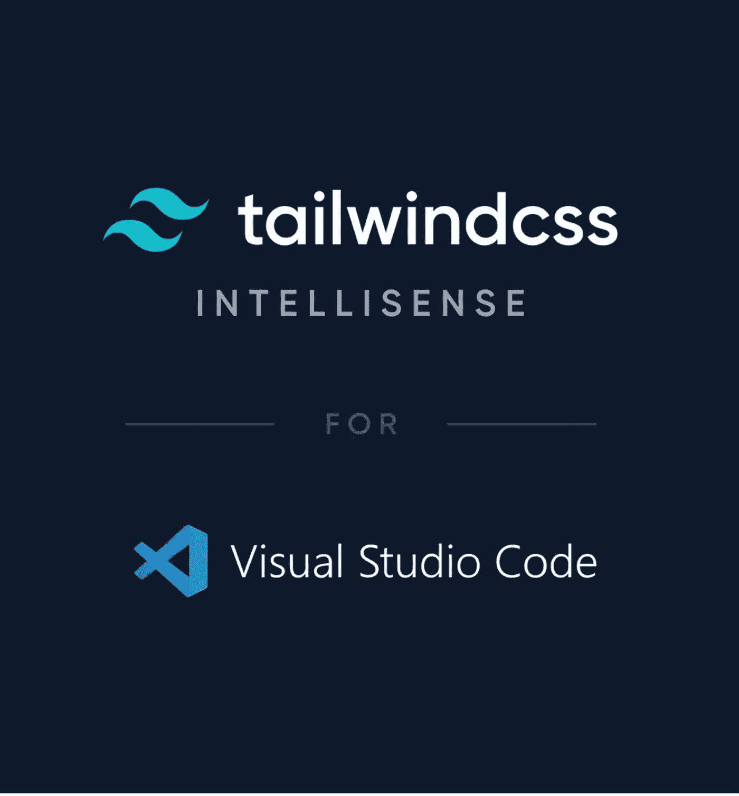
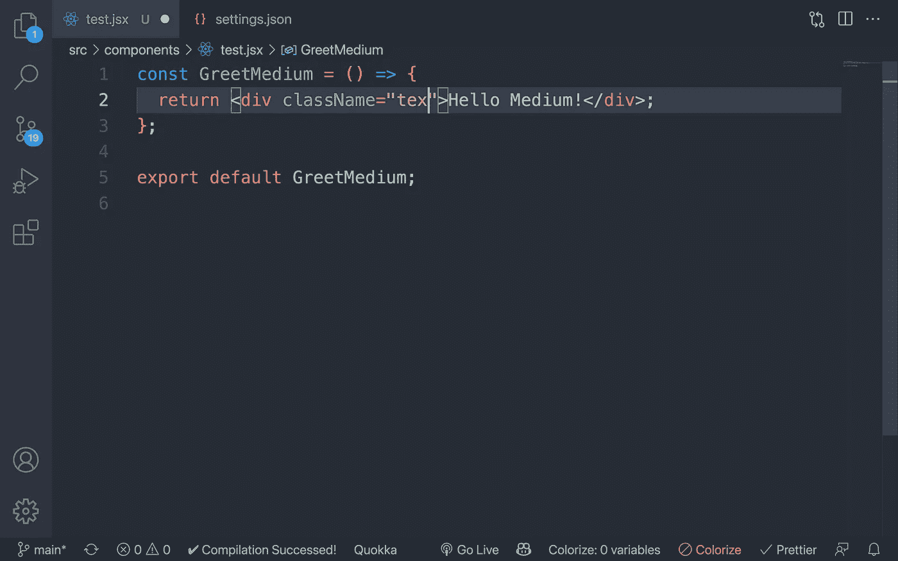
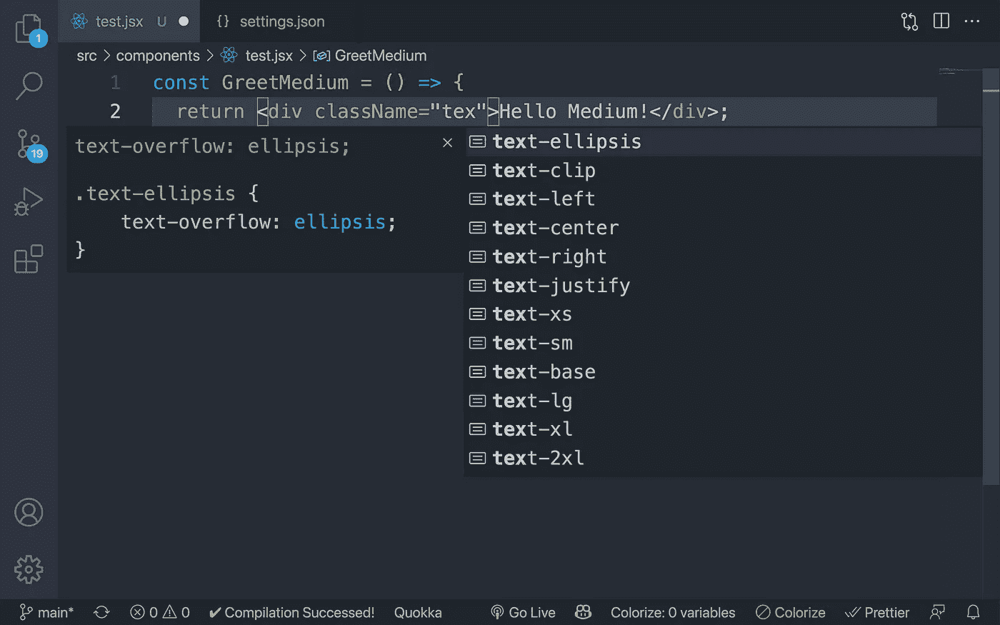

# 如何在 Visual Studio 代码中修复 Tailwind CSS 智能感知

> 原文：<https://javascript.plainenglish.io/how-to-fix-tailwind-css-intellisense-in-visual-studio-code-3dede794df21?source=collection_archive---------2----------------------->

## TailwindCSS 智能感知在 VS 代码中不起作用？按照文章中的步骤来修复它。



[TailwindCSS IntelliSense](https://marketplace.visualstudio.com/items?itemName=bradlc.vscode-tailwindcss)

# 问题是

我最近开始从传统的 CSS/SCSS 过渡到更现代的选项，比如 [TailwindCSS](https://tailwindcss.com) 。在他们的在线游乐场玩过之后，我决定在本地尝试一下，并建立一个小的[项目](https://github.com/kens-visuals/interactive-rating-component)。

然而，我遇到了这个小问题，但真的令人沮丧。我知道 TailwindCSS 在 [VSCode marketplace](https://marketplace.visualstudio.com/items?itemName=bradlc.vscode-tailwindcss) 中有一些智能感知，安装后我很快意识到它根本不起作用。所以我决定重新加载 VSCode，但还是没有结果。



Before adding the snippets

# 解决方案

在挖掘文档之后，我终于找到了这段代码:

```
"editor.quickSuggestions": {
   "strings": true
},
"css.validate": false,
"editor.inlineSuggest.enabled": true
```

将它放在我的 VSCode 的`settings.json`文件中，它就像预期的那样工作。要打开设置编辑器，请使用下面的 VS 代码菜单命令:

*   在 Windows/Linux 上—文件>首选项>设置
*   在 macOS 上—代码>首选项>设置

您也可以从命令调板(⇧⌘P)中使用“首选项:打开设置”或使用键盘快捷键(⌘,).)打开设置编辑器您可以将代码片段放在您的`settings.json`中的任何地方，它应该可以正常工作。如果它不只是给它 1-2 分钟或重新加载 VSCode 窗口。



After adding the snippets

# 奖金

如果你想在你的 TailwindCSS 中使用 [**Emmet**](https://emmet.io) ，确保将这一行`"tailwindCSS.emmetCompletions": true`添加到同一个`settings.json`文件中。

# 简单地说

您的最终代码片段应该如下所示:

```
"tailwindCSS.emmetCompletions": true,
"editor.inlineSuggest.enabled": true,
"editor.quickSuggestions": {
   "strings": true
},
"css.validate": false,
```

耶！现在，您可以在 TailwindCSS 中编写代码，而无需记住所有的类。🎉

因为我花了很长时间才找到解决方案，所以我认为与正在过渡到 TailwindCSS 的开发人员分享它可能是个好主意。我希望这篇简单的文章能帮助你解决这个问题，并把重点放在编码上。

如果你想知道我用的是什么主题，那就是 [One Monokai](https://marketplace.visualstudio.com/items?itemName=azemoh.one-monokai) 。🙃

[](https://medium.com/@kens_visuals/membership) [## 通过我的推荐链接加入 Medium-Ken Nersisyan

### 用媒介释放你的潜能。立即加入，阅读我和其他顶尖作家的文章。读书，学习，变得更好…

medium.com](https://medium.com/@kens_visuals/membership) 

# 进一步阅读

[](/how-to-master-web-development-in-30-days-8f6d29237361) [## 如何在 30 天内掌握 Web 开发

### 什么是前端导师，它如何帮助我练习技能并走出教程地狱？

javascript.plainenglish.io](/how-to-master-web-development-in-30-days-8f6d29237361) [](https://bootcamp.uxdesign.cc/12-unheard-background-pattern-resources-1f1041718ac6) [## 12 个前所未闻的背景模式资源

### 为你的下一个项目获得一些独特的背景图案。

bootcamp.uxdesign.cc](https://bootcamp.uxdesign.cc/12-unheard-background-pattern-resources-1f1041718ac6) [](/object-freeze-vs-object-seal-in-plain-english-813f27a71eb8) [## Object.freeze()与 Object.seal()的简单对比

### 这两种方法的主要区别，简单地说就是并列。

javascript.plainenglish.io](/object-freeze-vs-object-seal-in-plain-english-813f27a71eb8) 

# 让我们连接

[](https://twitter.com/kens_visuals) [## 在推特上关注我﹫kens_visuals

### 👨🏻‍💻👾

twitter.com](https://twitter.com/kens_visuals) [](https://github.com/kens-visuals) [## kens-视觉效果-概述

### 前端开发者| JS 爱好者|科技写手。kens-visual 有 63 个可用的存储库。遵循他们的准则…

github.com](https://github.com/kens-visuals) 

*更多内容请看*[***plain English . io***](https://plainenglish.io/)*。报名参加我们的* [***免费周报***](http://newsletter.plainenglish.io/) *。关注我们关于*[***Twitter***](https://twitter.com/inPlainEngHQ)*和**[***LinkedIn***](https://www.linkedin.com/company/inplainenglish/)*。加入我们的* [***社区***](https://discord.gg/GtDtUAvyhW) *。**