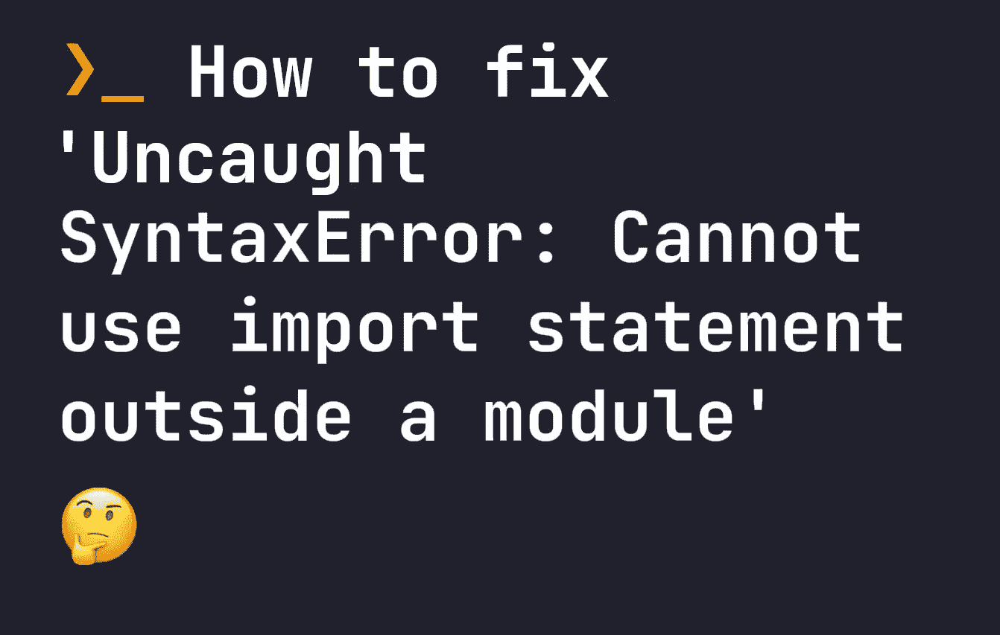

# 如何修复“未捕获的语法错误:无法在模块外使用导入语句”

> 原文：<https://javascript.plainenglish.io/how-to-fix-uncaught-syntaxerror-cannot-use-import-statement-outside-a-module-b771b00fd84?source=collection_archive---------14----------------------->



在这个快速指南中，我们将看看如何解决一个非常常见的错误，“未捕获的语法错误:不能在模块外使用导入语句”。当我们试图在一个没有为模块设置的项目中使用`import`时，就会出现这个错误——所以让我们看看如何解决这个问题。

# 在模块错误之外解析导入语句

之所以会出现这个错误，是因为我们必须明确地告诉 JavaScript 这个文件是一个`module`，以便使用`import`语句。例如，如果您正在使用下面的行，并且没有告诉 JavaScript 该文件是一个模块，它将抛出一个错误:

```
import fs from 'fs'
```

根据错误的来源，有几种不同的方法来解决它。

# 解决 Node.js 中的导入模块错误

如果您使用的是 Node.js，可以通过两种方式解决此错误。首先是更新 package.json，告诉 Node.js 整个项目是一个模块。打开 package.json，在顶层添加`"type": "module"`。比如我的`package.json`会是这样的:

```
{
    // ... other package.json stuff
    "type": "module"
    // ... other package.json stuff
}
```

这将立即解决问题。然而，在一些边缘情况下，您可能会发现这方面有问题，并且代码的其他部分可能会开始抛出错误。如果您只想让项目中的一个文件支持`import`，那么将文件扩展名更改为`.mjs`。例如，如果您的`import`在`index.js`中，则将`index.js`重命名为`index.mjs`。现在你的问题将得到解决。

# 解决脚本标记中的导入模块错误

第二个可能发生此错误的地方是脚本标记，如下所示:

```
<script src="mymodule.js"></script>
```

在这种情况下，如果`mymodule.js`包含一个`import`语句，它就不起作用。要解决这个问题，请将`type="module"`添加到您的脚本标签中:

```
<script type="module" src="mymodule.js"></script>
```

现在你再也不会与`import`有问题了。

*更多内容请看*[***plain English . io***](https://plainenglish.io/)*。报名参加我们的* [***免费周报***](http://newsletter.plainenglish.io/) *。关注我们关于* [***推特***](https://twitter.com/inPlainEngHQ)[***领英***](https://www.linkedin.com/company/inplainenglish/)**和* [***不和***](https://discord.gg/GtDtUAvyhW) ***。****