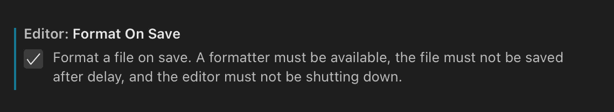

# 如何在 VS 代码中格式化代码

> 原文：<https://javascript.plainenglish.io/how-to-format-in-vs-code-81a60fa22926?source=collection_archive---------5----------------------->

## VS 代码

## 您将了解如何在 VS 代码中格式化代码

Photo by [Mohammad Rahmani](https://unsplash.com/@afgprogrammer?utm_source=medium&utm_medium=referral) on [Unsplash](https://unsplash.com?utm_source=medium&utm_medium=referral)

在您的 IDE 中格式化代码是一项非常重要的任务，您必须完成这项任务。为了清晰易读，它对于跟踪特定信息的位置非常有用。

当你保存一个文件时，一些 IDE 会自动格式化他们的文件，但是一些不会，那么你可以使用你的 IDE 所拥有的快捷键。

## 如何格式化代码？

您可以通过使用 VS 代码的可用快捷键来格式化文件。有两个可以在 Windows 和 Mac 的桌面应用程序中都使用:`format document`和`format selection`。

格式化文档是一个快捷键，它将格式化你所在的整个文档/文件，用一种编程语言来编写你的文件。在 Windows 上的快捷方式是`Ctrl+Shift+I`,在 Mac 上是`Shift+⌥+F`。

格式选择是一个快捷键，它将格式化您用光标选择的文件的一部分。在 Windows 上的快捷键是`Ctrl+K Ctrl+F`，在 Mac 上的快捷键是`⌘K ⌘F`。

Photo by [Mohammad Rahmani](https://unsplash.com/@afgprogrammer?utm_source=medium&utm_medium=referral) on [Unsplash](https://unsplash.com?utm_source=medium&utm_medium=referral)

## 如何设置“保存时的格式”？

设置每次保存代码时格式化代码，这是 VS 代码的一个非常有用的特性，它允许你不用按任何快捷键就可以保存文件。

你可以在你的 VS 代码设置中找到这个特性，你可以通过在 Windows 上按`Ctrl+,`或者在 Mac 上按`⌘,`来打开它。在页面顶部的设置中有一个搜索输入，您可以在其中搜索术语`format on save`，第一个显示的设置就是所需的设置。

一旦我们选中了设置框，VS 代码将在保存时自动格式化文件。

VS Code — Format on Save setting

## 我可以格式化带有扩展名的文件吗？

是的，您的 VS 代码完全支持使用扩展名来格式化文件，而不是 IDE 使用的默认系统。在最佳格式扩展的列表中，肯定有更漂亮的。

Prettier 是 VS 代码市场上的免费扩展，支持大多数前端语言(JavaScript/TypeScript、Angular、Vue、CSS/SCSS、HTML、JSON、GraphQL、Markdown、YAML)。这个扩展还支持保存时格式化，默认设置为 true。Prettier 也有快捷键——格式化整个文档或其中的一部分，在 Windows 和 Mac 上是相同的快捷键`Ctrl+Shift+P`和`⌘+Shift+P`。

你可以在 VS 代码市场[这里](https://marketplace.visualstudio.com/items?itemName=esbenp.prettier-vscode)下载 beautiful，或者在官方网站[这里](https://prettier.io/)阅读更多关于这个扩展的内容。

Prettier logo

## 结论

正如我前面说过的，格式化代码对于保持代码的清晰和可读性非常重要。我希望这篇文章能帮助您理解为什么保留它们很重要，什么是快捷方式&如何使用它们，以及创建另一个格式化代码的选项——使用扩展。

*更多内容看* [***说白了就是***](https://plainenglish.io/) *。报名参加我们的* [***免费周报***](http://newsletter.plainenglish.io/) *。关注我们关于*[***Twitter***](https://twitter.com/inPlainEngHQ)*和*[***LinkedIn***](https://www.linkedin.com/company/inplainenglish/)*。加入我们的* [***社区***](https://discord.gg/GtDtUAvyhW) *。*