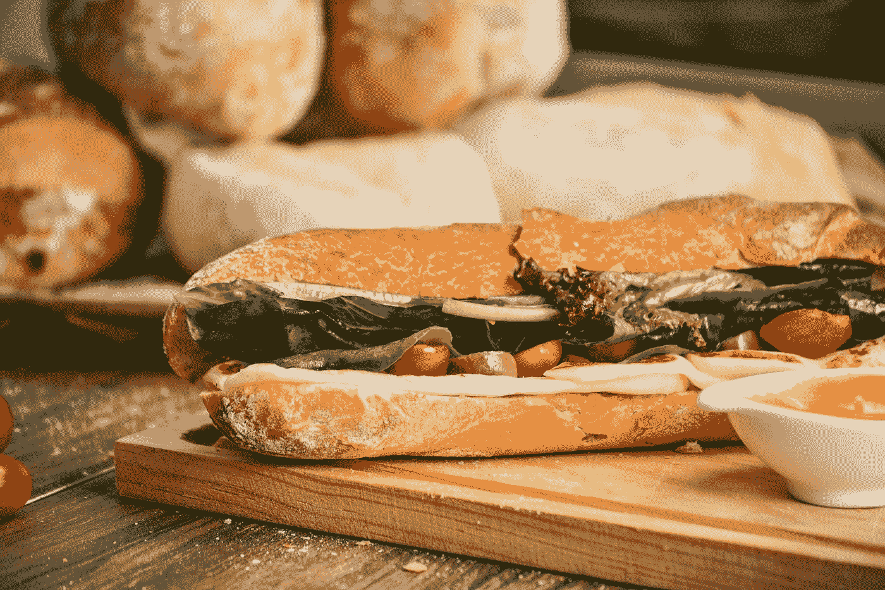

# 如何获取 JavaScript 对象属性的子集？

> 原文：<https://javascript.plainenglish.io/how-to-get-a-subset-of-a-javascript-objects-properties-93242a921a74?source=collection_archive---------14----------------------->



Photo by [Raphael Nogueira](https://unsplash.com/@phaelnogueira?utm_source=medium&utm_medium=referral) on [Unsplash](https://unsplash.com?utm_source=medium&utm_medium=referral)

有时，我们可能想从一个对象中获取 JavaScript 属性的子集。

在本文中，我们将研究如何将 JavaScript 对象属性的子集放到我们可以使用它们的地方。

# 对象析构

获取 JavaScript 对象属性子集的最简单快捷的方法是使用对象析构语法。

例如，我们可以写:

```
const object = {
  a: 1,
  b: 2,
  c: 3
};
const {
  a,
  b
} = object
const picked = {
  a,
  b
}
console.log(picked)
```

我们有一个具有属性`a`、`b`和`c`的`object`。

要获得属性，我们可以析构它们，将它们赋给自己的变量。

我们是这样做的:

```
const {
  a,
  b
} = object
```

现在`a`被分配到`object.a`。

并且`b`被分配给`object.b`。

然后我们可以把它们放进另一个物体里:

```
const picked = {
  a,
  b
}
```

所以`picked`是:

```
{a: 1, b: 2}
```

我们也可以在函数参数中进行析构。

例如，我们可以写:

```
const object = {
  a: 1,
  b: 2,
  c: 3
};
const pick = ({
  a,
  b
}) => ({
  a,
  b
})
const picked = pick(object);
console.log(picked)
```

创建一个`pick`函数，该函数返回一个具有从 object 参数析构的`a`和`b`属性的对象。

所以当我们用`object`调用`pick`时，我们得到`picked`和之前一样。

# 洛达什

我们还可以使用 Lodash 的`pick`方法返回一个具有给定属性的对象。

例如，我们可以写:

```
const object = {
  a: 1,
  b: 2,
  c: 3
};
const picked = _.pick(object, ['a', 'b']);
console.log(picked)
```

我们用要从中提取属性的对象调用`pick`。

数组中有我们想要的属性名字符串。

因此`picked`与其他示例相同。

# array . protocol . reduce

我们可以使用 JavaScript array `reduce` 方法从一个对象获取属性，并将它们放入另一个对象。

例如，我们可以写:

```
const object = {
  a: 1,
  b: 2,
  c: 3
};
const picked = ['a', 'b'].reduce((resultObj, key) => ({
  ...resultObj,
  [key]: object[key]
}), {});
console.log(picked)
```

我们在`[‘a’, ‘b’]`数组上调用`reduce`，这是我们想要从`object`获取的属性的属性名称字符串。

`resultObj`具有已选取属性的对象。

拥有我们想要从数组中获取的密钥。

我们返回一个带有`resultObj` spread 和`key`的对象，其相应的值被附加到它的末尾。

`reduce`的第二个参数是一个空对象，所以我们可以将属性扩展到其中。

所以`picked`的结果和之前一样。

# 结论

我们可以用析构赋值、数组`reduce`或 Lodash `pick`方法获得 JavaScript 属性的子集。

*更多内容看* [***说白了。报名参加我们的***](http://plainenglish.io/) **[***免费周报***](http://newsletter.plainenglish.io/) *。在我们的* [***社区获得独家访问写作机会和建议***](https://discord.gg/GtDtUAvyhW) *。***