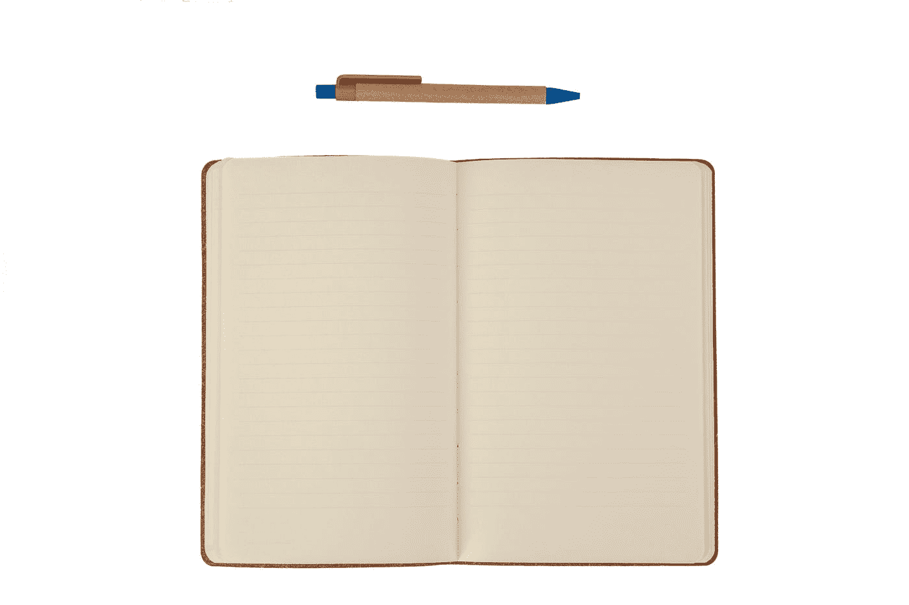

# 如何用 JavaScript 获取和设置当前网页滚动位置？

> 原文：<https://javascript.plainenglish.io/how-to-get-and-set-the-current-web-page-scroll-position-with-javascript-f4de502eb500?source=collection_archive---------6----------------------->



Photo by [engin akyurt](https://unsplash.com/@enginakyurt?utm_source=medium&utm_medium=referral) on [Unsplash](https://unsplash.com?utm_source=medium&utm_medium=referral)

有时候，我们想用 JavaScript 获取并设置当前网页的滚动位置。

在本文中，我们将看看如何用 JavaScript 获取和设置当前网页的滚动位置。

# 获取当前网页的滚动位置

我们可以使用`document.documentElement.scrollTop`或 `document.body.scrollTop`来获取页面的滚动位置。

例如，我们可以写:

```
const div = document.querySelector('div')
for (let i = 0; i < 100; i++) {
  const p = document.createElement('p')
  p.textContent = i
  document.body.appendChild(p)
}window.addEventListener('scroll', () => {
  console.log(document.documentElement.scrollTop, document.body.scrollTop)
});
```

向一个 div 添加元素并监听窗口上的`scroll`事件。

在事件监听器中，我们记录了应该记录页面滚动位置的`document.documentElement.scrollTop`属性。

当我们向上或向下滚动时，`document.documentElement.scrollTop`的值应该发生变化。

# 设置当前网页的滚动位置

我们还可以将`document.documentElement.scrollTop`属性设置为我们想要的滚动位置。

位置应该是以像素为单位的数字。

例如，我们可以写:

```
const div = document.querySelector('div')
for (let i = 0; i < 100; i++) {
  const p = document.createElement('p')
  p.textContent = i
  document.body.appendChild(p)
}document.documentElement.scrollTop = document.body.scrollTop = 300;
```

将页面下方的`document.documentElement.scrollTop`和`document.body.scrollTop`属性设置为 300 像素。

现在我们应该看到页面向下滚动了 300 像素。

# 结论

我们可以用`document.documentElement.scrollTop`属性获取并设置页面的滚动位置。

*更多内容请看*[***plain English . io***](https://plainenglish.io/)*。报名参加我们的* [***免费周报***](http://newsletter.plainenglish.io/) *。关注我们关于*[***Twitter***](https://twitter.com/inPlainEngHQ)[***LinkedIn***](https://www.linkedin.com/company/inplainenglish/)*[***YouTube***](https://www.youtube.com/channel/UCtipWUghju290NWcn8jhyAw)***，以及****[***不和***](https://discord.gg/GtDtUAvyhW) *对成长黑客感兴趣？检查* [***电路***](https://circuit.ooo/) ***。*****