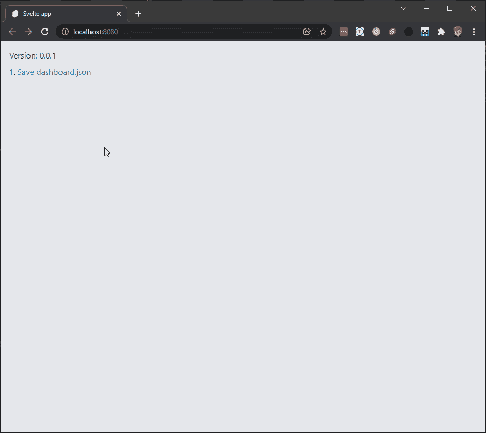
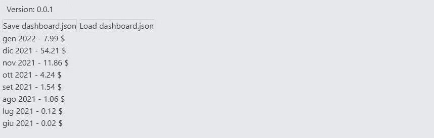
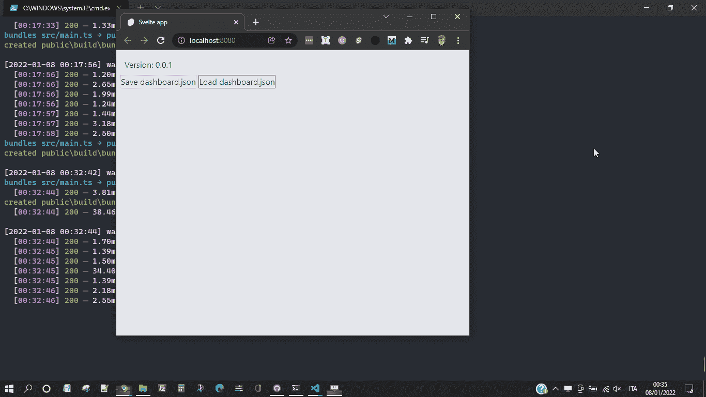

# 如何用 JavaScript 和 Svelte 获得中等统计

> 原文：<https://javascript.plainenglish.io/how-to-get-medium-stats-with-javascript-and-svelte-part-1-a1d08b96799e?source=collection_archive---------8----------------------->

## 第 1 部分:了解如何下载和分析媒体的统计数据。


Photo by [Justin Morgan](https://unsplash.com/@justin_morgan?utm_source=medium&utm_medium=referral) on [Unsplash](https://unsplash.com?utm_source=medium&utm_medium=referral)

众所周知，Medium 不提供深入的统计数据。这不是问题，但是我习惯于记录一些我写的和编程的数据。所以我在寻找一种简单的方法来保存基本信息。

有一些有趣的帖子。其中最有趣的是[如何用](https://python.plainenglish.io/how-to-get-medium-story-stats-with-3-lines-of-python-code-c28df3501392)[索尔·多比拉斯](https://solclover.com/)的 3 行 Python 代码获得中等故事统计。我从这里开始了解如何下载和分析媒体的统计数据。

# 合作伙伴仪表板

首先:要下载各种统计数据，你必须首先登录到媒体。之后就可以下载一些带有一些数据的 JSON 文件了。

索尔推荐[medium.com/me/stats?format=json&计数=100](https://medium.com/me/stats?format=json&count=100) 。在这个页面上，您可以下载一个 JSON 文件，其中包含最近 30 天的数据。但是我更喜欢稍微不同的方法。

强行推理，Medium 唯一真正客观的参数是和货币化有关的。观看、阅读、鼓掌等等也算。一个数字对我来说就足够了:每个故事赚了多少钱？

是的，我知道，这听起来像一个腐败的演讲。更重要的是，我的“收入”很少，确实很少。但是我想从这里开始。

为此，我需要一个包含收益数据的 JSON 文件。为了获得它，我使用了地址:[medium.com/me/partner/dashboard?format=json](https://medium.com/me/partner/dashboard?format=json)。

这个文件很有趣，它包含了一些有用的数据。首先，必须消除第一个字母:

这根弦是一个现在已经解决的老问题的遗留物。有一篇十几年前的文章解释得很好: [JSON 劫持](http://haacked.com/archive/2009/06/25/json-hijacking.aspx/)。

JSON 文件由几个部分组成:

当然，我什么都不在乎。让我感兴趣的是:

# 当月金额

`currentMonthAmount`包含当前月份的数据:

我不确定最后三项是什么意思，但第一项是确定参考期间的日期。

要将时间戳转换成可读性更好的格式，只需使用[date . prototype . toda testring()](https://developer.mozilla.org/en-US/docs/Web/JavaScript/Reference/Global_Objects/Date/toDateString):

`amount`表示当月的总“收入”。当然是美分，不是整美元。

# 完成的每月金额

`completedMonthlyAmounts`包含已完成月份的数据。这是一个数组，每个月都有一个对象:

除了前面的数据之外，还保存了一些附加信息:用户 ID 和数据合并的时间。不知道`state`是什么意思。

# 过帐金额

`postAmounts`是一个数组，包含每个已发布帖子的一些有趣数据:

我没有检查所有的项目。然而，我想强调一些数据:

*   `totalAmountPaidToDate`:是一个故事从发表那天起已经赚了多少钱
*   `totalAmountInCents`:是当月故事的收入
*   `post.id`:是在媒体中唯一标识一个故事的`id`。我可以使用类似于`https://medium.com/story/id`的地址访问这篇文章。例如，我最近的帖子可以通过地址[medium.com/story/9db50dff8f38](https://medium.com/story/9db50dff8f38)联系到
*   `post.homeCollectionId`是标识拥有故事的出版物的`id`。
*   `post.title`、`post.virtuals.wordCount`和`post.virtuals.readingTime`包含一些故事的标题、字数和阅读时间的估计

有了这些信息，我可以开始创作一些东西来下载、存储和分析我在媒体上的故事数据。

# 如何下载中等统计数据

所以，总之，我去[medium.com/me/partner/dashboard?format=json](https://medium.com/me/partner/dashboard?format=json)并保存页面。只需使用鼠标右键并选择`Save As...`。为了帮助我，并提醒我所有的步骤，我创建了一个小应用程序。我从一个已经配置好 [Svelte](https://svelte.dev/) 、 [Typescript](https://www.typescriptlang.org/) 和 TailwindCSS 的模板开始:[El 3um 4s/memento-Svelte-Typescript-tailwind](https://github.com/el3um4s/memento-svelte-typescript-tailwind):

```
npx degit el3um4s/memento-svelte-typescript-tailwind medium-stats
cd medium-stats
npm install
```

所以，第一步是记得下载最新的统计数据。我用 Svelte 在页面上添加了一个链接:



# 导入 JSON 文件

下载完`dashboard.json`文件后，我可以使用[文件系统访问 API](https://web.dev/file-system-access/) 将其导入我的应用程序。这个想法是上传带有统计数据的文件，只提取我感兴趣的那些。然后，在稍后的时间，可能在未来的帖子中，我将结合这些数据，给它我感兴趣的形状。

让我们从创建一个按钮开始:

我增加一个功能:

我使用`showOpenFilePicker()`打开一个系统窗口并选择要使用的文件。然后我用`getFile()`将文件载入页面。最后，我使用`text()`提取内容并保存在 string 类型的变量中。

此时，对于一个普通的 JSON 文件，使用 [JSON.parse()](https://developer.mozilla.org/en-US/docs/Web/JavaScript/Reference/Global_Objects/JSON/parse) 来获取一个对象就足够了。但在这种情况下，我必须删除字符])} `first. I create`原文`Stats() function:`

我给`loadDashboardJSON()`加上这个功能。

# 分析数据

现在我有了数据，我可以决定如何在屏幕上查看它们。作为第一个测试，为了检验我的想法，我决定限制自己做一些简单的事情。我想创建两个列表。第一笔是每个月的收入。第二个与每个职位的累进收入。

我从每月收益开始。为了得到它，我使用了属性`currentMonthAmount`和`completedMonthlyAmounts`。对于这两者，使用`periodStartedAt`和`amount`就足够了。我创建了一个函数来帮助我提取这些信息:

日期是一个很难处理的话题。为了获得可读的内容，我必须使用一些方法:

*   [getFullYear()](https://developer.mozilla.org/en-US/docs/Web/JavaScript/Reference/Global_Objects/Date/getFullYear)
*   [getMonth()](https://developer.mozilla.org/en-US/docs/Web/JavaScript/Reference/Global_Objects/Date/getMonth)
*   [toLocaleString()](https://reactgo.com/convert-month-number-to-name-js/)

我创建了`getDate()`函数:

我在`getMonthStats()`中使用它:

现在，我可以使用以下命令提取当月和前几个月的数据:

我修改了按钮，并添加了一个列表来显示各种值:

所以在屏幕上，我可以看到这样的东西:



# 添加图表

下一步是弄清楚如何以图形方式显示这些值。有 3 个库需要考虑:

*   [千层饼](https://github.com/mhkeller/layercake)
*   [煎饼](https://github.com/Rich-Harris/pancake)
*   [ffood Chaarts](https://ffoodd.github.io/chaarts/index.html)

我感兴趣的很简单，所以我创建了一个基本组件来绘制直方图。

我从设置变量开始

*   `data`为要显示的数据
*   `labels`
*   `columns`为竖条显示的数量
*   `maxData`要正确缩放条形

我需要一种基于要显示的数据量来管理一些样式的方法:

我补充一下`html`部分:

为了使图形表示成比例，我使用了`height:{(d / maxData) * 100}%`。

至于 CSS 部分，我使用了一个[网格](https://css-tricks.com/snippets/css/complete-guide-grid/):

我创建了一个助手函数来提取我感兴趣的数据集:

为了动态管理图形表示，我使用了 [$](https://svelte.dev/docs#component-format-script-3-%24-marks-a-statement-as-reactive) :

最后，我将图形添加到主页:

这样我可以得到这样的东西:



好了，现在够了。还是有话要说:近期我会再写一篇关于这个话题的文章。

感谢阅读！敬请关注更多内容。

***不要错过我的下一篇文章—报名参加我的*** [***中邮箱列表***](https://medium.com/subscribe/@el3um4s)

[](https://el3um4s.medium.com/membership) [## 通过我的推荐链接加入 Medium—Samuele

### 阅读萨缪尔的每一个故事(以及媒体上成千上万的其他作家)。不是中等会员？在这里加入一块…

el3um4s.medium.com](https://el3um4s.medium.com/membership) 

*原载于 2022 年 1 月 8 日 https://blog.stranianelli.com**[*。*](https://blog.stranianelli.com/medium-stats-with-javascript-and-svelte-part-1/)*

*更多内容看* [*说白了. io*](http://plainenglish.io/) *。报名参加我们的* [*免费每周简讯*](http://newsletter.plainenglish.io/) *。在我们的* [*社区*](https://discord.gg/GtDtUAvyhW) *获得独家写作机会和建议。*