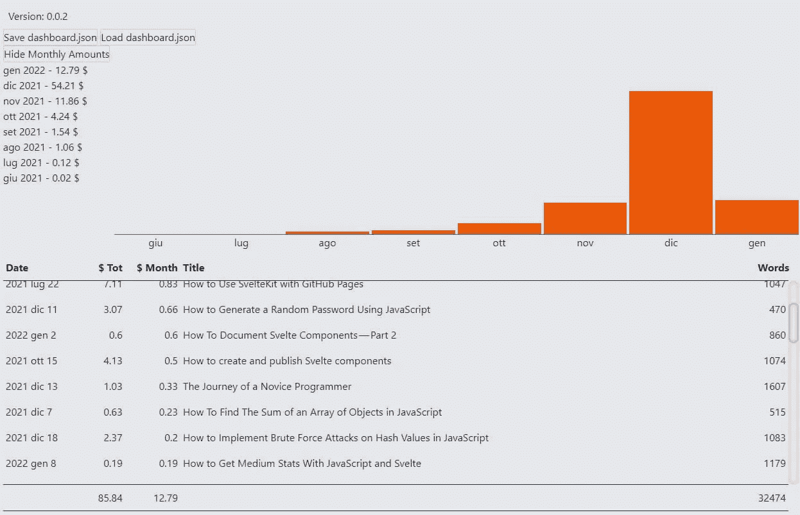
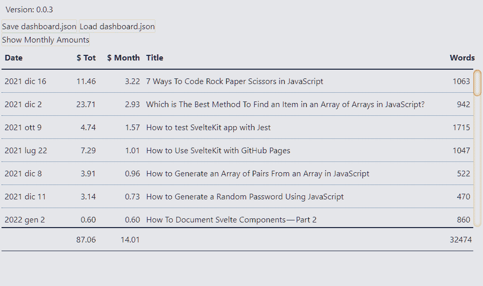
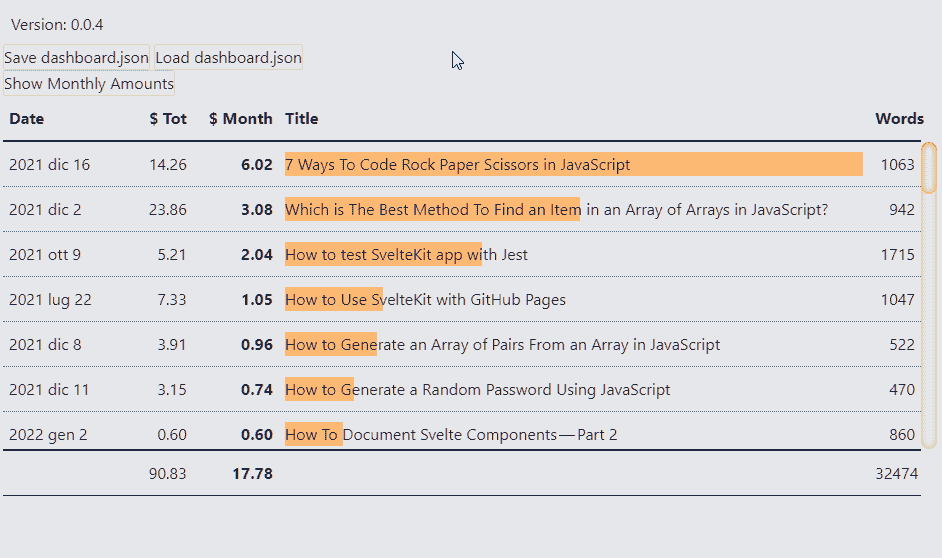
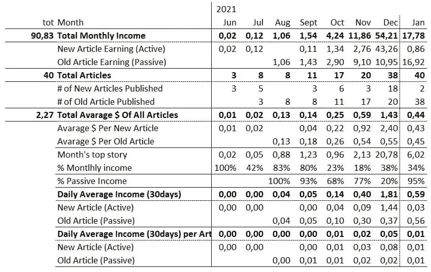
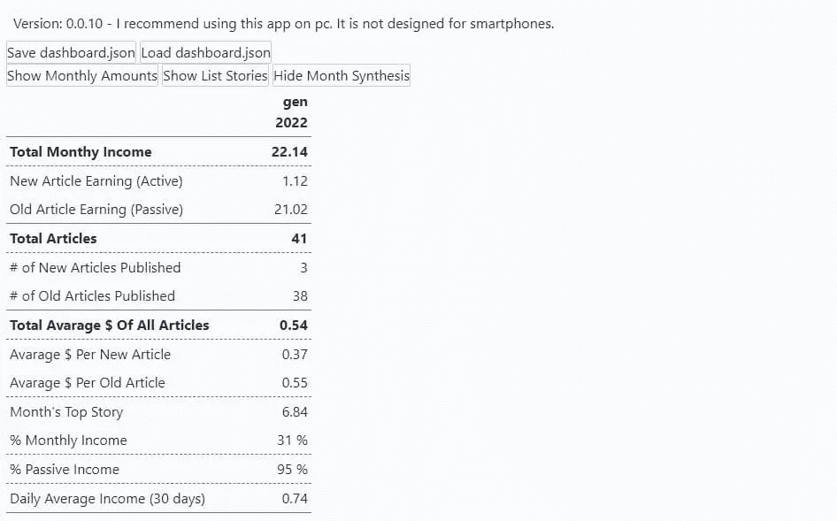
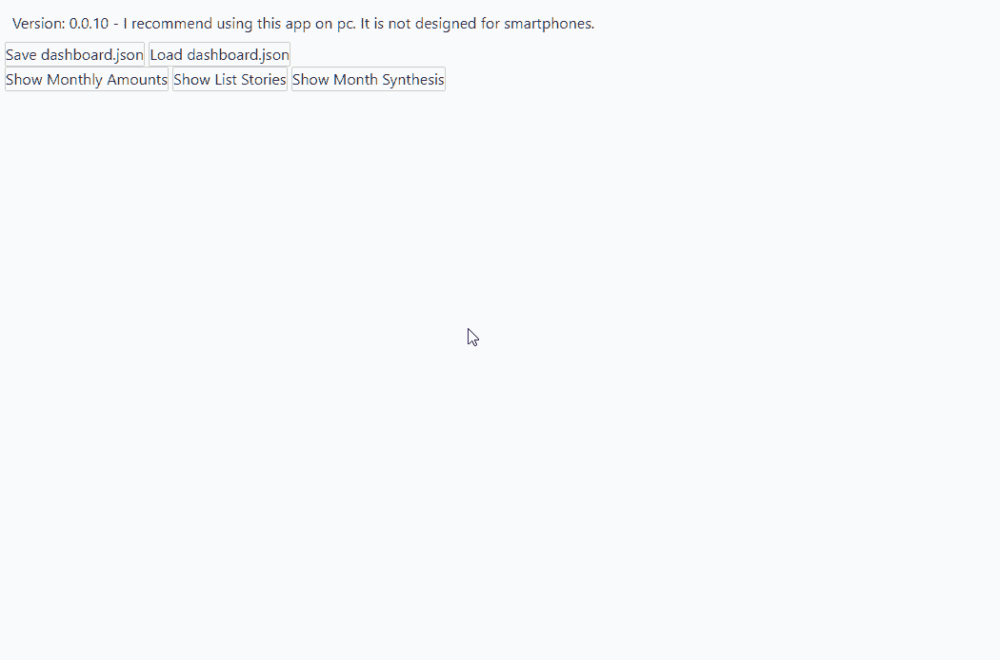

# 如何用 JavaScript 和 Svelte 获得中等统计

> 原文：<https://javascript.plainenglish.io/how-to-get-medium-stats-with-javascript-and-svelte-part-2-1f52e86631c0?source=collection_archive---------19----------------------->

## 第 2 部分:用 JavaScript 和 Svelte 获得中等统计数据

Photo by [Lukas Blazek](https://unsplash.com/@goumbik?utm_source=medium&utm_medium=referral) on [Unsplash](https://unsplash.com?utm_source=medium&utm_medium=referral)

是时候了解如何分析各个岗位的收益了。所以我将回到本系列的第一篇文章，但是将重点放在`postAmounts`属性上。目前，我只对几个价值观感兴趣:

*   `totalAmountPaidToDate`，故事所赢得的一切
*   `amount`，当月收益
*   `post.id`，故事的指认`ID`
*   `firstPublishedAt`，第一次出版的日期(目前我决定忽略最后一次修改的日期)
*   `post.title`，故事的标题
*   `post.virtuals.wordCount`，帖子中的字数
*   `post.virtuals.readingTime`，预计阅读时间
*   `post.homeCollectionId`，托管故事的出版物的 ID

# 显示故事数据

首先，我将数据加载到页面中。为此，我使用了`loadDashboardJSON()`函数

我需要添加一个特定的函数来将每个帖子的数据加载到一个单独的对象中。我创建了`getListStories()`函数:

这种保存`firstPublishedAt`的方式有一个问题:当我想过滤和排序不同的帖子时，这可能会造成复杂性。为了避免这种情况，我把日期分成几个部分。我通过添加[date . prototype . getdate()](https://developer.mozilla.org/en-US/docs/Web/JavaScript/Reference/Global_Objects/Date/getDate)方法来修改`getDate()`:

据此，我修正`getListStories()`:

我修改了`Load dashboard.json`按钮来保存`listStories`数组中的所有内容:

现在我有了我的数据，如何展示它们？

# 用 CSS 网格创建表格

我决定使用 [CSS 网格布局](https://developer.mozilla.org/en-US/docs/Web/CSS/CSS_Grid_Layout)创建一个表格。在这篇文章的第一稿中，我写了一篇很长的关于如何做的解释。但是又长又跑题。然而，我用我的笔记创建了一个关于如何使用 CSS 网格布局创建表格的指南。你可以在这里阅读:

 [## 如何用 CSS 网格创建响应式数据表

### 创建自己的中等统计和收入分析工具

better 编程. pub](https://betterprogramming.pub/how-to-create-responsive-data-tables-with-css-grid-9e0a37394450) 

所以，现在我有了一个包含我的故事的统计数据的数组。我需要第二个包含列信息的数组:

我将`Table`组件添加到我的页面:

显示列的总数很方便:我使用了道具`totals`。首先，我定义了一个计算各种值之和的函数:

然后我编辑了`App.svelte`文件:

这是各种文章的统计表。

# 添加排序函数

另一个有用的东西是能够按照日期、标题、收入和字数对故事进行分类。为此，我使用了上下文菜单和`ordersTable`变量:

我编辑 HTML 部分

我得到了一个类似这样的列表:

# 添加条形图

清单是不够的。我想添加一些图形，有一个更好的视野。然后，我在表格中添加了一个条形图。基本上，我想使用最宽的列作为一个区域来绘制我的条形图。首先，我定义哪些列可以成为图形的源:

然后我添加相应的道具

最后我得到了各种职位的收入列表:

# 让我们做一个总结

每天我都在 excel 中手工填写一个类似于这样的方案:

只要我有几篇文章，这很简单。但是如果我继续用媒介写作，可以预见事情会变得复杂。这就是为什么我想让媒体的统计数据的收集和分析尽可能自动化。

我可以从创建这个概要的简化版本开始。最简单的版本是当月的。但首先澄清一下。

正如我在本系列的第一篇文章中已经解释过的，我使用的是 TypeScript。或者说，到目前为止我只用过 JavaScript。但是从现在开始，事情变得复杂了。因此，为了使开发更容易，我开始引入一些类型。第一个是我创建摘要所需的数据:

然后我创建组件。或者，更好的办法是，我先创建一个非常简化的版本:

我将组件导入`App.svelte`:

显然，我什么也没得到，因为我还没有创建提取数据的函数。最简单的计算方法是发表的文章数量和它们的收入:

很快就能知道哪个故事在这个月里收益最高:

当我必须将本月和前几个月的故事数据分开时，事情变得有点复杂。

有各种方法可以做到这一点。也许最聪明的方法是使用另一个 JSON 文件。我可以下载 [stats.json](https://medium.com/me/stats?format=json&count=1000) 文件，并从那里提取 firstPublishedAtBucket 属性。但这不是我要做的，不是现在。稍后我将使用这个新文件来获取更多的数据:`views`、`reads`、`claps`和`fans`。

今天我只是用我已经拥有的。那么我如何按照发表的月份和年份来划分各种帖子呢？

当我创建`StoryAmountStats`接口时，我也保存了类型`CustomDateTime`的 `firstPublishedAt`属性:

好了，这就是我要开始的全部内容。

我怎么知道我们在哪个月？我可以用 [Date.now()](https://developer.mozilla.org/en-US/docs/Web/JavaScript/Reference/Global_Objects/Date/now) 计算系统日期。然后，我提取月份和年份的数字，并将其用作过滤器。

为了计算前几篇文章的数据，我可以做减法。或者我可以创建一个函数。我认为特定的功能更合适，也因为我以后会需要它:

现在我只需要把它们放在一起:

添加了一些 CSS 样式后，我终于得到了这个月的总结:

# 我们在哪里

我今天就到这里。还有一些问题需要解决。尤其是引发这一切的一个问题:我如何查看连续几个月的相同数据？我将在以后的文章中讨论这个问题。

到目前为止，我们已经创建了一个页面，显示各个月份的整体表现、各个故事的表现以及当月的简要总结:

至于本文的第一部分，你可以在这里阅读:

 [## 如何用 JavaScript 和 Svelte 获得中等统计

### 第 1 部分:了解如何下载和分析媒体的统计数据。

javascript.plainenglish.io](/how-to-get-medium-stats-with-javascript-and-svelte-part-1-a1d08b96799e) 

这是包含代码的存储库:

 [## GitHub — el3um4s/medium-stats:如何用 JavaScript 和 Svelte 获得中等统计数据

### 现场直播:el3um4s.github.io/medium-stats/，我关于如何获得更好的中等统计数据的实验。我写博客是关于…

github.com](https://github.com/el3um4s/medium-stats) 

显然，它仍然是一项正在进行的工作，所以仍然有一些功能需要修复，一些代码需要清理。

感谢阅读！敬请关注更多内容。

***不要错过我的下一篇文章—报名参加我的*** [***中邮件列表***](https://medium.com/subscribe/@el3um4s)

 [## 通过我的推荐链接加入 Medium—Samuele

### 阅读萨缪尔的每一个故事(以及媒体上成千上万的其他作家)。不是中等会员？在这里加入一块…

el3um4s.medium.com](https://el3um4s.medium.com/membership) 

*原载于 2022 年 1 月 16 日*[*【https://blog.stranianelli.com】*](https://blog.stranianelli.com/medium-stats-with-javascript-and-svelte-part-2/)*。*

*更多内容看* [***说白了。报名参加我们的***](http://plainenglish.io/) **[***免费周报***](http://newsletter.plainenglish.io/) *。在我们的* [***社区不和谐***](https://discord.gg/GtDtUAvyhW) *获得独家获取写作机会和建议。***