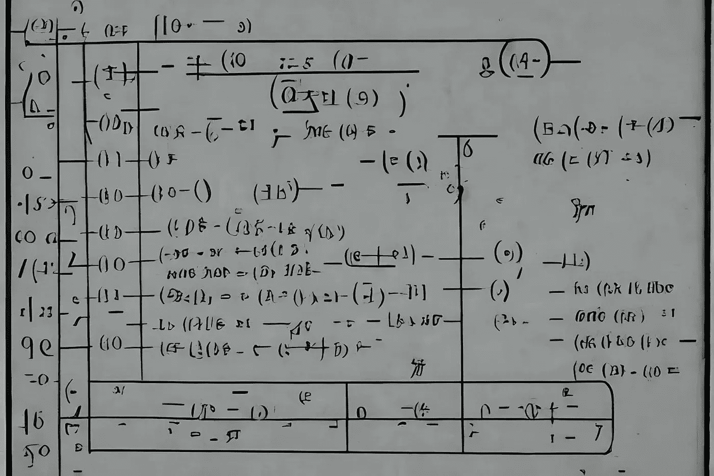

# 如何在 JavaScript 和 TypeScript 中获取数组的最小值或最大值

> 原文：<https://javascript.plainenglish.io/how-to-get-min-or-max-of-an-array-in-javascript-and-typescript-ed1087c080cf?source=collection_archive---------7----------------------->

## 毁灭 2022

## 既然有 Math.min()和 Math.max()存在，为什么还要重新发明轮子？


Image by [Samuele](https://medium.com/@el3um4s)

新的一天，我的毁灭 2022 的新练习。周末期间，我发现了一些其他的不利因素，但仍然决定不遵循其中任何一个。相反，我将继续从 CodeWars 中挑选一个随机问题。今天的题目是关于如何求一系列数的最小值和最大值。

# 问题是

在这个小作业中，给你一串空格分隔的数字，你必须返回最高和最低的数字。

例子

```
highAndLow("1 2 3 4 5"); // return "5 1"
highAndLow("1 2 -3 4 5"); // return "5 -3"
highAndLow("1 9 3 4 -5"); // return "9 -5"
```

# 解决方案



Image by [Samuele](https://medium.com/@el3um4s)

这是我对打字稿的解决方案:

```
export class Kata {
  static highAndLow(numbers: string): string {
    const arr: number[] = numbers.split(" ").map((c) => parseInt(c));
    const max: number = Math.max(...arr);
    const min: number = Math.min(...arr);
    return `${max} ${min}`;
  }
}
```

这是我对 JavaScript 的解决方案:

```
function highAndLow(numbers) {
  const arr = numbers.split(" ").map((c) => parseInt(c));
  const max = Math.max(...arr);
  const min = Math.min(...arr);
  return `${max} ${min}`;
}
```

同样在这种情况下，我更喜欢把问题分成几个步骤。

首先，我把字符串拆分成一个数字数组。然后我使用了`Math.max`和`Math.min`函数来寻找最大值和最小值。最后，我将结果作为字符串返回。

为了拆分字符串，我使用了 [String.split()](https://developer.mozilla.org/en-US/docs/Web/JavaScript/Reference/Global_Objects/String/split) 方法。这样我得到了一个字符串数组。

```
// ts
const arrString: string[] = numbers.split(" ");

//js
const arrString = numbers.split(" ");
```

然后我使用 [Array.map()](https://developer.mozilla.org/en-US/docs/Web/JavaScript/Reference/Global_Objects/Array/map) 方法来修改数组的每个元素。这样我可以把每个元素转换成一个数字。

```
// ts
const arrNumber: number[] = arrString.map((c) => parseInt(c));

//js
const arrNumber = arrString.map((c) => +c);
```

最后，我使用 [Math.max()](https://developer.mozilla.org/en-US/docs/Web/JavaScript/Reference/Global_Objects/Math/max) 和 [Math.min()](https://developer.mozilla.org/en-US/docs/Web/JavaScript/Reference/Global_Objects/Math/min) 函数来查找最大值和最小值。

```
// ts
const max: number = Math.max(...arr);
const min: number = Math.min(...arr);

// js
const max = Math.max(...arr);
const min = Math.min(...arr);
```

我也可以用稍微不同的方式来处理这个问题。将字符串转换成数字数组后，我对数组进行排序。然后我返回第一个和最后一个项目。

```
export class Kata {
  static highAndLow(numbers: string) {
    let arr = numbers
      .split(" ")
      .map((x) => parseInt(x))
      .sort((a, b) => a - b);
    return `${arr[arr.length - 1]} ${arr[0]}`;
  }
} 
```

```
function highAndLow(numbers) {
  const arr = numbers
    .split(" ")
    .map((c) => parseInt(c))
    .sort((a, b) => a - b);
  return `${arr[arr.length - 1]} ${arr[0]}`;
}
```

感谢阅读！敬请关注更多内容。

***不要错过我的下一篇文章—报名参加我的*** [***中邮箱列表***](https://medium.com/subscribe/@el3um4s)

[](https://el3um4s.medium.com/membership) [## 通过我的推荐链接加入 Medium—Samuele

### 阅读萨缪尔的每一个故事(以及媒体上成千上万的其他作家)。不是中等会员？在这里加入一块…

el3um4s.medium.com](https://el3um4s.medium.com/membership) 

*更多内容请看* [***说白了就是***](https://plainenglish.io/) *。*

*报名参加我们的* [***免费周报***](http://newsletter.plainenglish.io/) *。关注我们关于*[***Twitter***](https://twitter.com/inPlainEngHQ)，[***LinkedIn***](https://www.linkedin.com/company/inplainenglish/)*，*[***YouTube***](https://www.youtube.com/channel/UCtipWUghju290NWcn8jhyAw)*，以及* [***不和***](https://discord.gg/GtDtUAvyhW) ***。***

***有兴趣缩放你的软件启动*** *？检查* [***电路***](https://circuit.ooo?utm=publication-post-cta) *。*