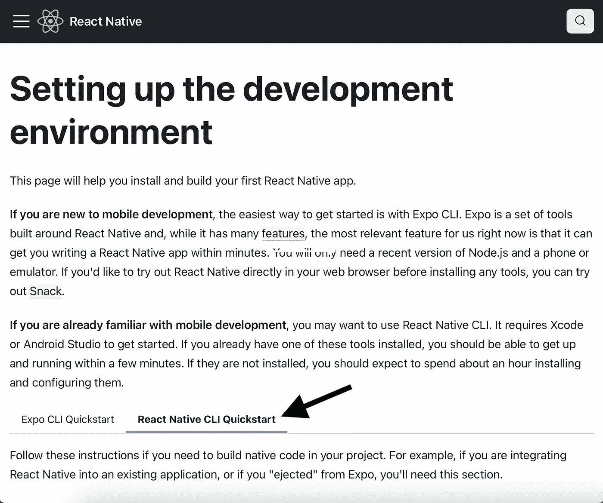
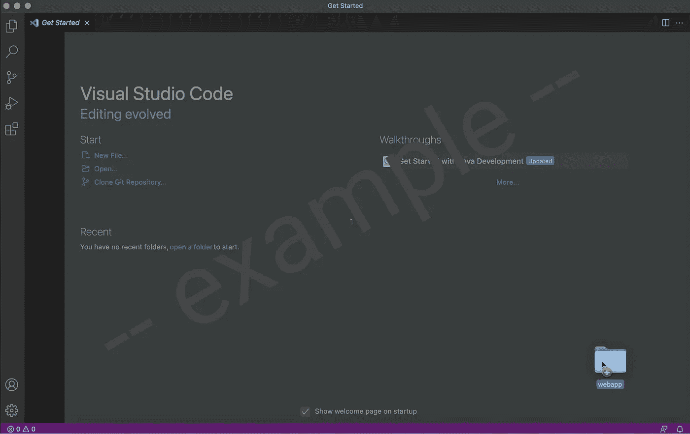
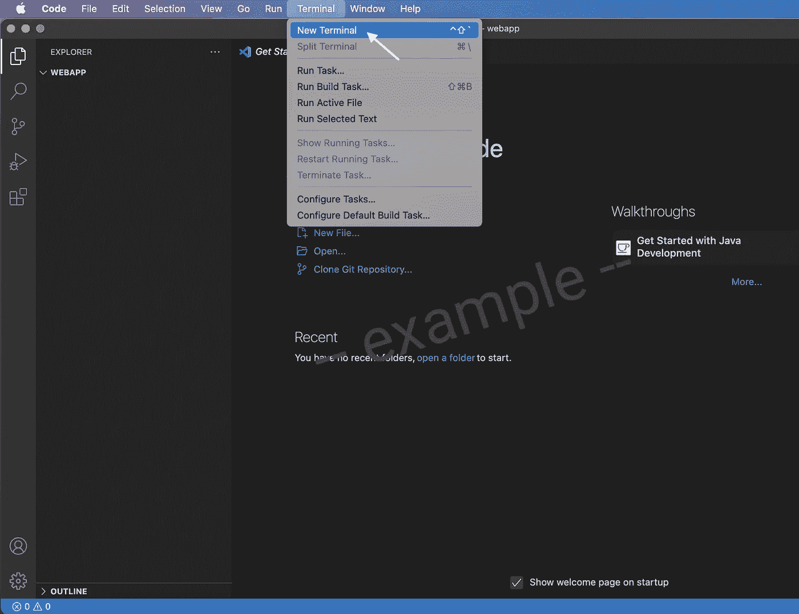
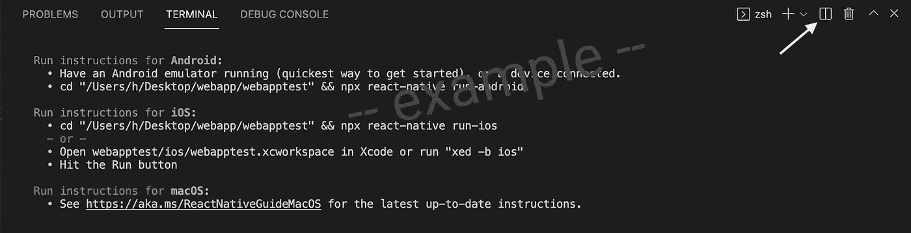
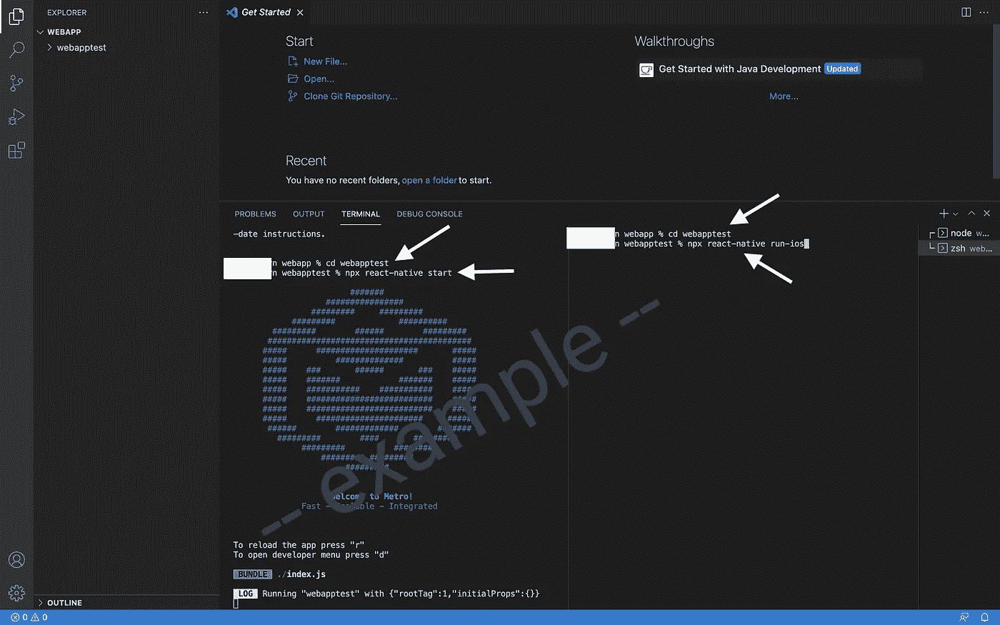
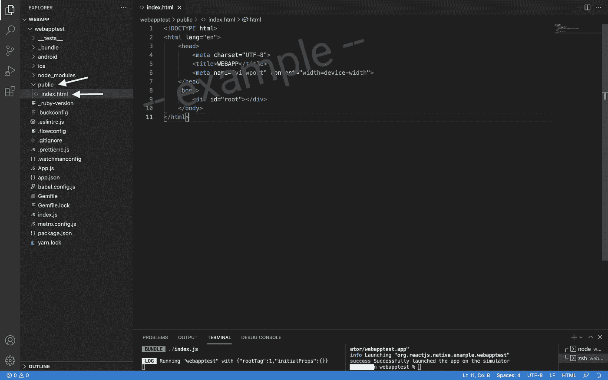
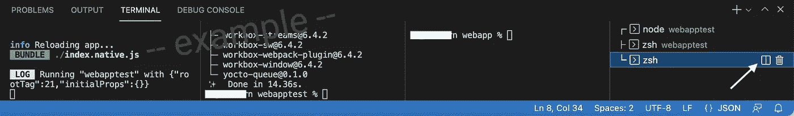
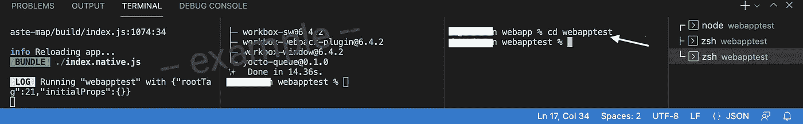

# 如何开始使用 React Native Web & React Native(最简单的方法)

> 原文：<https://javascript.plainenglish.io/how-to-get-started-in-react-native-web-react-native-the-easiest-way-4d95c78d4470?source=collection_archive---------0----------------------->

## 在一个源代码中创建本地应用和 web 应用的方法(综合指南)


Photo by [Fabian Irsara](https://unsplash.com/@firsara?utm_source=medium&utm_medium=referral) on [Unsplash](https://unsplash.com?utm_source=medium&utm_medium=referral)

想知道如何同时为 iOS 和 Android 创建一个 web 应用程序(浏览器)和一个原生应用程序吗？使用 React Native for Web，您可以在一个源代码中开发一个 iOS 和 Android 的原生应用程序+一个 Web 应用程序。这里有一个简单的指导让你开始**(绝对初学者)** —

## **设置开发环境**

按照 **React Native CLI 快速入门**下的【https://reactnative.dev/docs/environment-setup[中的说明进行操作](https://reactnative.dev/docs/environment-setup)



**步骤 1 —在桌面上手动创建一个文件夹**(在这个简单的指南中，我们将创建一个名为 webapp 的文件夹。该文件夹将位于您的桌面上)

(**或者**，也可以使用终端创建文件夹→打开终端， ***cd*** 桌面，***mkdir****web app。在本例中，我们在桌面上创建了一个名为“webapp”的文件夹。你可以把它改成你喜欢的任何名字。例如，cd 桌面，mkdir 测试。您的文件夹的名称将是“测试”)*

```
*cd desktopmkdir webapp*
```

***第二步—** 打开[***VSCode***](https://code.visualstudio.com)*，将文件夹(截图如下)拖入 vs code。您可能会被问到，“您信任该文件夹中文件的作者吗？”。“是的，我信任作者。信任文件夹并启用所有功能”。**

****

**Screenshot (aurora)**

****步骤 3 —在 VSCode** 、(Mac 用)**内同时按下这三个按钮** ( **控制**、`、**换挡**)打开 VSCode 内的**端子**。
( **或者**，你可以转到 VSCode 的顶部，打开终端，然后打开‘新终端’)**

****

**Screenshot (aurora)**

****步骤 4 —** 在 VSCode 的终端中，运行—**

```
**npx react-native init webapptest**
```

**您可以将文件夹命名为任何您想要的名称。例如，npx react-native init mywebapp。如果您正确地遵循了本教程，您应该已经在桌面上创建了第一个文件夹，并在其中创建了第二个文件夹。在第 4 步中，您将在名为 webapptest 的第二个文件夹中安装 react-native。**

****第 5 步——重要！**—**CD**web apptest(**或**更改为您使用“npx react-native init”命令创建的文件夹名称。**

```
**cd webapptest**
```

****步骤 6 —** 现在是**拆分终端**的时候了。**同时按下这两个按钮** ( **命令**、 **\** )
( **或者**，点击白色箭头所指的按钮，如下图截图所示)。现在，在 VSCode 中您将拥有 **2 个端子**。**

****

**Screenshot (aurora)**

****步骤 7 —** 要检查您是否已经正确设置了所有内容，请在左侧终端运行
—**

```
**npx react-native start**
```

**在右边的终端上，运行—**

```
**cd webapptest
npx react-native run-ios** 
```

****

**Screenshot (aurora)**

****步骤 8 —** 创建一个名为 **public** 的文件夹。在里面加上**index.html**。**

****

**Screenshot (aurora)**

****第 9 步—** 将这些添加到**index.html**→**

```
**<!DOCTYPE html>
<html lang=”en”>
<head>
      <meta charset=”UTF-8">
      <meta name=”viewport” content=”width=device-width”>     
      <title> WEBAPP </title>
</head>
<body>
      <div id=”root”></div>
</body>
</html>**
```

****** *根据您的喜好定制以上 index.html 文件*******

****步骤 10 —** 在**右侧**端子上，**运行**这些命令→**

```
**mkdir src
mv App.js src
mv app.json src
cp index.js src
mv index.js index.native.js**
```

> **** **mkdir** —制作目录(制作文件夹名为，src)。 **mv** — move(将 app.json 移动到 src 文件夹&将 App.js 移动到 src 文件夹)。 **cp** — copy(将 index.js 复制到 src)。最后一个命令是将**重命名** index.js 为 index.native.js。**

**关于 **.native.js** 扩展名，请参考([https://reactnative.dev/docs/platform-specific-code](https://reactnative.dev/docs/platform-specific-code))。**

****步骤 11 —** 因为 App.js 和 app.json 已经被移动到 src 文件夹中，所以必须更新导入。删除“从导入{name as appName}”。/app . JSON '；"来自 index.js +一些编辑。检查这些文件→**

**在 **index.native.js 中→****

```
**import {AppRegistry} from ‘react-native’;
import App from './src/App';
import name from './src/app.json';const {appName} = name;
AppRegistry.registerComponent('webapptest', () => App);**
```

**在 **index.js 中→****

```
**import {AppRegistry} from ‘react-native’;
import App from ‘./App’;
AppRegistry.registerComponent('App', () => App);
AppRegistry.runApplication('App', {
        rootTag: document.getElementById(‘root’),});**
```

****步骤 12 —** 在 VSCode 终端的右侧运行这些命令→**

```
**yarn add react-dom react-native-web
yarn add --dev react-scripts** 
```

****步骤 13 —** 将**" web ":" react-scripts start "**添加到 **package.json** 下 **"scripts"** →**

```
**“scripts”: {
“android”: “react-native run-android”,
“ios”: “react-native run-ios”,
“web”: “react-scripts start”,
“start”: “react-native start”,
“test”: “jest”,
“lint”: “eslint .”
},**
```

****步骤 14 —** 去掉 **App.js 里面的代码** & **自己写** →**

```
**import React from ‘react’;
import {View, Text, StyleSheet} from ‘react-native’;const App = () => {
return (
       <View style = {styles.title}>
       <Text style = {styles.text}> My First Web App </Text>
       </View>
   )
}export default App;const styles = StyleSheet.create ({
      title: {
      textAlign: ‘center’,
      margin: 100,
},text: {
      fontFamily: ‘American Typewriter’,
      fontSize: 50,
},
})**
```

****** *根据自己的喜好定制上述 App.js 文件！*****

****第 15 步—** 假设你已经完成了**第 7 步**，按下 VSCode 终端左侧的 **r** 按钮**重新加载**app。**再次拆分端子**(参见截图中的白色箭头)**

****

**Screenshot (aurora)**

****步骤 16 —** 在新创建的拆分终端(终端的最右侧)上，cd webtestapp(截图)**

****

**Screenshot (aurora)**

**在 VSCode 终端的最右侧，运行命令→**

```
**yarn run web**
```

**你会看到→**

```
**yarn run v1.22.17
$ react-scripts start
? We’re unable to detect target browsers.
Would you like to add the defaults to your package.json? › (Y/n)**
```

**按下→ **Y****

**您可能会在终端和浏览器上看到关于“流类型”的 **1 错误**。通过按下位于浏览器右上角的“x”按钮**关闭浏览器上的**错误，或者您可以按下终端**最右侧**的 **2 按钮**(控制，c)(与您之前运行命令“纱线运行网络”的终端相同)。然后**再次运行该命令** →**

```
**yarn run web**
```

***更多内容看* [***说白了就是***](http://plainenglish.io/) *。报名参加我们的* [***免费周报***](http://newsletter.plainenglish.io/) *。在我们的* [***社区不和谐***](https://discord.gg/GtDtUAvyhW) *获得独家获取写作机会和建议。***

**[](https://forelsketaura.medium.com/subscribe) [## 每当 Aurora 发布时收到一封电子邮件。

### 每当 Aurora 发布时收到一封电子邮件。注册后，如果您还没有中型帐户，您将创建一个…

forelsketaura.medium.com](https://forelsketaura.medium.com/subscribe)**