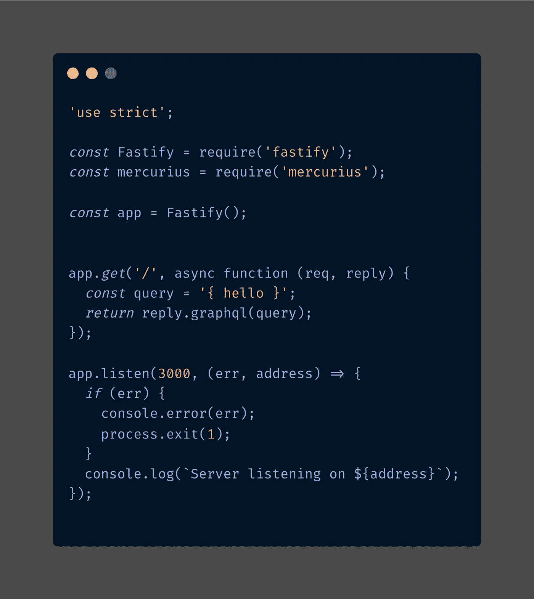
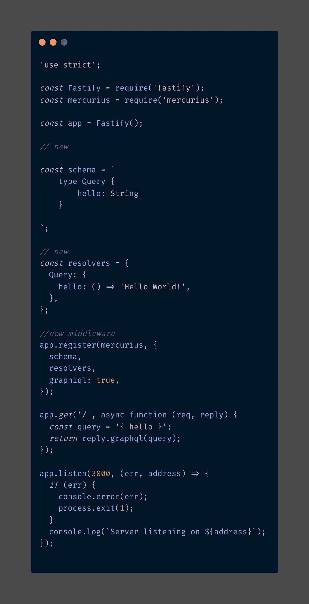
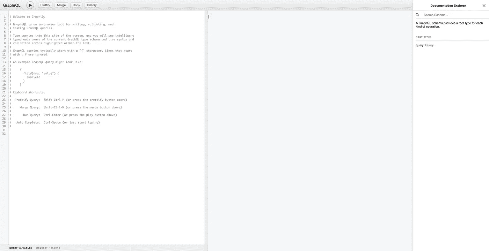
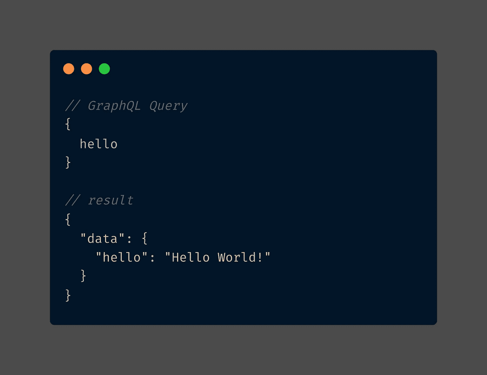
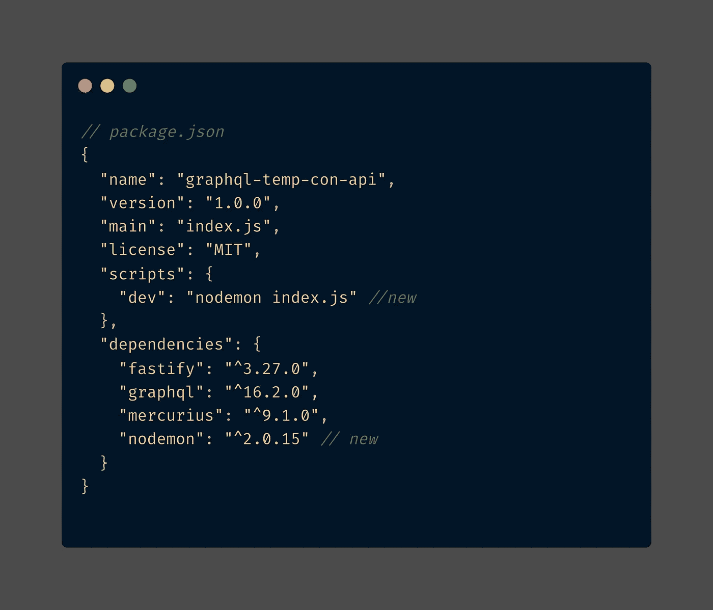
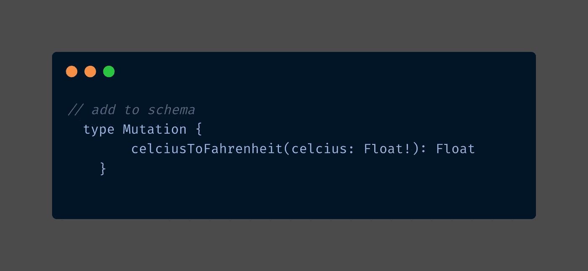
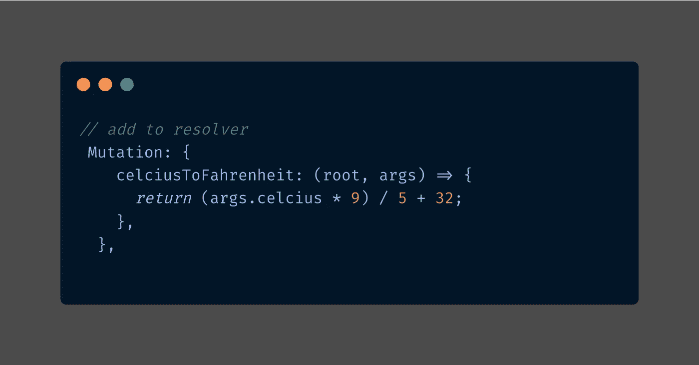
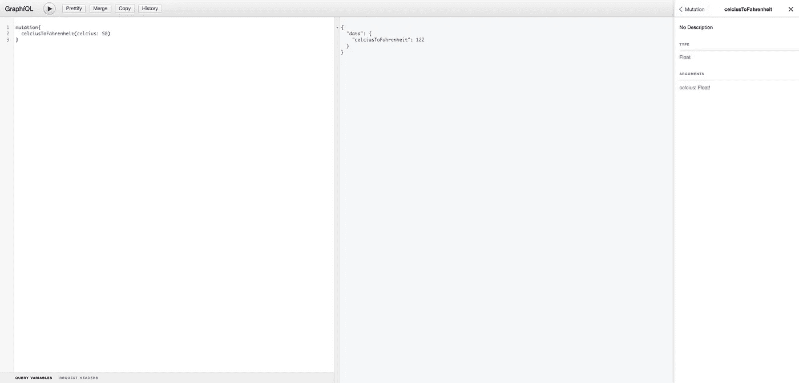
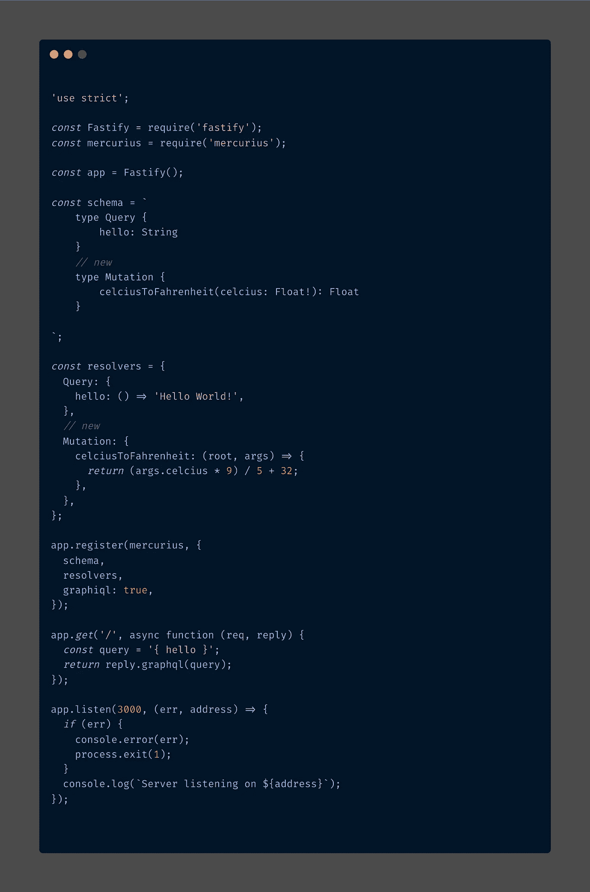

# GraphQL 初学者入门指南——用墨丘利构建温度转换器

> 原文：<https://javascript.plainenglish.io/how-to-get-started-with-graphql-for-beginners-build-a-temperature-converter-with-mercurius-ea51559dee3a?source=collection_archive---------18----------------------->


Photo by [fabio](https://unsplash.com/@fabioha?utm_source=unsplash&utm_medium=referral&utm_content=creditCopyText) on [Unsplash](https://unsplash.com/s/photos/network?utm_source=unsplash&utm_medium=referral&utm_content=creditCopyText)

# 目的

已经有很多关于为什么使用 GraphQL、将它与 REST 进行比较以及其他技术的文章。所以我在这里不打算这样做，这篇文章的目的是让您在构建一个简单的 API 的同时尝试一下 GraphQL，并向您介绍这项技术，以便您可以进一步探索它。

本教程不是针对绝对的初学者，而是针对已经构建了一些 REST APIs 并且已经熟悉命令行和 Git 的人。

**定义:**

> GraphQL 是一种 API 查询语言，也是一种用现有数据完成这些查询的运行时语言。GraphQL 为 API 中的数据提供了完整且易于理解的描述，使客户能够准确地要求他们需要的东西，使 API 更容易随时间发展，并支持强大的开发工具。—graphql.org

# 技术

出于本教程的目的，我们将使用墨丘利一个 [GraphQL](https://graphql.org/) 适配器用于 [Fastify](https://www.fastify.io/) 我个人认为这很神奇，我已经用 Apollo Server 和 Apollo Server Express 构建了一个 GraphQL 服务器，你也可以看看它们，它们很神奇。墨丘利的特点只是为我勾选了很多框，见他们在他们的[网站](https://mercurius.dev/#/)下面列出。

**功能:**

*   查询解析和验证的缓存。
*   自动加载器集成，避免 1 + N 查询。
*   通过 [graphql-jit](http://npm.im/graphql-jit) 的实时编译器。
*   订阅。
*   联邦支持。
*   联合订阅支持。
*   网关实现，包括订阅。
*   批量查询支持。
*   可定制的持久化查询。

# 装置

要遵循本教程，您需要让 [Node JS install](https://nodejs.org/en/download/) 访问网站安装最新版本。我也使用 yarn 进行包装管理，你也可以使用 NPM。yarn 只是个人喜好。要安装[纱线，请访问此链接](https://classic.yarnpkg.com/lang/en/docs/install/#mac-stable)。

我使用 [VS Code IDE](https://code.visualstudio.com/) ，我认为它是 JavaScript 开发的最佳 IDE 之一，对 GraphQL 进行了很好的扩展。

创建一个项目目录并运行下面的命令。

```
yarn init -y
```

上面的命令在我们的项目目录中创建了一个新的 package.json，如下所示。

```
{"name": "graphql-temp-con-api","version": "1.0.0","main": "index.js","license": "MIT"}
```

然后分别安装以下库，Fastify、墨丘利和 Graphql。

```
yarn add fastify mercurius graphql
```

在上面的成功安装之后，在我们的项目目录中创建一个`index.js`文件，并放入下面的代码来创建一个简单的 Fastify 服务器。



上面的代码类似于我们如何在 Node 中创建一个普通的 REST API 服务器。关于 GraphQL 需要注意的重要一点是，所有其他部分都是仅使用一个端点完成的。

让我们更深入地了解一些 graphql 细节如何填充到我们的 index.js 中，我们将为 fastify 添加一个模式、一个解析器和墨丘利中间件。下面的代码是一个简单的 hello world GraphQL API。让我们运行它，然后详细解释它是如何工作的。



在终端中运行这个

```
node index.js
```

去[http://127 . 0 . 0 . 1:3000/graphiql](http://127.0.0.1:3000/graphiql)

GraphQL 是一个浏览器内工具，用于编写、验证和
测试 graph QL 查询。



现在，我们有了一个正在运行的 GraphQL API 服务器，GraphQL 提供了您可以在上面看到的浏览器浏览器，它也可以用于测试我们的 API，并提供从我们的模式定义生成的文档。在左侧，您可以编写查询和突变，在中间，您可以获得您的 API 请求结果，右侧给出了我们的 API 自动生成的文档。

**工作原理**

GraphQL 服务是通过定义类型和这些类型上的字段，然后为每个类型上的每个字段提供函数来创建的。从上面的代码中可以看出，类型和字段是我们的模式，相应的函数是解析器。

**查询:**

这是我们从 GraphQL API 获取数据的方式，它的美妙之处在于，它只提供我们需要的数据，防止数据提取过多或不足。



**突变:**

我们在 GraphQL 中改变数据的方式是把它想象成创建、更新和删除所有这些操作都是通过突变来完成的。

**订阅:**

GraphQL 还通过订阅提供实时数据。

# 自动重新加载

目前，我们的服务器不会立即响应更改，如果您注意到您必须终止终端并再次重新运行它来获取新的更改，以使我们的服务器监听更改并重新加载服务器，让我们安装 Nodemon 并更新我们的`package.json`文件。

```
yarn add nodemon
```



关掉服务器然后运行

```
yarn dev
```

# 温度转换器

我们将创建一个功能，允许用户提供摄氏温度并将其转换为华氏温度。让我们给我们的模式添加一个突变类型。

更新模式



`Float!`意味着需要摄氏温度值，`!`强制执行该值。如果我们在没有提供温度的情况下运行突变，我们将立即得到一个错误。

更新解析程序



创建模式后，我们还将为突变类型`celciusToFahrenheit`创建相应的函数，称为解析器。

如果我们现在去我们的服务器运行我们的突变:

```
mutation{
  celciusToFahrenheit(celcius: 40)
}
```



我们回来了:

```
{
  "data": {
    "celciusToFahrenheit": 104
  }
}
```

多酷啊。在几行代码中，我们已经设置了一个 GrapQL 服务器，这只是皮毛，我们可以添加一个持久层，包含我们选择的任何数据库，还有一个巨大的生态系统，它具有惊人的工具，可以让您从简单的应用程序到企业级应用程序。许多科技巨头都已经在使用 GraphQL 了。

查看我关于[教程、工具、库和 VS 代码扩展的文章，在 2022 年开始使用 graph QL](https://thepeterayeni.medium.com/tutorials-tools-libraries-and-vs-code-extensions-to-get-started-with-graphql-in-2022-c9a652692632)

完整的代码在 [Git](https://github.com/peterayeniofficial/celciusToFahrenheit) 上



[Git 回购](https://github.com/peterayeniofficial/celciusToFahrenheit)

# 结论

GraphQL 在过去 3 年中被广泛采用，其受欢迎程度也在不断增长。作为一名开发人员，我相信这是一项非常棒的技术，现在大多数语言都有 GraphQL 实现，许多顶级语言框架都提供了对它的支持。生态系统是巨大的，有许多资源和社区可供学习。

资源:

 [## 墨丘利

### 描述

mercurius.dev](https://mercurius.dev/#/) [](https://graphql.org/) [## API 的查询语言

### 一种用于 API 的查询语言——graph QL 提供了 API 中数据的完整描述，为客户提供了…

graphql.org](https://graphql.org/) [](https://graphql.org/foundation/) [## GraphQL 基础是什么？

### 一种用于 API 的查询语言——graph QL 提供了 API 中数据的完整描述，为客户提供了…

graphql.org](https://graphql.org/foundation/) [](https://www.the-guild.dev/) [## 公会-开源

### 公会的高级开源生态系统涵盖了您的 API 基础设施所需的一切，具有模块化、开放的…

www.the-guild.dev](https://www.the-guild.dev/) 

*更多内容看* [***说白了。报名参加我们的***](http://plainenglish.io/) **[***免费周报***](http://newsletter.plainenglish.io/) *。在我们的* [***社区不和谐***](https://discord.gg/GtDtUAvyhW) *获得独家获取写作机会和建议。***