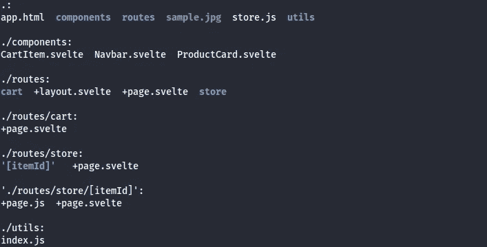

# 通过建立自己的电子商务网站来学习苗条身材

> 原文：<https://javascript.plainenglish.io/how-to-get-started-with-svelte-f09a56a023f4?source=collection_archive---------9----------------------->

## 一个初学者指南到苗条使用苗条工具包

*Photo by* [*Jukan Tateisi*](https://unsplash.com/@tateisimikito?utm_source=medium&utm_medium=referral) *on* [*Unsplash*](https://unsplash.com?utm_source=medium&utm_medium=referral)

一开始，苗条身材的入门似乎让人不知所措，但是一旦你掌握了诀窍，它实际上是非常简单的。在这篇文章中，我将带你经历开始构建你的第一个苗条应用程序所需的基本步骤。

# *概述*

1.  *什么是苗条*
2.  *创建我们的应用*
3.  *如何用苗条的方式写代码*
4.  *苗条路线*
5.  *让我们写一些代码*

我的 [GitHub 上的完整代码](https://github.com/ogofe/sv-commerce)

*PS:如果已经安装了 svelte，可以跳到* [*代码部分*](#setting-up-our-application) *。*

# *1。什么是苗条*

来自[官网](https://svelte.dev/)

> “Svelte 是一种全新的构建用户界面的方法。尽管 React 和 Vue 等传统框架在浏览器中完成大部分工作，但 Svelte 将这些工作转变为编译步骤，在构建应用程序时进行。
> 
> Svelte 没有使用虚拟 DOM diffing 之类的技术，而是编写代码，当应用程序的状态改变时，以外科手术的方式更新 DOM。”

这意味着 Svelte 是一个框架，允许开发人员用 HTML、CSS 和 Javascript 构建高性能的应用程序，并在编译时处理应用程序更新，因此当应用程序的状态改变时，应用程序也会改变，但这是在编译时完成的，而不是在运行时。

# *2。创建我们的应用程序*

首先，您需要设置您的开发环境。您可以使用您喜欢的代码编辑器，但是建议安装 Node.js 和 Svelte CLI。一旦你安装了这些，你就可以在你的终端上运行命令`npx degit sveltejs/template my-svelte-app`来创建一个新的苗条应用。

一旦你创建了你的应用程序，你需要导航到它的目录并运行命令`npm install`来安装必要的依赖项。然后，您可以通过运行命令`npm run dev`来启动开发服务器。这将在`http://localhost:5000`启动您的应用程序，您可以在浏览器中查看它。

# *3。如何用苗条的方式写代码*

现在，您的应用程序已经设置好了，是时候开始构建了！Svelte 使用基于组件的架构，这意味着您将构建可用于创建您的应用程序的单独组件。您可以通过在您的`src`目录中创建一个新的`.svelte`文件来创建一个新组件。这个文件应该包含组件的 HTML、CSS 和 JavaScript。

在 Svelte 中，您可以使用`script`标签来定义组件的 JavaScript，使用`style`标签来定义 CSS，使用常规的 HTML 标签来定义组件的结构。Svelte 还提供了许多内置的指令和反应语句，您可以使用它们来为您的应用程序添加动态功能。

要在你的应用中使用一个组件，你需要将它导入到另一个组件或主`App.svelte`文件中。您可以通过在文件顶部添加一个`import`语句，然后在 HTML 中使用组件名作为标签来实现这一点。

*A sample svelte component file syntax*

# *4。苗条路线*

*在我们开始编码之前，让我们在 my-svelte-app/src 中创建几个目录和文件来匹配这个文件夹结构。*

*showing your-project/src/**

您可能已经注意到了本项目中使用的文件名命名约定前的加号“+”，让我解释一下它们的含义。

Svelte 使用基于文件系统的路由器，将应用程序中的路由匹配到应用程序目录范围内的文件夹。这些路线被放置在“*src/routes”*中一个方便命名为“ *routes* 的目录中，这意味着 *routes/profile/* 和 *routes/settings 将产生两条路线——我们应用程序中的一条配置文件和设置路线。如果你使用过 Next.js* ，这应该看起来很熟悉

在我们继续之前，需要注意一些事情

1.  ` *+page.svelte`* 是主要的路线组件*——当用户在我们的应用*中访问一条路线时所呈现的内容
2.  *`+page.js`* 是一个函数，它在呈现每个关联的路由之前运行，并使用加载时可能需要的任何数据填充每个路由(类似于 Next.js 中的 getStaticProps)。

> 为了清楚起见，从现在开始任何带有+page.js 的文件都将被称为路由，而以。纤细的我们称之为组件

# 5.让我们写一些代码

首先，我们创建应用程序的布局。我们希望我们的应用程序在不同的路线上显示一致的布局

src/routes/+layout.svelte

注意到`标签了吗？除了一个例外，svelte 只要求这个标签在你的布局文件中出现一次，它将根据你的文件夹结构处理路由。标签只是显示放置内容的位置。

我们需要创建一些助手函数来简化我们的开发和语法。

src/utils/index.js

我们已经引用了 GlobalStore，但我们还没有创建我们的商店，为此我们需要使用 Svelte 的 store API 来创建一个可写的商店，该商店将存储我们的产品数据，在我们的应用程序生命周期内在全球范围内保存我们的购物车数据，并允许我们显示通知。

Svelte 有三种类型的商店

1.  可读存储—只读(如用户详细信息)
2.  可写存储—读和写
3.  衍生商店。

src/store.

在你的 src/routes/+page.svelte 中粘贴这个。这个文件的原因是，Svelte 期望一个索引路径匹配基本路径'*https://example.com/*'，而我们没有一个登陆页面，所以我们只是将 StorePage 呈现为索引路径，即“ */src/routes/+page.svelte* ”。

现在让我们创建我们的 StorePage 组件——它将作为我们的登录页面和店面。将这段代码粘贴到“/src/routes/store/+page.svelte”中

现在，对于我们的产品详细信息页面，我们需要分别创建两个文件"*src/routes/store/[itemId]/+page . js*"和"*src/routes/store/[itemId]/+page . svelte*"。

现在，这些文件之间有什么区别？“+page.js”是一个特殊的文件，svelte 在任何+page.svelte 之前运行，它允许我们解析路线参数并将数据传递给实际的+page.svelte，这就是用户所看到的。

必须从+page.js 导出一个名为“load”的函数，然后返回一个 Javascript 对象，该对象在+page.svelte 中作为一个名为“data”的变量可用。Svelte 还向 load 函数传递一些其他参数，如 *url、fetch 等。*

> 如果您想从后端服务或 API 获取数据，您应该只在+page.js 加载函数中这样做，而不是在+page.svelte 中。

注意—“*load*”和“ *data* ”是保留名称，因此请避免在变量和函数中使用它们，以免将来遇到错误。

src/routes/store/[itemId]/+page.js & src/routes/store/[itemId]/+page.svelte

在第 4 行中，我们看到一条语句“导出信函数据”这是由+page.js 加载函数传递给组件的数据。语法有点奇怪，但这就是我们在 Svelte 中声明 props 的方式，所以如果你想像这样将一个 prop 传递给一个组件:"*<name tag name = " John Doe "/>*"在你的 NameTag.svelte 文件中，你将导出一个变量名，即" export let name "。

此外，当您想在代码中执行一些逻辑时，如条件表达式或循环，Svelte 有一些特殊的标记来处理这些——这有点类似于 Django 的模板语言和手柄。

同样，当将回调绑定到事件，或者将状态绑定到输入元素时，我们使用这种模式*: event≥= {<action>}*和*bind:value = {<state>}*参见下面的例子

现在我们将创建我们的组件。在你的“src/components”文件夹中创建三个组件文件，即 *CartItem.svelte、Navbar.svelte 和 ProductCard.svelte。以相似的顺序粘贴这些代码(见下面的文件名要点)*

CartItem.svelte, Navbar.svelte, ProductCard.svelte

我们的应用程序即将完成，但我们缺少最后一页，所以现在我们将创建一个购物车页面，用户可以在其中看到他们的购物车商品。在 *src/routes/cart/* 中创建一个 *+page.svelte* 并粘贴到你的编辑器中。

src/routes/cart/+page.svelte

我们已经完成了应用程序的构建。现在，如果您运行“ *npm run dev* ”，您应该会在“[*http://localhost:5173*](http://localhost:5173)看到您的应用程序

这是如何开始使用苗条套装进行苗条训练的基本概述。关于这个强大的框架，还有很多东西需要学习，但这应该足以让你开始使用你的第一个应用程序。祝你好运！

如果你觉得这篇文章有帮助，或者你喜欢这篇文章，请关注我和主演回购。这对我意义重大，我感谢你的支持和反馈。编码快乐！

如果您有任何建议、推荐或问题，请联系我。您可以在[我的“关于”部分](https://medium.com/@jtogofe/about)找到我的链接和联系人。

*更多内容看* [***说白了。报名参加我们的***](https://plainenglish.io/) **[***免费周报***](http://newsletter.plainenglish.io/) *。关注我们关于* [***推特***](https://twitter.com/inPlainEngHQ) ，[***LinkedIn***](https://www.linkedin.com/company/inplainenglish/)*，*[***YouTube***](https://www.youtube.com/channel/UCtipWUghju290NWcn8jhyAw)*，以及* [***不和***](https://discord.gg/GtDtUAvyhW) *。对增长黑客感兴趣？检查出* [***电路***](https://circuit.ooo/) *。***