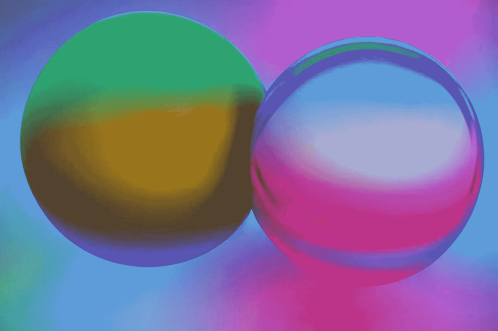
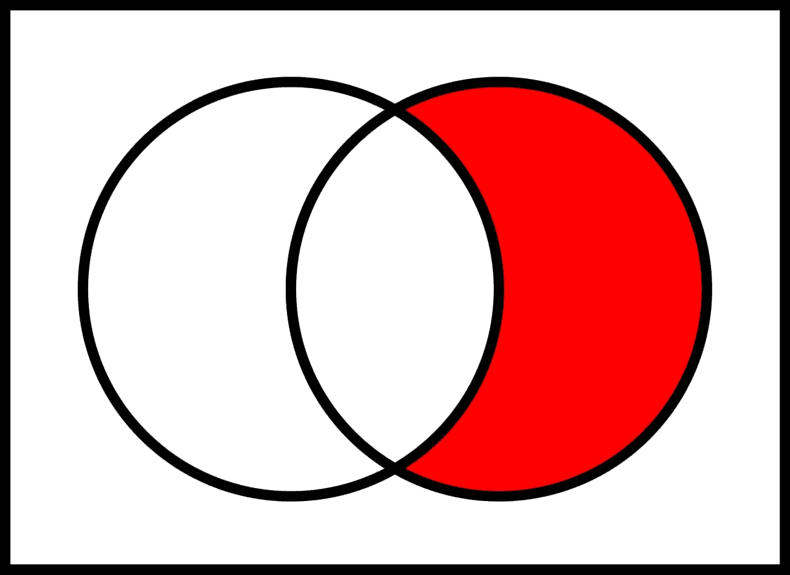
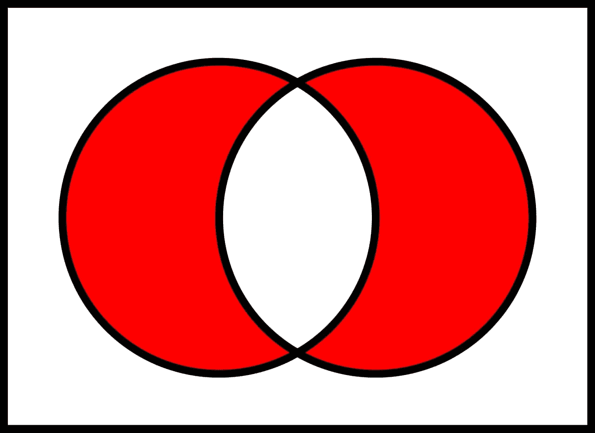
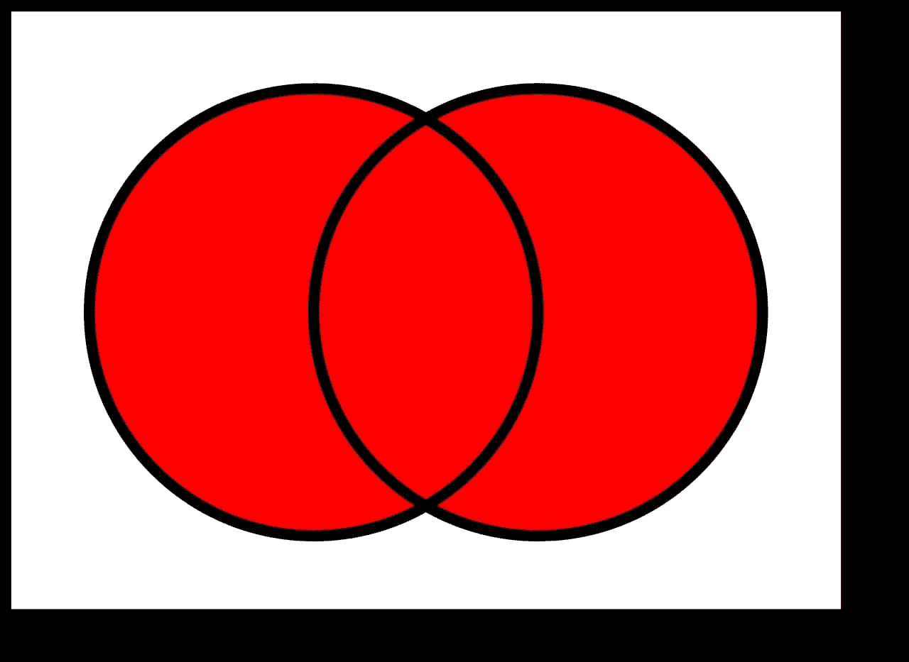
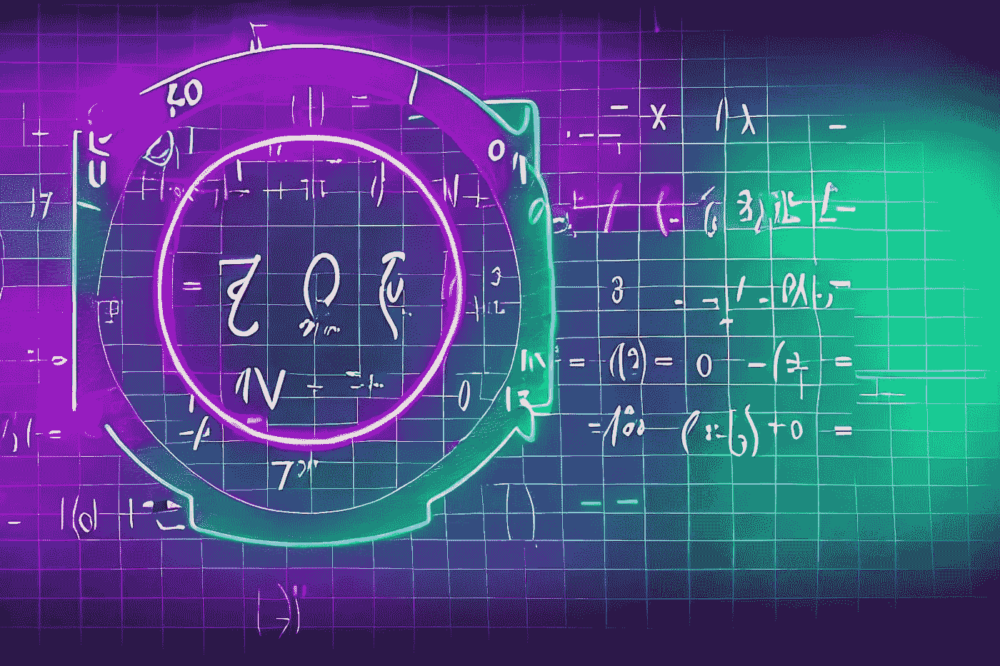

# 如何在 JavaScript 中得到两个数组的区别

> 原文：<https://javascript.plainenglish.io/how-to-get-the-difference-between-two-arrays-in-javascript-f547268bd0ee?source=collection_archive---------12----------------------->

## 毁灭 2022

## 或者说，如何用 JavaScript 做 differe(A \ B)、交集(A ∩ B)、并集(A ∪ B)、对称差(AδB)和笛卡尔积(A × B)



Image from Lexica.Art

今天的《毁灭 2022》是关于集合论的。给定两个元素数组，我如何找到它们的区别？有一个非常简单的方法可以做到这一点。还可以求两个数组的交集，并计算它们的几何差。

# 问题:Array.diff()

链接到[形](https://www.codewars.com/kata/523f5d21c841566fde000009)

在这个形中，你的目标是实现一个差函数，从一个列表中减去另一个列表，并返回结果。

它应该从列表`a`中删除所有值，这些值出现在列表`b`中，并保持它们的顺序。

```
array_diff({1, 2}, 2, {1}, 1, *z) == {2} (z == 1)
```

如果一个值出现在 b 中，它的所有出现必须从另一个中删除:

```
array_diff({1, 2, 2, 2, 3}, 5, {2}, 1, *z) == {1, 3} (z == 2)
```

# Array.diff(): `A \ B`(也写作`A − B`)



Image from Wikipedia

不过还是先从基本问题说起吧。为了解决这个问题，我从[维基百科对集合间差异的定义](https://en.wikipedia.org/wiki/Set_(mathematics))开始:

给定任意两个集合`A`和`B`，集合差`A \ B (also written A − B)`是属于`A`而不属于`B`的所有事物的集合。特别是当`B`是`A`的子集时，在`A`中又称为`B`的相对补码。

我可以把这个定义转化成一个算法:

*   对于的每个元素
*   检查它是否属于 B
*   如果不属于 B，就去下一个元素
*   如果它属于 B，我就把它从 A 中删除

我也可以改写成这样的形式:

*   过滤 A 中不属于 B 的每个元素

在这一点上，我有我需要的一切。我可以使用 [Array.filter()](https://developer.mozilla.org/en-US/docs/Web/JavaScript/Reference/Global_Objects/Array/filter) 方法来选择值。并决定根据 [Array.includes()](https://developer.mozilla.org/en-US/docs/Web/JavaScript/Reference/Global_Objects/Array/includes) 的结果过滤所有值方法:

```
export const arrayDiff = (a: number[], b: number[]): number[] =>
  a.filter((x) => !b.includes(x));
```

# Array.intersect(): `A ∩ B`



Image from Wikipedia

解决了基本问题后，我可以尽情地尝试添加更多的数组和集合运算。通过集合的交叉点:

给定任意两个集合`A`和`B`，它们的交集`A ∩ B`是同时为`A`和`B`成员的所有事物的集合。如果`A ∩ B = ∅`，则称 A 和 B 不相交。

我可以把这个定义转化成一个算法:

*   对于的每个元素
*   检查它是否属于 B
*   如果它不属于 B，我就把它从 A 中删除
*   如果它属于 B，则转到下一个元素

我也可以改写成这样的形式:

*   过滤 A 中所有属于 B 的元素

```
export const arrayIntersect = (a: number[], b: number[]): number[] =>
  a.filter((x) => b.includes(x));
```

# Array.union(): `A ∪ B`



Image from Wikipedia

在 JavaScript 中，连接两个集合是一个简单的问题。但是在解决之前，定义:

给定任意两个集合`A`和`B`，它们的并集`A ∪ B`是属于`A`或`B`或两者的所有事物的集合。

在这种情况下，有一个 [Array.concat()](https://developer.mozilla.org/en-US/docs/Web/JavaScript/Reference/Global_Objects/Array/concat) 方法，它允许您连接两个数组:

```
export const arrayUnion = (a: number[], b: number[]): number[] => a.concat(b);
```

# Array.symDiff(): `A Δ B`


Image from Wikipedia

下一个操作是对称差。维基百科是这样定义的:

给定任意两个集合`A`和`B`，它们的对称差`A Δ B`是属于 A 或 B 但不属于两者的所有事物的集合。必须是 A 的成员而不是 B 的成员，或者是 B 的成员而不是 A 的成员:`A Δ B = (A \ B) ∪ (B \ A)`。

事实上，它是由两个不同的操作组成的。我可以这样写:

```
export const arraySymDiff = (a: number[], b: number[]): number[] =>
  arrayUnion(arrayDiff(a, b), arrayDiff(b, a));
```

或者如果我更喜欢使用扩展符号:

```
export const arraySymDiff = (a: number[], b: number[]): number[] =>
  a.filter((x) => !b.includes(x)).concat(b.filter((x) => !a.includes(x)));
```

# Array.cartesian(): `A × B`

最后要处理的操作是两个数组的笛卡尔积。维基百科是这样定义的:

给定任意两个集合`A`和`B`，它们的笛卡尔积`A × B`是所有有序偶`(a,b)`的集合，使得`a`是`A`的元素，`b`是`B`的元素。

换句话说，这是一种允许您生成两个数组的所有可能元素对的操作。

我可以用这样一个函数来解决这个问题:

```
export const arrayCartesian = (a: number[], b: number[]): number[][] =>
  a.map((x) => b.map((y) => [x, y])).flat();
```

或者用这个:

```
const arrayCartesian = (a: number[], b: number[]): number[][] =>
  a.reduce((p, x) => [...p, ...b.map((y) => [x, y])], []);
```

# 结论



Image from Lexica.Art

最后，我可以将这些功能添加到道具中。这样，我可以将它们直接用于每个阵列:

```
Array.prototype.diff = function (arr2) {
  return this.filter((x) => !arr2.includes(x));
};
Array.prototype.intersect = function (arr2) {
  return this.filter((x) => arr2.includes(x));
};
Array.prototype.union = function (arr2) {
  return this.concat(arr2);
};
Array.prototype.symDiff = function (arr2) {
  return this.diff(arr2).concat(arr2.diff(this));
};
Array.prototype.cartesian = function (arr2) {
  return this.reduce((p, x) => [...p, ...arr2.map((y) => [x, y])], []);
};

[1, 2, 3].diff([2, 3]);
[1, 2, 3].intersect([2, 3]);
[1, 2, 3].union([2, 3]);
[1, 2, 3].symDiff([2, 3]);
[1, 2, 3].cartesian([2, 3]);
```

感谢阅读！敬请关注更多内容。

***不要错过我的下一篇文章—报名参加我的*** [***中邮箱列表***](https://medium.com/subscribe/@el3um4s)

[](https://el3um4s.medium.com/membership) [## 通过我的推荐链接加入 Medium—Samuele

### 阅读萨缪尔的每一个故事(以及媒体上成千上万的其他作家)。不是中等会员？在这里加入一块…

el3um4s.medium.com](https://el3um4s.medium.com/membership) 

*更多内容看* [***说白了。报名参加我们的***](https://plainenglish.io/) **[***免费周报***](http://newsletter.plainenglish.io/) *。关注我们关于* [***推特***](https://twitter.com/inPlainEngHQ) ，[***LinkedIn***](https://www.linkedin.com/company/inplainenglish/)*，*[***YouTube***](https://www.youtube.com/channel/UCtipWUghju290NWcn8jhyAw)*，以及* [***不和***](https://discord.gg/GtDtUAvyhW) ***。*****

***有兴趣缩放你的软件启动*** *？检查出* [***电路***](https://circuit.ooo/?utm=publication-post-cta) *。*