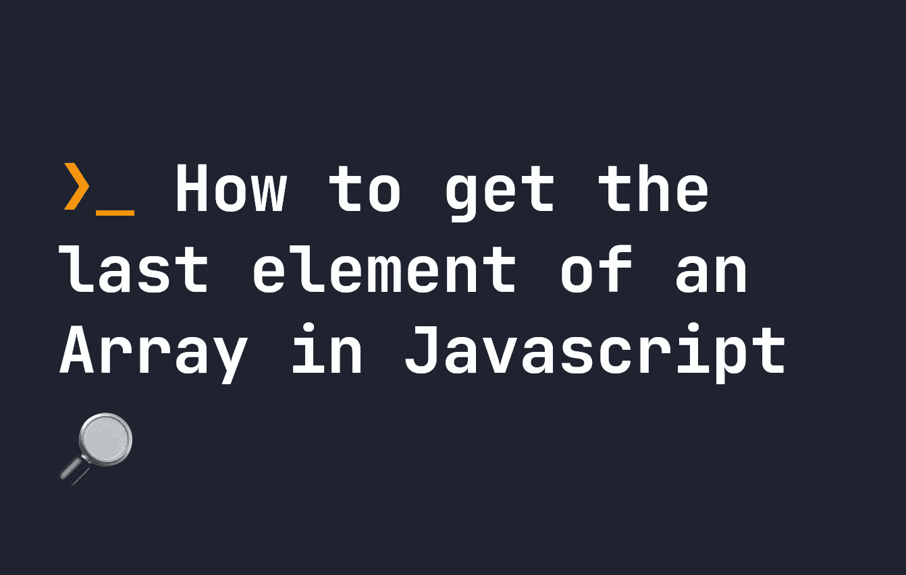

# 如何在 JavaScript 中获取数组的最后一个元素

> 原文：<https://javascript.plainenglish.io/how-to-get-the-last-element-of-an-array-in-javascript-9d5ecb992961?source=collection_archive---------10----------------------->

## 在 JavaScript 中获取数组最后一个元素的两种简单方法。



所以你有一个 JavaScript 数组，你想得到最后一个元素。以这个例子为例:

```
let myArray = [ '🔩', '⚡️', '🔑', '🖇' ]
```

这个数组有 4 个元素——您可能知道，要获取数组中的任何元素，我们可以使用方括号符号`[]`。例如，要获取闪电，我们可以使用`myArray[1]`:

```
let myArray = [ '🔩', '⚡️', '🔑', '🖇' ]
console.log(myArray[1]) // ⚡️
```

因为数组从索引`0`开始，所以第一个元素实际上是`myArray[0]`，以此类推。所以要得到数组的最后一个元素，我们可以使用`myArray.length - 1`。这将得到数组的长度(`4`)，并减去 1，以考虑数组从`0`开始计数。因此，要使用方括号符号获取数组的最后一个元素，我们可以这样做:

```
let myArray = [ '🔩', '⚡️', '🔑', '🖇' ]
console.log(myArray[myArray.length-1]) // 🖇
```

这是获取数组最后一个元素的最常见的方法。但是，您也可以使用`at`方法来做同样的事情:

```
let myArray = [ '🔩', '⚡️', '🔑', '🖇' ]
console.log(myArray.at(myArray.length-1)) // 🖇
```

更好的是，你可以简单地写下`myArray.at(-1)`！这大大简化了将数组的最后一个元素转换成简单表达式的过程:

```
let myArray = [ '🔩', '⚡️', '🔑', '🖇' ]
console.log(myArray.at(-1)) // 🖇
```

如您所料，`at`开始倒计数，因此`at(-2)`将返回密钥:

```
let myArray = [ '🔩', '⚡️', '🔑', '🖇' ]
console.log(myArray.at(-2)) // 🔑
```

[🙇‍♂️:如果你喜欢这个，请考虑支持我](https://www.patreon.com/smpnjn?fan_landing=true)

*更多内容请看*[***plain English . io***](https://plainenglish.io/)*。报名参加我们的* [***免费周报***](http://newsletter.plainenglish.io/) *。关注我们关于*[***Twitter***](https://twitter.com/inPlainEngHQ)[***LinkedIn***](https://www.linkedin.com/company/inplainenglish/)*[***YouTube***](https://www.youtube.com/channel/UCtipWUghju290NWcn8jhyAw)*[***不和***](https://discord.gg/GtDtUAvyhW) *。对增长黑客感兴趣？检查* [***电路***](https://circuit.ooo/) *。***