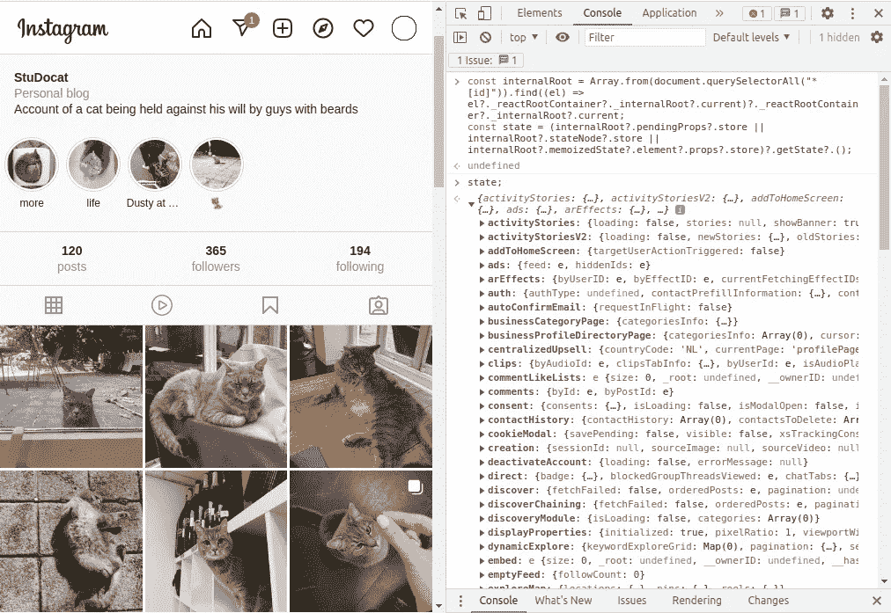

# 如何通过浏览器的控制台从产品构建中获得 Redux 状态

> 原文：<https://javascript.plainenglish.io/how-to-get-the-redux-state-from-a-production-build-via-the-browsers-console-724b830627e6?source=collection_archive---------2----------------------->

## 当您没有为生产启用 redux-devtools 时，您可以在生产上从应用程序中调试 Redux 状态。

有时候你想在生产中调试应用程序的 Redux 状态，但是你没有为生产启用 [redux-devtools](https://github.com/zalmoxisus/redux-devtools-extension) ，那么你能做什么呢？

# TL；速度三角形定位法(dead reckoning)

在浏览器的控制台上运行这个。

# 长篇版本

最近，我不得不在生产中调试一个问题，我需要访问 Redux 状态，所以我遇到了[这个解决方案](https://til-engineering.nulogy.com/Accessing-Redux-Store-Without-Redux-DevTools/)，它需要 [React DevTools](https://github.com/facebook/react-devtools) 安装在浏览器中，这对我来说很有效，但我想知道如何在不使用任何扩展的情况下做到这一点。

经过一番研究后，我发现了堆栈溢出的解决方案,这促使我创建了以下脚本:

运行这个脚本后，所有的 Redux 状态在变量`stores`中都是可用的，您可以通过`[...stores].forEach((store) => store.getState())`访问它们。

下一集再见！

*原发布于*[*https://pablo . gg*](https://pablo.gg/en/blog/coding/how-to-get-the-redux-state-from-a-production-build-via-the-browsers-console/)*。*

*更多内容看* [***说白了。报名参加我们的***](http://plainenglish.io/)***[***免费每周简讯***](http://newsletter.plainenglish.io/) *。在我们的* [***社区***](https://discord.gg/GtDtUAvyhW) *获得独家获得写作机会和建议。****