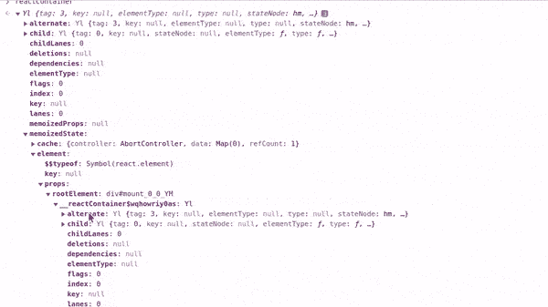

# 通过浏览器的控制台获取 React 18 生产版本中的 Redux 状态

> 原文：<https://javascript.plainenglish.io/how-to-get-the-redux-state-in-a-react-18-production-build-via-the-browsers-console-a01814eebfa8?source=collection_archive---------13----------------------->

## 关于如何通过浏览器控制台在 React18 生产版本中获得 Redux 状态的教程。

几个月前我写了一篇关于[如何在产品](https://pablo.gg/en/blog/coding/how-to-get-the-redux-state-from-a-production-build-via-the-browsers-console/)中获得 Redux 状态的博文，但是随着 React 18 的最新发布，这些代码不再有效。

让我们深入了解为什么它不再有效，并找出如何创建一个有效的新脚本。

# 什么变了？

在 React 17 上，React 容器包含了一个名为`_reactRootContainer`的属性，而 React 18 不再是这种情况，[正如我们在 React 源代码](https://github.com/facebook/react/blob/a724a3b578dce77d427bef313102a4d0e978d9b4/packages/react-dom/src/client/ReactDOMComponentTree.js#L40)中看到的，它现在使用`__reactContainer`作为前缀，最后是一个随机键。

记住这一点，我们可以通过检查 React 容器是否包含以`__reactContainer`开头的属性来尝试找到 React 容器，但在此之前，我们需要找到所有可能成为 React 容器的潜在 DOM 元素。

大多数 React apps 会用一个 HTML `id`来设置容器，然后用`getElementById()`来查询，所以要查询文档中所有带`id`的元素，我们可以用`document.querySelectorAll("*[id]")`。

要查找页面上的所有 React 容器，我们可以运行以下脚本:

搞定了。现在我们所要做的就是找到`_internalRoot`，我们就准备好了，对吗？对吗？

# 不

老实说，第一部分很容易理解，由于我不太熟悉 React 源代码，在尝试了容器元素中所有可用的属性之后，我决定采用惰性解决方案。

好了，我们知道可以通过`getState()`函数获得 Redux 状态，所以我们要做的就是在 React 容器变量中进行树搜索。简单。

谢天谢地，[对于这个](https://gist.github.com/mindplay-dk/1843c267fc633688059dfa5e3b07d0dd)已经有了一个 GitHub 要点，所以我们所要做的就是使它适应我们的情况，所以我们研究一个特定的变量，而不是在`window`。

完成，现在我们可以用`[...stores].map((store) => store.getState())`访问状态。

您可以复制并粘贴以下完整脚本:

下一场见！

*最初发布于*[*https://pablo . gg*](https://pablo.gg/en/blog/coding/how-to-get-the-redux-state-from-a-react-18-production-build-via-the-browsers-console/)*。*

*更多内容看* [***说白了。报名参加我们的***](https://plainenglish.io/) **[***免费周报***](http://newsletter.plainenglish.io/) *。关注我们关于* [***推特***](https://twitter.com/inPlainEngHQ) ，[***LinkedIn***](https://www.linkedin.com/company/inplainenglish/)*，*[***YouTube***](https://www.youtube.com/channel/UCtipWUghju290NWcn8jhyAw)*，以及* [***不和***](https://discord.gg/GtDtUAvyhW) *。***