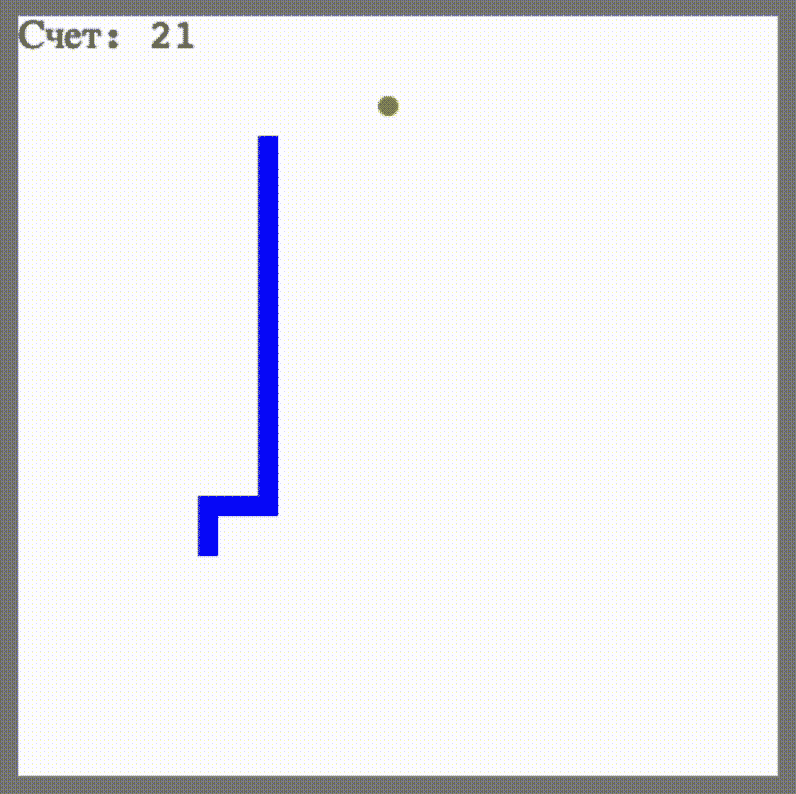
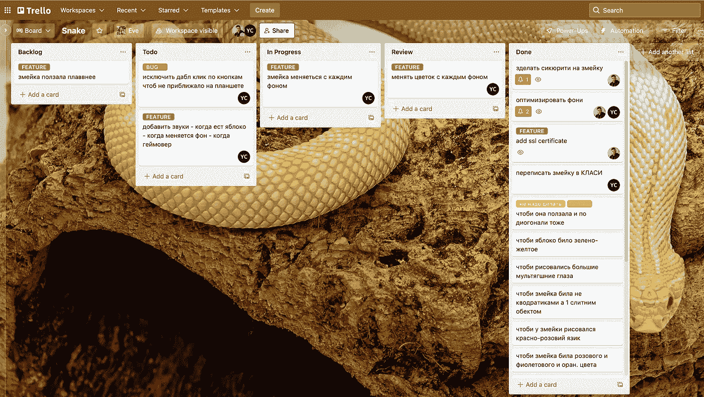
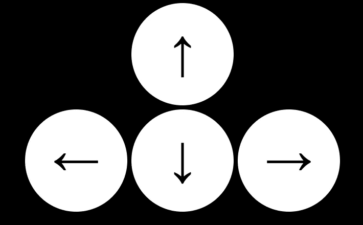
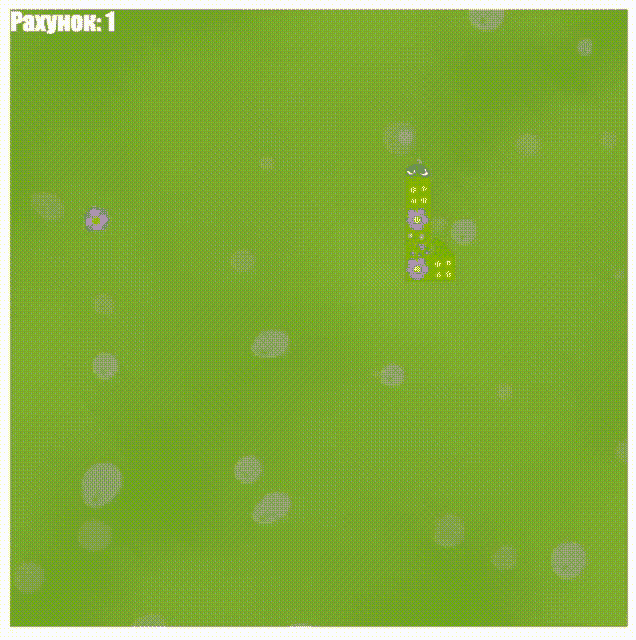

# 如何让孩子对编程感兴趣

> 原文：<https://javascript.plainenglish.io/how-to-get-your-child-interested-in-programming-94ca02712310?source=collection_archive---------15----------------------->

## 我女儿写第一个游戏的经历。

我有一个十岁的女儿。我编程的时候她一直看着我。因此，我决定尝试让她参与到编程的世界中来。今天我就分享一下我女儿写第一个游戏的经历。

她的旅程从《儿童 JavaScript》这本书开始。我们开始慢慢的一天读一两章。我们边走边聊数据类型和她研究的其他话题。

在这一章之后，她在书中有令人兴奋的任务，比如写一个“骂人生成器”或者一个游戏“寻宝”。在这本书的最后，她写了游戏《蛇》:

这本书已经结束了，但改进这条蛇的愿望仍然存在。因此，我为孩子组织了一个完整的工作流程。
首先，我解释了什么是 Git。我在 GitHub 上创建了一个账户，我们在那里进行了第一次提交。在那之后，我们使用 Trello 创建了一个关于“snake”项目的任务板。

我们计划在早餐时开会。讨论晚上散步时的任务和 bug，计划如何改进游戏。所以我们改变了很多事情。首先，我向孩子解释了什么是类和继承，第一个任务是将游戏重写为类。这并没有影响视觉效果，但是代码变得更加清晰和结构化。我们想在平板电脑上玩，所以我们想出了箭头按钮，你可以按下并控制蛇。

增加了一个开始按钮，如果你输了，你可以重新开始关卡

哦对了，我没说我女儿爱画画。我建议她用她会画的画来代替彩色方块。因此，游戏有了新的面貌。然后我们继续进一步发明。

*   "让我们让背景、蛇皮和苹果皮像自然季节一样变化."
*   “让我们给游戏添加声音。”

结果，这条蛇呈现出完全不同的样子，变得像一个真正的电子游戏。当这个孩子看到她的画栩栩如生时，很难描述她的感受。

当然，我帮助了她。设置 CICD 向连接到 CloudFront 的 S3 桶提供游戏的快速新版本，使其可以使用链接在任何设备上玩游戏并与朋友分享。也可以尝试用[这个链接](https://d2a7y15qp50wym.cloudfront.net/)来玩。

## 结论

现在我们继续开发游戏。并且继续学习 HTML 和 CSS，为她创造一些有趣的东西。有了这一切，我想向孩子展示什么是程序员的工作，以及你如何在项目中发展和改进它。并且也给了她很多实际的编程经验。我们也已经在思考接下来要写什么游戏了，所以如果你有什么想法，一定要写在评论里。

所有代码都可以在我女儿的 GitHub 账户上找到。

*更多内容看* [***说白了。报名参加我们的***](https://plainenglish.io/) **[***免费周报***](http://newsletter.plainenglish.io/) *。关注我们关于* [***推特***](https://twitter.com/inPlainEngHQ) *和****[***LinkedIn***](https://www.linkedin.com/company/inplainenglish/)*。查看我们的* [***社区不和谐***](https://discord.gg/GtDtUAvyhW) *加入我们的* [***人才集体***](https://inplainenglish.pallet.com/talent/welcome) *。**