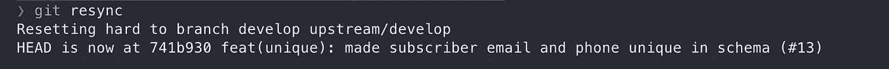

# 如何“变得”善于改变基础

> 原文：<https://javascript.plainenglish.io/how-to-git-good-at-rebasing-42cba815ded5?source=collection_archive---------13----------------------->

## 使用这些 Git 脚本，每天节省几个小时

Git 同时是每个开发人员最好的朋友和最坏的敌人。令人惊讶的是，当我们每天都在使用 Git 时，却有如此多的开发人员在为它而苦恼。Git 不容易掌握；因此，这就是为什么像 [Github Desktop](https://desktop.github.com/) 、 [GitKraken](https://www.gitkraken.com/lp/e1?utm_feeditemid=&utm_device=c&utm_term=best%20git%20tools&utm_campaign=GK+Git+GUI+-+Search+(US)&utm_source=google&utm_medium=ppc&hsa_acc=1130375851&hsa_cam=16449602314&hsa_grp=136834049231&hsa_ad=585374020000&hsa_src=g&hsa_tgt=kwd-156967579504&hsa_kw=best%20git%20tools&hsa_mt=e&hsa_net=adwords&hsa_ver=3) 和其他产品有助于可视化源代码管理。但即使这样，我们中的一些人仍然与 rebase 斗争。在这里，我将向您展示如何在您最喜欢的 IDE 中轻松地使用 Git CLI 重新构建基础并解决合并冲突。


Photo by [Yancy Min](https://unsplash.com/@yancymin?utm_source=medium&utm_medium=referral) on [Unsplash](https://unsplash.com?utm_source=medium&utm_medium=referral)

# 什么是 rebase？

我相信你已经了解了什么是 rebase 以及 rebase 和 merge 之间的区别。我没有复杂的图给你看(因为我觉得没必要)。所以你需要知道的是:

rebase 和 merge 命令都是一种将您的工作和其他人的工作(或您另一个时代的工作)结合起来的方法。不同之处在于，当您将您的特性分支与一个“开发”或者“主”分支合并时，您是将来自共享分支的所有变更合并到您的特性分支中。虽然 rebase 会将您的工作放在一边，用共享分支中的最新变更来更新您的分支，然后将您的工作添加回来，但是如果在相同的文件中有变更，两者都会引入冲突。这是大多数人感到困惑的地方。让我向您展示如何在不破坏代码的情况下有效地解决合并冲突。**提示:您不需要保留您工作的副本，也不需要手动将您的更改添加到新的分支😉**

# 1.设置遥控器

当与多个开发人员一起处理一个项目时。最好是派生存储库，而不是在同一个远程上工作。这是为了防止分支名称冲突和意外地将您的开发代码推入共享分支。我通常将`origin`遥控器作为我的分支，将`upstream`作为共享遥控器。

```
git remote add origin [personal_fork_url]
git remote add upstream [shared_remote_url]
```

# 2.配置 git 合并工具

`git mergetool`是一个 CLI 工具，帮助我们解决终端中的合并冲突。当存在冲突时，运行此命令将打开需要在代码编辑器中解决的文件。默认情况下，它使用`vim`，但我们比它更复杂。让我们配置它使用我们最喜欢的 IDE，VS 代码。

打开 git 配置文件

```
git config --global --edit
```

添加 VS 代码作为合并工具编辑器

```
[merge]
  tool = vscode
[mergetool "vscode"]
  cmd = code --wait $MERGED
```

# 3.Git 重新同步

在使用共享分支重新建立基础之前，您应该首先从该分支获得最新的变更。姑且称这个共享分支`develop`。有些人喜欢打电话给`git pull`，但我喜欢打电话给`git reset`以获得最新的变化。通过对上游分支进行重置，我们将放弃所有的本地更改，并更新本地分支，使其具有与上游分支相同的代码。这将有助于我们避免任何潜在的合并冲突，以及在需要时合并代码的额外提交。为此，我编写了下面的`git resync`脚本。该脚本将从`origin`和`upstream`遥控器获取最新的更改，并用`upstream`分支重置您所在的分支。

让我们将这个脚本存储在一个公共位置，例如`~/git-custom-commands`。然后，我们需要给这个脚本权限，让它作为 bash 脚本执行。

```
cd ~/git-custom-commands
chmod 777 git-resync
```

为了将它作为 git 命令运行，我们需要将文件夹添加到`PATH`，我们可以通过将这一行添加到您的`.zshrc`或`.bashrc`文件来完成。

```
export PATH=$PATH:/Users/[your_username]/Helpers/git-custom-commands
```

此时，您应该能够转到 git 项目并运行`git resync`。



# 4.把它们放在一起

请敲鼓吧…这是我们期待已久的时刻！(Sike！)

在我们开始之前，让我们回顾一下到目前为止我们已经设置的内容:

*   设置 git 远程起点(个人分叉)和上游(共享分叉)
*   配置`git mergetool`使用 VS 代码作为我们的文本编辑器
*   设置`git resync`脚本

现在让我们使用我们的工具。以下是将最新的共享分支(`develop`)重置为特性分支(`feat/medium`)的步骤:

1.  `git checkout develop`
2.  `git resync`
3.  `git checkout feat/medium`
4.  `git rebase develop`
5.  搞定了。(如果没有合并冲突)

如果有合并冲突，那么您将运行`git mergetool`，这将打开 VS 代码和包含冲突的文件。您将解决 VS 代码中的冲突，保存并关闭文件。如果有多个文件有冲突，`git mergetool`会一个接一个地打开它们，直到你解决了所有的冲突。

# 5.推送基于代码

一旦您完成了代码的重新基础化，您需要使用`-f`标志将您的代码强制推送到远程分支。

```
git push origin feat/medium -f
```

这是因为`git rebase`实际上改变了 git 历史，因此来自特性分支的提交将位于来自共享分支的新提交之上。这也将按照时间顺序组织您的提交和其他开发人员的变更。

# 结论

我原以为这篇文章只有一半的长度，但是它提醒了我 Git 实际上有多复杂。我希望上面的技巧可以帮助你克服对 Git rebase 和 Git 的恐惧。如果您有任何问题，请随时联系我们！

不要忘记。去吧。🚀

*更多内容尽在* [***说白了. io***](https://plainenglish.io/) *。报名参加我们的* [***免费周报***](http://newsletter.plainenglish.io/) *。关注我们关于* [***推特***](https://twitter.com/inPlainEngHQ) *和*[***LinkedIn***](https://www.linkedin.com/company/inplainenglish/)*。查看我们的* [***社区不和谐***](https://discord.gg/GtDtUAvyhW) *加入我们的* [***人才集体***](https://inplainenglish.pallet.com/talent/welcome) *。*