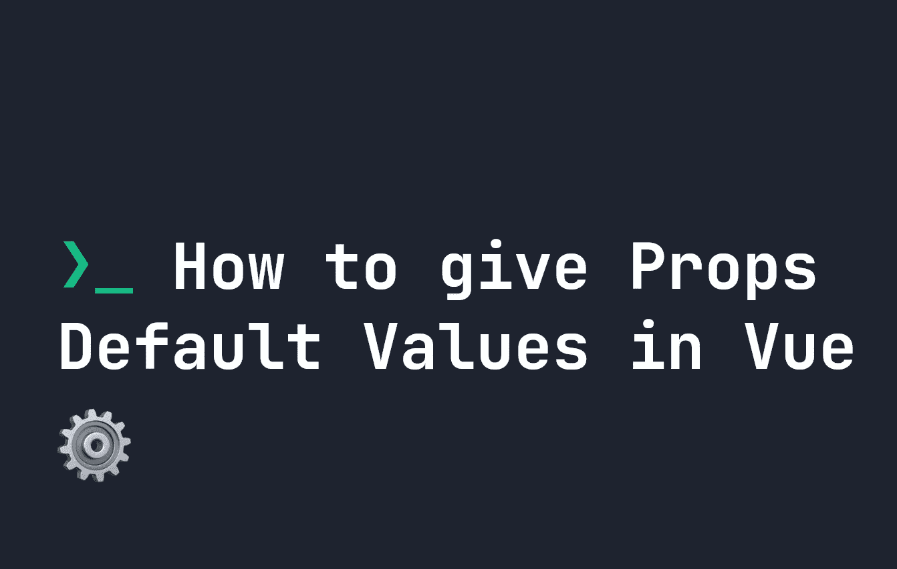

# 如何在 Vue.js 中给道具默认值

> 原文：<https://javascript.plainenglish.io/how-to-give-props-default-values-in-vue-js-993aac2ef0f5?source=collection_archive---------2----------------------->



当我们在 [Vue](https://fjolt.com/category/vue) 中使用组件时，我们经常使用[属性或道具](https://fjolt.com/article/vue-how-do-props-work)将定制的数据片段向下传递给子组件。例如，我们可以告诉我们的子组件，对于这个版本的组件，“名称”被设置为“我的组件”:

```
<Component name="my-component" />
```

如果我们试图在没有`name`属性的情况下调用这个组件，它会在代码中返回`undefined`，或者在 HTML 中显示时没有文本。比方说我们的`Component`长这样:

```
<script>
export default {
    props: {
        name: String
    },
    mounted() {
        console.log(this.name);
    }
}
</script><template>
    <p>
        Hi {{ name }}
    </p>
</template>
```

我们的组件所做的就是定义一个类型为`String`的叫做`name`的道具，并且控制台记录这个属性。它也以`Hi {{ name }}`的形式显示出来。这里唯一的问题是，如果调用组件时`name`未定义，则不会给出默认名称。

# 在 Vue 中设置默认属性值

在 Vue 中设置默认值很容易。如果您使用的是[选项 API](https://fjolt.com/article/vue-composition-api-vs-options-api) ，那么就像将我们的属性扩展到一个对象中一样简单。例如，如果我们希望我们的`name`有一个默认值“**那里**”，那么我们更新我们的道具如下所示:

```
export default {
    props: {
        name: {
            type: String,
            default: "there"
        }
    },
    mounted() {
        console.log(this.name);
    }
}
```

现在，如果没有给出姓名，消息将简单地说“**你好**

# 在合成 API 中设置默认属性值

在 composition API 中，定义 props 使用了`defineProps`函数。该函数遵循与 Options API 上定义的 props 相同的语法。定义一个没有默认值的道具如下所示:

```
import { defineProps } from 'vue';const props = defineProps({
    name: String
});
```

**然后添加一个默认值**，我们扩展`name`来拥有一个默认属性，就像之前一样:

```
import { defineProps } from 'vue';const props = defineProps({
    name: {
        type: String,
        default: "there"
    }
});
```

# 在 Vue 中按要求设置道具

为了避免在属性上设置默认值的需要，我们可以通过使用`required`字段来强制要求一个属性。例如，如果我们想要定义我们的`name`属性，我们只需将`required`设置为`true`:

```
<setup>
import { defineProps } from 'vue';const props = defineProps({
    name: {
        type: String,
        required: true
    }
});
</script>
```

*更多内容请看*[***plain English . io***](https://plainenglish.io/)*。报名参加我们的* [***免费周报***](http://newsletter.plainenglish.io/) *。关注我们关于*[***Twitter***](https://twitter.com/inPlainEngHQ)*和*[***LinkedIn***](https://www.linkedin.com/company/inplainenglish/)*。加入我们的* [***社区不和谐***](https://discord.gg/GtDtUAvyhW) *。*