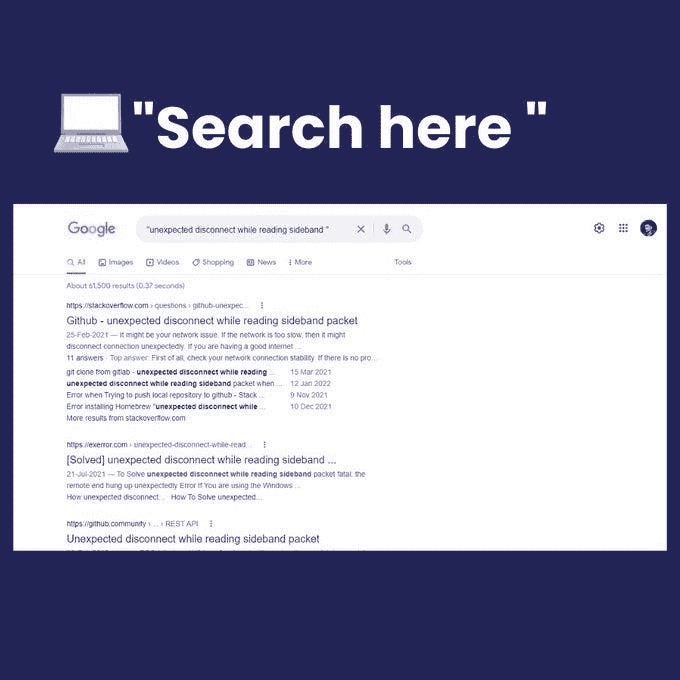
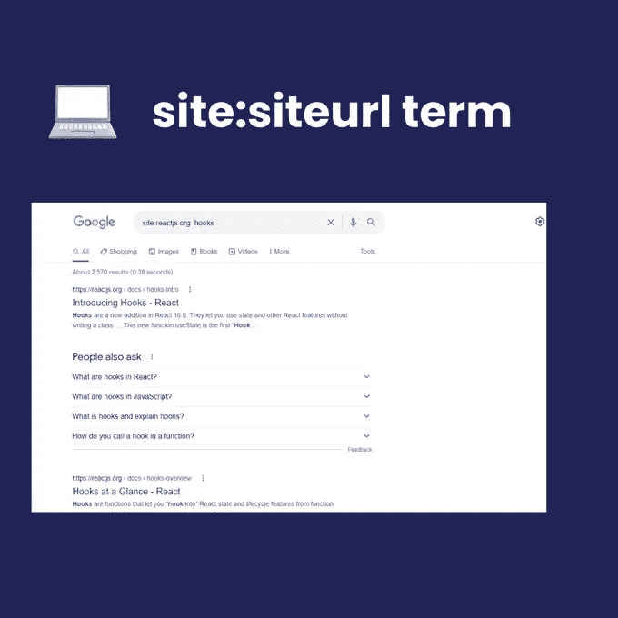
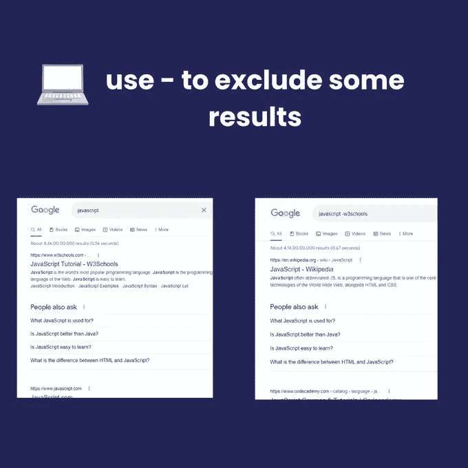
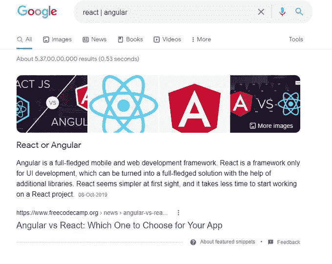
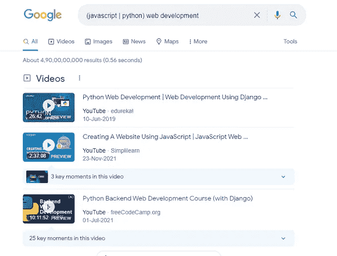
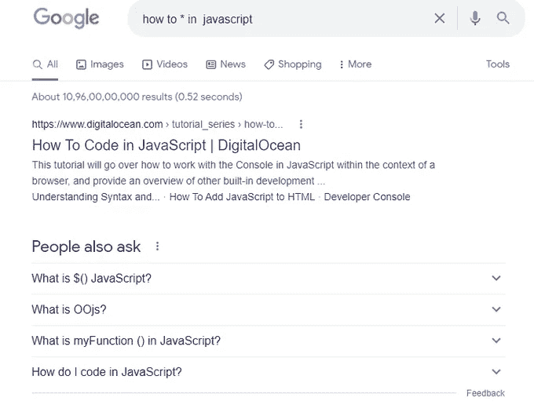

# 如何像专业人士一样“谷歌一下”

> 原文：<https://javascript.plainenglish.io/how-to-google-it-like-a-pro-42753b0755d0?source=collection_archive---------9----------------------->

## 开发者们，这是给你们的

[source](https://www.pexels.com/photo/orange-safety-ring-on-man-shoulder-near-body-of-water-319930/)

谷歌搜索对个人和开发者来说都是最必要的技能。它帮助我们获取信息，即相关信息，只需几个额外的字符串。

以下是最好的谷歌模仿技术:

## 1.精确匹配

使用" "(双引号)来精确匹配您的搜索词。

## 2.从特定网站获取结果。

使用 site:siteurl your_search_term 从特定站点获取

## 3.排除一些结果

使用—排除一些结果术语。

## 4.特定日期前后

使用 after:year 或 before:year 获取特定年份之前或之后的结果

## 5.非此即彼

使用|(管道)搜索任何一个给定的术语。

## 6.(这样或那样)还有这个

使用(A | B) C 得到一个与 A & B 都有联系的结果 C

## 7.通配符

使用*返回搜索词的所有匹配组合。

➱使用“相关:术语”来查找相似的网站；➱使用“位置:关键字”来根据位置进行过滤；➱使用“vs”来比较两个术语

就是这样&像专业人士一样使用谷歌还有很多技巧🔥

# 结束了！

祝贺你走到这一步！你是一个了不起的读者！！

这些是您可以用来获得准确结果的许多技巧中的一些。如果你知道更多，请在评论中告诉我。

如果你想深入了解 [CSS flexbox](https://gumroad.com/a/381209427/GHwFS) ，看看这本[电子书](https://gumroad.com/a/381209427/GHwFS)

在这里关注我:) [Adarsh gupta](https://medium.com/u/4323d7b9f6b1?source=post_page-----42753b0755d0--------------------------------) 以及在 [Twitter](http://twitter.com/adarsh____gupta) 上。

如果你愿意，你可以给我买杯茶来支持我。

*更多内容请看*[***plain English . io***](https://plainenglish.io/)*。报名参加我们的* [***免费周报***](http://newsletter.plainenglish.io/) *。关注我们上*[***Twitter***](https://twitter.com/inPlainEngHQ)[***LinkedIn***](https://www.linkedin.com/company/inplainenglish/)*[***YouTube***](https://www.youtube.com/channel/UCtipWUghju290NWcn8jhyAw)**和* [***不和***](https://discord.gg/GtDtUAvyhW) *对成长黑客感兴趣？检查* [***电路***](https://circuit.ooo/) ***。*****