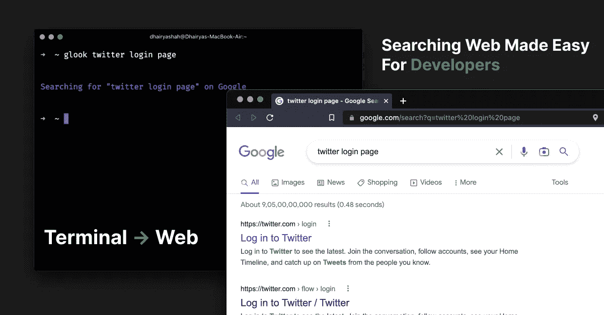

# 如何从终端谷歌搜索

> 原文：<https://javascript.plainenglish.io/how-to-google-search-from-the-terminal-72207021bad2?source=collection_archive---------9----------------------->



最初发表在我的[博客](https://www.dhairyashah.dev/posts/how-to-google-search-from-the-terminal)上的博文。

作为开发人员，我们大部分时间都在使用终端。该终端在节省时间和提高生产率方面表现出色，例如在创建文件或执行复杂任务时。

你想过直接从终端搜索谷歌吗？

在这篇文章中，我将向您展示一种简单易行的方法，直接从终端使用谷歌搜索。

# 先决条件

*   [*节点 JS 安装在*机器上](https://nodejs.org/en/)。

先决条件列表中没有太多内容:)

# 让我们像开发者一样用谷歌搜索

*   步骤 1:安装 npm 软件包

```
$ npm i -g glook
```

*   第二步:所有的事情都已经准备好了

```
$ glook SEARCH_TERM
```

现在，你可以从终端直接谷歌搜索。

欲了解更多信息，请访问[*glook . dhairyashah . dev*](https://glook.dhairyashah.dev/)

# 感谢阅读

关注我的 [*推特*](https://www.dhairyashah.dev/twitter)

感谢阅读！

*更多内容看* [***说白了就是***](https://plainenglish.io/) *。报名参加我们的* [***免费周报***](http://newsletter.plainenglish.io/) *。关注我们* [***推特***](https://twitter.com/inPlainEngHQ) ，[***LinkedIn***](https://www.linkedin.com/company/inplainenglish/)*，*[***YouTube***](https://www.youtube.com/channel/UCtipWUghju290NWcn8jhyAw)*，*[*不和*](https://discord.gg/GtDtUAvyhW) *。对增长黑客感兴趣？检查出* [***电路***](https://circuit.ooo/) *。*