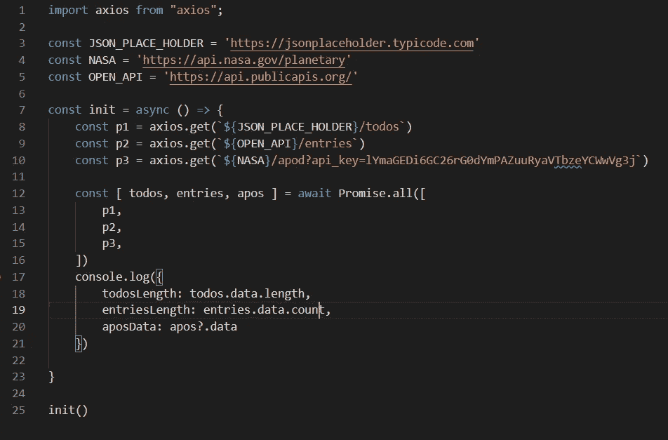
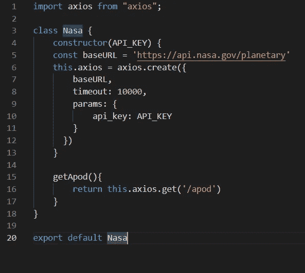
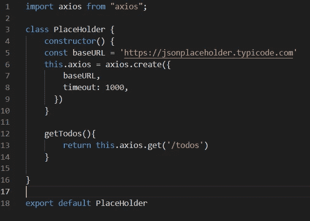
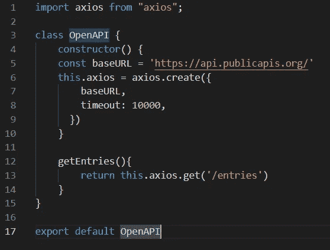
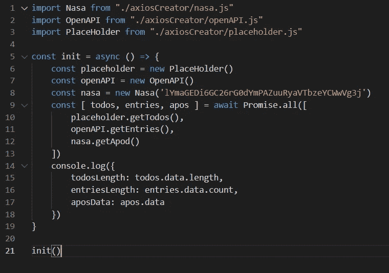

# 如何处理 Axios 和 Node.js 中的不同端点

> 原文：<https://javascript.plainenglish.io/how-to-handle-different-endpoints-in-axios-and-nodejs-8b288d92e940?source=collection_archive---------2----------------------->

## 为 Axios 创建基于类的实例，并有效地使用它们。

Photo by [Arawark chen](https://unsplash.com/@arawark?utm_source=medium&utm_medium=referral) on [Unsplash](https://unsplash.com?utm_source=medium&utm_medium=referral)

# Axios

Axios 是一个基于 JS 和 Promise 的库，它可以帮助任何给定 HTTP 客户端的服务器发出 HTTP 请求。它可以通过`npm i axios`安装，并在任何 JS 应用程序中使用。

几乎所有需要创建 HTTP 的应用程序都在使用某种 HTTP 客户端，Axios 是这场竞赛中的主要参与者之一。这篇文章将关注一个非常小的主题，但是对于如何在 Axios 项目中处理不同的域非常有效。

## 开始

让我们创建一个小节点应用程序，并假设它必须进行几次 API 调用来从不同的域获取数据，并且在调用之前，每个 API 调用都有一组授权。

我们将调用三种服务:

*   JSON 占位符
*   公共 API
*   NASA 公共 API(受保护)

## 方法 I —将其作为常量传递

方法 1 非常简单，用基本 URL 名称创建几个变量，然后一起传递

Approach I example

这里，我们声明了基本 URL 的常量变量，并把它附加到我们想要的 URL 上。这里的挑战是，我们必须在所有请求中重复配置，这不会非常通用。

## 方法二——为实例创建类

现在让我们创建一个 Axios 类的类实例，我们可以为每个类创建一个单独的方法和配置。当我说配置时，这意味着我们可以定义自定义 Axios 路径，并默认为类级别。

这种方法的一个例子是 Nasa 的类，它将为 Axios 定制默认值。

Nasa.js file with custom Axios instance

这里，我们将 API_KEY 作为构造函数参数，它将实例化 Axios 实例，并将其附加到类变量 Axios 中，默认参数包括 baseURL、timeout 和 api_key。

如果你仔细观察这个方法，你会发现我们调用的不是 Axios，而是我们在类变量中从它创建的实例。

同样的方法还有几个例子。

**Placeholder.js**

Placeholder API similar to Nasa

**OpenAPI.js**

OpenAPI example similar to Nasa and Placeholder

## 方法的使用

要使用我们刚刚创建的类，我们可以简单地创建一个方法来执行它们。就像下面的例子:

usage of the classes including Nasa, Placeholder and OpenAPI

## 结论

人们喜欢他们自己的版本，但是我个人建议使用基于类的方法，这种方法可以让你对提取和方法暴露有更多的控制。你可以在这里找到整个项目的源代码。

## **打字稿版本**

对于类的 typescript 版本，您可以从 repo 中访问 [Gumroad.ts](https://github.com/Piyush-Use-Personal/axios-class-instances/blob/main/axiosCreator/gumroad.ts) 文件来创建增强的类。

希望你喜欢这篇文章，并从中学到一些好的东西。

*更多内容请看*[***plain English . io***](https://plainenglish.io/)*。报名参加我们的* [***免费周报***](http://newsletter.plainenglish.io/) *。关注我们关于*[***Twitter***](https://twitter.com/inPlainEngHQ)*和**[***LinkedIn***](https://www.linkedin.com/company/inplainenglish/)*。加入我们的* [***社区***](https://discord.gg/GtDtUAvyhW) *。**