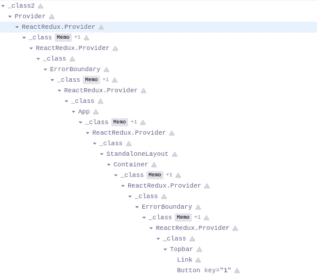
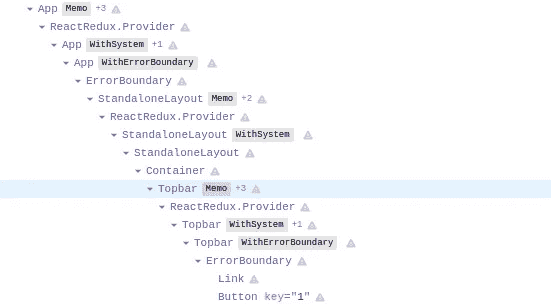

# 如何处理 SwaggerUI 中的错误

> 原文：<https://javascript.plainenglish.io/how-to-handle-errors-in-swaggerui-2e2f5344acb?source=collection_archive---------19----------------------->

## SwaggerUI 中的错误处理指南。


SmartBear Software, Inc.

错误处理是当今现代单页面应用程序的一个重要方面。错误处理指的是对不同种类错误的预测、检测和解决。从版本[*v 4 . 3 . 0*](https://www.npmjs.com/package/swagger-ui/v/4.3.0)*，* [*开始，SwaggerUIs*](https://github.com/swagger-api/swagger-ui)*错误处理能力有了很大的提高，并允许 swaggeri 集成器轻松集成他们的自定义错误处理程序。*

最初的 SwaggerUI 错误处理包括用命令性的`try/catch`语句包装每个类组件的每个 render 方法，并在抛出错误时显示`Fallback`组件。除了显示回退组件，`console.error`还用于在浏览器控制台中显示捕获的错误。这个解决方案需要将每个功能组件包装成类组件，以确保组件具有`render`方法。

React 16 引入了一个[错误边界](https://reactjs.org/docs/error-boundaries.html)的新概念。不再需要创建一个定制的解决方案来捕捉 React 应用程序中的错误，因为我们有一个标准化的方法来做这件事。

为了充分利用新的错误边界，我不得不重写 swagger ui[视图插件](https://github.com/swagger-api/swagger-ui/tree/master/src/core/plugins/view)，所有其他插件都基于它。引入了一个叫做`safe-render`的新插件，允许对 SwaggerUI 组件应用可配置的错误边界。

## 查看插件

视图插件**公共 API 没有改变**，我只是添加了一个额外的 util 函数`getDisplayName`，用于访问 React 组件名称。

```
{
  rootInjects: {
    getComponent: memGetComponent,
    makeMappedContainer: memMakeMappedContainer,
    render: render(getSystem, getStore, getComponent, getComponents),
  },
  fn: {
    getDisplayName,
  },
}
```

`view`插件不再负责错误处理逻辑。重写插件有几个积极的副作用，比如使 SwaggerUI 渲染更快，简化 React 开发工具中的 React 组件树:



Before refactor



After refactor

## 安全渲染插件

这个插件单独负责 SwaggerUI 中的错误处理逻辑。接受应受错误边界保护的组件名称列表。

它的公共 API 如下所示:

```
{
  fn: {
    componentDidCatch,
    withErrorBoundary: withErrorBoundary(getSystem),
  },
  components: {
    ErrorBoundary,
    Fallback,
  },
}
```

安全渲染插件由[基础](https://github.com/swagger-api/swagger-ui/blob/78f62c300a6d137e65fd027d850981b010009970/src/core/presets/base.js)和[独立](https://github.com/swagger-api/swagger-ui/tree/78f62c300a6d137e65fd027d850981b010009970/src/standalone) SwaggerUI 预设自动使用，并且应该始终作为最后一个插件使用，因为所有组件都已经为 SwaggerUI 所知。该插件定义了应受错误边界保护的默认组件列表:

```
[
  "App",
  "BaseLayout",
  "VersionPragmaFilter",
  "InfoContainer",
  "ServersContainer",
  "SchemesContainer",
  "AuthorizeBtnContainer",
  "FilterContainer",
  "Operations",
  "OperationContainer",
  "parameters",
  "responses",
  "OperationServers",
  "Models",
  "ModelWrapper",
  "Topbar",
  "StandaloneLayout",
  "onlineValidatorBadge"
]
```

如下所示，通过使用带有配置选项的安全渲染插件，可以保护额外的组件。如果你是一个 SwaggerUI 集成者，并且你维护着一些带有额外定制组件的插件，这将变得非常方便。

```
const swaggerUI = SwaggerUI({
  url: "[https://petstore.swagger.io/v2/swagger.json](https://petstore.swagger.io/v2/swagger.json)",
  dom_id: '#swagger-ui',
  plugins: [
    () => ({
      components: {
        MyCustomComponent1: () => 'my custom component',
      },
    }),
    SwaggerUI.plugins.SafeRender({
      fullOverride: true, // only the component list defined here will apply (not the default list)
      componentList: [
        "MyCustomComponent1",
      ],
    }),
  ],
});
```

## componentDidCatch

这个静态函数在组件抛出错误后被调用。
它接收两个参数:

1.  `error` -抛出的错误。
2.  `info` -具有 componentStack 键的对象，该键包含关于哪个组件抛出了错误的[信息。](https://reactjs.org/docs/error-boundaries.html#component-stack-traces)

它与错误边界[componentiddcatch 生命周期方法](https://reactjs.org/docs/react-component.html#componentdidcatch)具有完全相同的签名，除了它是一个静态函数而不是一个类方法。

componentDidCatch 的默认实现使用`console.error`来显示收到的错误:

```
export const componentDidCatch = console.error;
```

为了利用您自己的错误处理逻辑(例如 [bugsnag](https://www.bugsnag.com/) ，创建一个新的 SwaggerUI 插件来覆盖 componentDidCatch:

```
**const** BugsnagErrorHandlerPlugin **=** () **=>** {
  *// init bugsnag*

  **return** {
    fn: {
      componentDidCatch **=** (error, info) **=>** {
        Bugsnag.notify(error);
        Bugsnag.notify(info);
      },
    },
  };
};
```

## withErrorBoundary

该功能是特设的(高阶组件)。它将一个特定的组件包装到`ErrorBoundary`组件中。可以通过一个插件系统覆盖它，以控制 ErrorBoundary 组件如何包装组件。在 99.9%的情况下，你不需要重写这个函数，但是如果你要重写，请先阅读这个函数的源代码。

## 撤退

当错误边界捕捉到错误时，将显示该组件。它可以通过插件系统被覆盖。它的默认实现很简单:

```
import React from "react"
import PropTypes from "prop-types"const Fallback = ({ name }) => (
  <div className="fallback">
    😱 <i>Could not render { name === "t" ? "this component" : name }, see the console.</i>
  </div>
)
Fallback.propTypes = {
  name: PropTypes.string.isRequired,
}
export default Fallback
```

请随意覆盖它以符合您的外观和感觉:

```
const CustomFallbackPlugin = () => ({
  components: {
    Fallback: ({ name } ) => `This is my custom fallback. ${name} failed to render`,
  },
});const swaggerUI = SwaggerUI({
  url: "[https://petstore.swagger.io/v2/swagger.json](https://petstore.swagger.io/v2/swagger.json)",
  dom_id: '#swagger-ui',
  plugins: [
    CustomFallbackPlugin,
  ]  
});
```

## 误差边界

这是实现 React 错误边界的组件。使用引擎盖下的`componentDidCatch`和`Fallback`。在 99.9%的情况下，您不需要覆盖这个组件，但是如果您需要，请先阅读这个组件的源代码。

## 行为的改变

在 SwaggerUI 的早期版本中，几乎所有的组件都受到了保护，当抛出错误时，会显示`Fallback` component。这在 SwaggerUI v4.3.0 中有所改变。现在只有由`safe-render`插件定义的组件受到保护并显示回退。如果 SwaggerUI React 组件树中某处的一个小组件无法呈现并抛出一个错误，该错误会冒泡到最近的错误边界，该错误边界会显示`Fallback`组件并调用`componentDidCatch`。

如果你对更多的技术细节感兴趣，这里是在 SwaggerUI 中引入新的错误处理的 [PR](https://github.com/swagger-api/swagger-ui/pull/7761/files) 。

*原载于 2022 年 1 月 25 日 https://vladimirgorej.com**[*。*](https://vladimirgorej.com/blog/swagger-ui-error-handling/)*

**更多内容看* [***说白了就是***](http://plainenglish.io/) *。报名参加我们的* [***免费周报***](http://newsletter.plainenglish.io/) *。在我们的* [***社区不和谐***](https://discord.gg/GtDtUAvyhW) *获得独家获取写作机会和建议。**