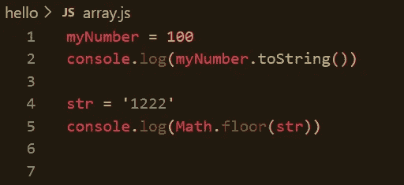

# 如何处理数字和字符串之间的 JavaScript 类型转换

> 原文：<https://javascript.plainenglish.io/how-to-handle-javascript-type-conversion-between-numbers-and-strings-3ca7ba47e5c7?source=collection_archive---------5----------------------->

在 JavaScript 中，你可以将一个数字表示为类型 ***数字*** (例如。`12`)，或者作为类型 ***字符串*** (例如。`'12'`)。有时在编码时，我们可能不得不将数据从一种类型转换成另一种类型。我想列举一些我所知道的从数字到字符串的数据转换方法，反之亦然。



# 数字到字符串

## 1.使用 toString()方法

有一个默认的字符串方法将数据转换为字符串。 *toString()* 方法返回字符串对象的值。

```
myNumber = 100
myNumber.toString() // expected result: '100'noNumber = NaN
noNumber.toString() // expected result: 'NaN'decNum = 122.33
decNum.toString() // expected result: "122.33"
```

## 2.使用字符串()

`String()`方法为传递给它的数字创建一个原始的字符串类型。

```
myNumber = 99
String(myNumber) // expected result: '99'fltNumber = 25.54
String(fltNumber) // expected result: '25.54'
```

## 3.连接空字符串

向数字值添加空字符串会将数据转换为字符串是完成这项工作最简单的方法之一。在性能上也算是比上面两个快。

```
myNumber = 22
myString = '' + myNumber // expected result: '22'fltNumber = 25.54
fltString = '' + fltNumber // expected result: '25.54'
```

## 4.模板字符串

随着 ES6 中*模板字符串*的引入，在字符串中注入数字是解析`Integer`或`Float`数据类型的有效方式。这是将数字转换为字符串的最快方法。

```
myNumber = 22
flt = 50.205;string = `${num}`;      *//* expected result: *'50'* 
floatString = `${flt}`; *//* expected result: *'50.205'*
```

## 5.使用 toFixed()方法

这是最不为人知的方法。但是十进制数字可能有点棘手。

```
myNumber = 22
myNumber.toFixed() // expected result: '22'a = 56.9887
a.toFixed() // expected result: '57'
a.toFixed(4) // expected result: '56.9887'
```

[这里的](https://i.stack.imgur.com/mPxVd.png)是说到性能的方法对比。

# 字符串到数字

## 1.使用 parseInt()

`parseInt()`解析字符串并返回整数。允许有空格。只返回第一个数字。

```
myString = '129' 
console.log(parseInt(myString)) // expected result: 129
```

## 2.使用数字()

`Number()`可用于将 JavaScript 变量转换为数字。我们可以用它将字符串转换成数字。

如果该值不能转换为数字，则返回 ***NaN*** 。

```
Number("10");          // returns 10
Number(" 10  ");       // returns 10
Number("10.33");       // returns 10.33
```

## 3.使用一元运算符(+)

一元加运算符(`+`)位于其操作数之前，计算其操作数，但试图将其转换为数字，如果它还不是数字的话。

```
const x = 25;
const y = -25;console.log(+x); // expected output: 25console.log(+y); // expected output: -25console.log(+''); // expected output: 0
```

## 4.使用 parseFloat()

`parseFloat()`解析一个字符串并返回一个数字。允许有空格。只返回第一个数字:

```
parseFloat("10");        // returns 10
parseFloat("10.33");     // returns 10.33
parseFloat("10 20 30");  // returns 10
parseFloat("10 years");  // returns 10
parseFloat("years 10");  // returns NaN
```

## 5.使用 Math.floor()

`**Math.floor()**`函数返回小于或等于给定数字的最大整数。

```
str = '1222'
console.log(Math.floor(str)) // returns 1222
```

## 6.与数字相乘

将字符串值乘以 **1** 不会改变值，默认情况下也会转换为数字。

```
str = '2344'
console.log(str * 1) // expected result: 2344
```

## 7.双颚化符(~~)运算符

我们可以使用双颚化符运算符将字符串转换为数字。

```
str = '1234'
console.log(~~str) // expected result: 1234negStr = '-234'
console.log(~~negStr) // expected result: -234
```

[这里的](https://i.stack.imgur.com/PXxhB.png)是所提到的方式的性能方面的比较。如果你知道更多的方法，请在下面评论。

谢谢大家！

*更多内容看* [***说白了。报名参加我们的***](https://plainenglish.io/) **[***免费周报***](http://newsletter.plainenglish.io/) *。关注我们关于*[***Twitter***](https://twitter.com/inPlainEngHQ)[***LinkedIn***](https://www.linkedin.com/company/inplainenglish/)*[***YouTube***](https://www.youtube.com/channel/UCtipWUghju290NWcn8jhyAw)***，以及****[***不和***](https://discord.gg/GtDtUAvyhW) ****