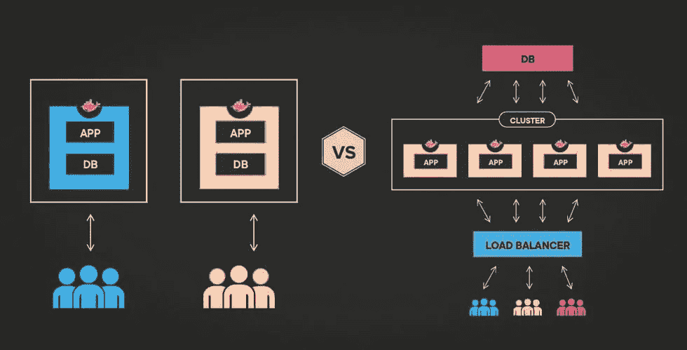
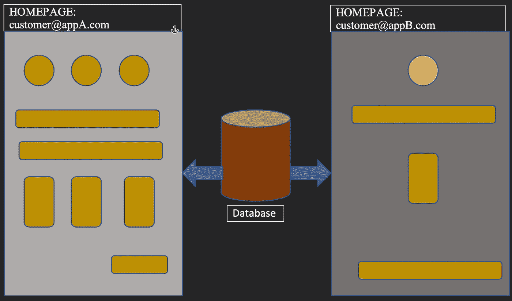

# 如何处理共享单个数据库的多租户前端

> 原文：<https://javascript.plainenglish.io/how-to-handle-multi-tenant-front-ends-sharing-a-single-database-1db9c74c216e?source=collection_archive---------9----------------------->

嗨伙计们！在本文中，我们将探讨什么是多租户前端，以及我们如何为共享单个数据库的前端实现多租户。



# 什么是软件开发中的多租户？

一个软件应用服务于多个不同的用户组，同时共享运行软件的单个实例，这被称为[多租户](https://techpearl.com/blog/building-a-multi-tenant-system-using-postgresql-and-django/)。从数据库的角度来看，这意味着多个应用程序使用一个数据库实例。

[多租户](https://docs.microsoft.com/en-us/azure/architecture/guide/multitenant/considerations/tenancy-models)有三种类型:

1.共享一切:所有的资源，包括基础设施，数据库共享。

2.单租户数据库:每个租户有一个不同的数据库。

3.单租户应用程序:共享同一个数据库。

# 单租户应用程序

今天，我们将关注最简单但最方便的多租户形式:一个单租户应用程序，其中我们将共享同一个数据库以供以功能为中心的应用程序使用。

让我们假设我们的应用程序运行在 customer@appA.com。现在，我们需要显示/隐藏某些功能，并在不同的域(如 customer@appB.com)运行该应用程序，因为两个域共享同一个数据库。让我们想象一下:



# 识别应用程序

因为我们的实现是以功能为中心的，定制是在运行时进行的，所以可以肯定地说，我们可以为运行在两个不同域的应用程序实例使用一个单一的构建。

所以现在我们的第一个目标应该是识别哪个应用程序实例正在被服务。这可以通过以下一种或两种方法实现:

1.在运行时识别域名。

2.从响应头获取应用名称/域。

# 在运行时识别域名

```
const hostName = window.location.hostname;// remove any subdomains
const domain = hostName.match(/^(?:.*?\.)?([a-zA-Z0-9\-_]{3,}\.(?:\w{2,8}|\w{2,4}\.\w{2,4}))$/)[1];// validate the domain for security reasons
if([<domain list>].includes(domain)) {
   switch(domain) { 
    case 'appB':
    default: 
  }
}
```

# 从标题中获取应用名称/域

我们还可以从标题下的[负载平衡器](https://www.f5.com/services/resources/glossary/load-balancer#:~:text=A%20load%20balancer%20is%20a,users)%20and%20reliability%20of%20applications.)端设置应用程序名称。然后，我们也可以从服务器端读取应用程序/域名，并相应地编写逻辑。

```
const appName = req?.headers?.appName
```

上述方法的缺点是，为了进行功能定制，我们需要在每次进行更改时重新部署应用程序。
这可以通过使用像[launch darky](https://launchdarkly.com/)这样的第三方特性管理工具来克服。

# 黑暗地使用 launch

1.  当处理 Node.js 特性时

`import as LD from 'launchdarkly-node-client-sdk'`

```
*const* client = LD.initialize(secretId, { key: '' });await client.waitForInitialization();
*this*.allFeatures = ldClient.allFlags();
```

2.处理 JS 特性时
`import { initialize } from 'launchdarkly-js-client-sdk'`

```
const client = initialize(secretId, {
  custom: { 
    domain: window.location.hostname,
  },
});client.waitForInitialization().then(() => {
  this.featureFlags = client.allFlags();
});
```

现在，在 launch crystally 平台下，我们可以读取域名并将标志状态传输到我们的前端。好消息是，我们可以在运行时改变特性标志的状态，例如，当我们的应用程序正在运行时。

这次到此为止。请在评论中提出你的任何建议。感谢阅读！

*更多内容看* [***说白了。报名参加我们的***](https://plainenglish.io/) **[***免费周报***](http://newsletter.plainenglish.io/) *。关注我们关于*[***Twitter***](https://twitter.com/inPlainEngHQ)*和*[***LinkedIn***](https://www.linkedin.com/company/inplainenglish/)*。加入我们的* [***社区***](https://discord.gg/GtDtUAvyhW) *。***