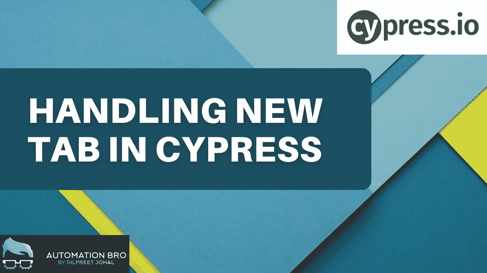

# 如何在 Cypress 中处理新标签

> 原文：<https://javascript.plainenglish.io/how-to-handle-new-tabs-in-cypress-fe768d13f357?source=collection_archive---------2----------------------->

## Cypress 不支持新标签的解决方法。



在本帖中，我们将学习如何在 Cypress 中处理新标签。默认情况下，Cypress 不支持新的选项卡，我们将研究一个变通方法来解决这个问题。

# 为什么 Cypress 不支持第二个 tab？

Cypress 测试在浏览器中运行，因此它将测试注入到第一个窗口/标签中；选项卡之外的任何内容，Cypress 都无法访问。

这是 Cypress 团队的设计决定，即使在将来，他们也不会支持多标签。

# 如何在 Cypress 中处理新标签页？

好的，我们知道 Cypress 不支持新标签页，但是如果你的应用程序在新标签页中打开链接，你会怎么处理这种情况呢？嗯，我们将需要做一些变通办法来让这个工作。

首先，理解网站如何打开第二个标签页是很重要的。这是两种常见的方式:

*   使用`target="_blank"`属性*(最常见)*
*   使用 JavaScript 重定向

# 处理`target`属性

```
<a href="/contact" target="_blank" role="button" id="contact-us">
```

当浏览器在一个链接上看到`target="_blank"`时，它会自动知道在一个新标签中打开这个链接。我们可以利用这一点，从链接中删除`target`属性，然后浏览器将在同一个选项卡中打开链接。

```
it('Handling new tab', () => {
    cy
      .get('#contact-us')
      .invoke("removeAttr", "target")
      .click() // will open the contact page in a new tab
    cy.get("h1").should("have.text", "Contact");
  })
```

我们使用`invoke`方法从链接元素中移除`target`属性，该属性触发浏览器在同一个选项卡中打开链接。

# 处理 JavaScript 重定向

对于 JavaScript 重定向，您需要理解重定向是如何完成的，并在此基础上实现一个解决方案。这是一个很好的[链接](https://glebbahmutov.com/blog/cypress-second-tab/)供 Gleb Bahmutov 参考，它提供了处理这种情况的各种解决方案。

**要了解更多关于如何在 Cypress 中处理新标签页的信息，请观看下面的视频:**

📧订阅我的[邮件列表](https://automationbro.com/mailing-list)以获取更多类似的内容，并成为令人惊叹的免费赠品的一部分。

👍你也可以在这里关注我的内容

*   [推特](https://twitter.com/automationbro)
*   [领英](https://www.linkedin.com/company/automation-bro)

*更多内容请看*[***plain English . io***](https://plainenglish.io/)*。报名参加我们的* [***免费周报***](http://newsletter.plainenglish.io/) *。关注我们关于*[***Twitter***](https://twitter.com/inPlainEngHQ)[***LinkedIn***](https://www.linkedin.com/company/inplainenglish/)*[***YouTube***](https://www.youtube.com/channel/UCtipWUghju290NWcn8jhyAw)*[***不和***](https://discord.gg/GtDtUAvyhW) *。对增长黑客感兴趣？检查* [***电路***](https://circuit.ooo/) *。***