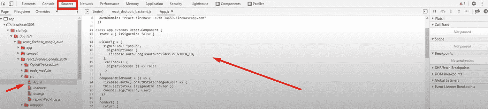
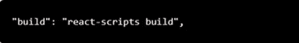
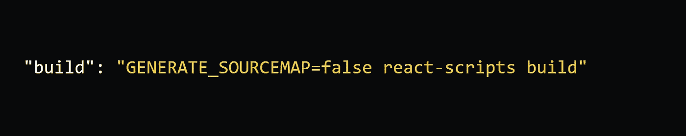
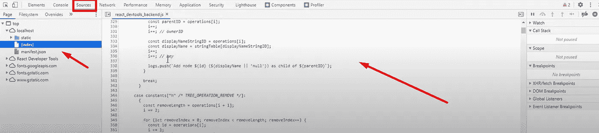

# 如何在 React 中隐藏网站源代码

> 原文：<https://javascript.plainenglish.io/how-to-hide-website-source-code-in-react-js-77164d474324?source=collection_archive---------0----------------------->

## 在 React 中隐藏网站源代码的简短指南。

成长的关键是将更高维度的意识引入我们的意识中老子


**请给我一个跟随。:)**

我最近在 React 开发中遇到的问题是，当我打开控制台进行检查，然后导航到 Source 选项卡时，我看到所有的网站代码都可以看到。你可以直接打开控制台就能看到所有的网站代码。为了防止这种情况，我做了一些研究，并提出了一个非常简单的解决方案，只需要几分钟就可以完成。

在这篇文章中，我将解释我如何在 React 中隐藏我的网站的源代码。



只需导航到您的 *package.json* 文件，并在脚本中找到 build 标记，如果之前没有更改，默认值如下所示:



只需如下所示进行更改:



如果您正在运行应用程序，这里的最后一步只是关闭本地主机，然后运行命令:

```
npm run build
```

运行命令并构建应用程序后，只需继续检查运行应用程序的本地主机，打开控制台并导航到源代码，您会看到没有源代码，只有一个简单的 JavaScript 文件。



那都是我送的。希望这篇文章对你有帮助:)

如果你想在 LinkedIn 上联系，请点击下面的链接。

[AKIN KARAYUN | LinkedIn](https://www.linkedin.com/in/akin-karayun-ab3239bb/)

*更多内容看* [***说白了。报名参加我们的***](https://plainenglish.io/) **[***免费周报***](http://newsletter.plainenglish.io/) *。关注我们关于* [***推特***](https://twitter.com/inPlainEngHQ) ，[***LinkedIn***](https://www.linkedin.com/company/inplainenglish/)*，*[***YouTube***](https://www.youtube.com/channel/UCtipWUghju290NWcn8jhyAw)*，以及* [***不和***](https://discord.gg/GtDtUAvyhW) *。***