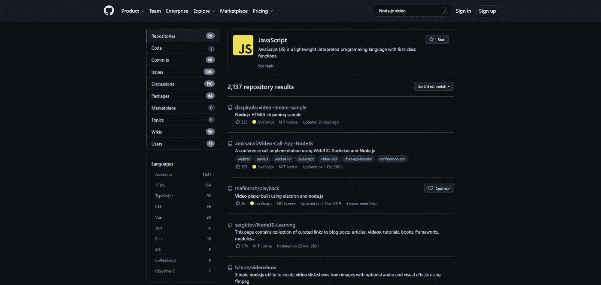
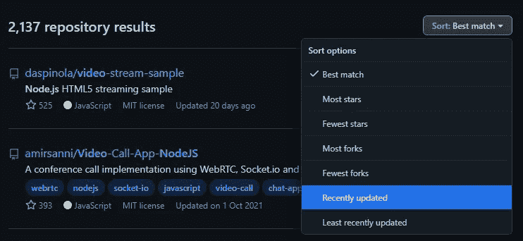
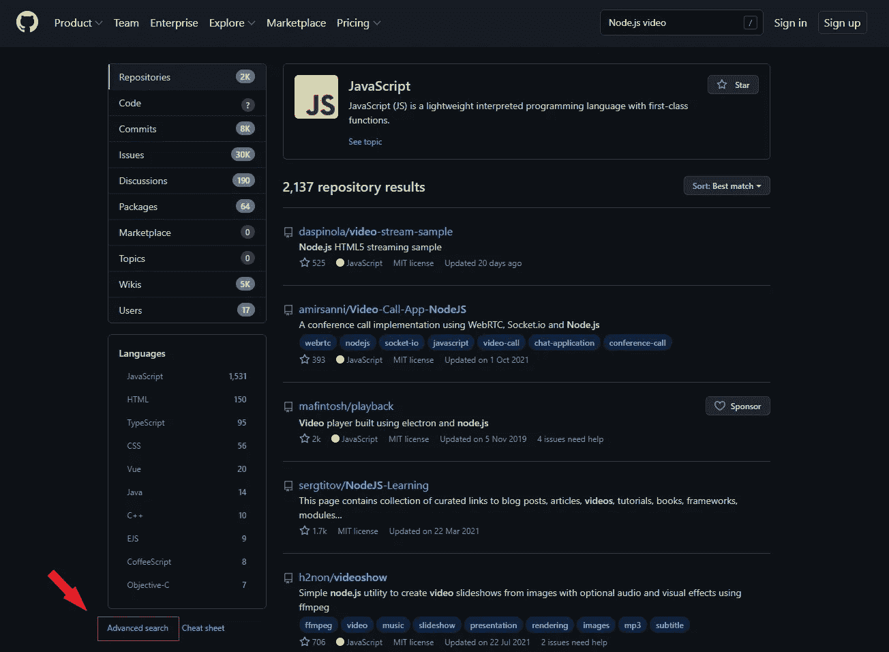
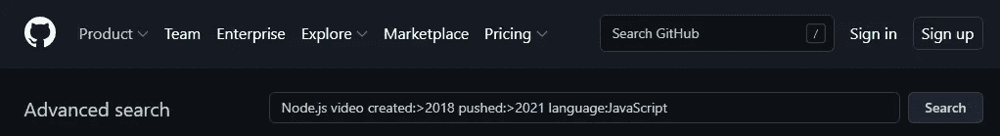

# 如何雇佣 Node.js 开发人员:8 个正确的技巧

> 原文：<https://javascript.plainenglish.io/how-to-hire-node-js-developers-8-tips-to-get-it-right-e5f75bcc53ab?source=collection_archive---------10----------------------->

## 雇佣合适的 Node.js 开发人员的 8 个技巧。

*   如何雇佣 Node.js 是业务和技术经理无数次问自己的问题，因为他们的团队创建的系统通常是公司的骨干；
*   LinkedIn、求职板、社交媒体群或 GitHub 只是你可能找到下一个开发者的网站的几个例子；
*   招聘过程是一项棘手的任务，因为有许多事情要同时考虑。此外，一个人必须挑战内心潜意识的偏见。我们有如何中和它的指南；
*   如果你更愿意有人在整个过程中帮助你(或为你做)，请联系我们，

后端系统曾经是两个重量级冠军之间的较量:C# (ASP。NET)，以及 Java (Spring)。在新的竞争者进入拳击场之前，他们一直享有相对稳定的优势。Node.js 和 JavaScript 是最新的挑战者，他们是一个难以击败的对手，与资深冠军相比有明显的优势。

当然，每个冠军都需要伟大教练的正确指导。如果没有适当的教练，即使是最好的战士也不会达到他们的巅峰:在这个比喻中，教练是 Node.js 开发人员。Node.js 是一个编写后端的精致平台，尽管它们会和你的开发人员一样好。

# Node.js 开发人员以及如何找到他们

## 商务化人际关系网

这个专业平台是招聘者的梦想。一个专业人士的网络是一块宝石，他们绝对自愿地保持他们的个人资料不断更新。不仅如此，你还可以更多地了解他们的想法和他们是谁。

然而，利用这个平台并不是那么简单。标准搜索框并非没有限制。解锁所有功能需要一些额外的努力(在这种情况下，金钱)。“LinkedIn Recruiter”为你提供了所有你需要的功能，让你轻松地列出候选人名单，甚至评估候选人。服务是如何运作的？它为您提供了使用关键词、过滤器等缩小搜索范围的选项。此外，你也可以伸出手，分析你的有效性。唯一要记住的是每周的联系限额；你可能只能接触到有限的几个专家。

## 工作公告板

你可能知道，有招聘广告的网站数量惊人。不过，我们会给你一些建议。

一类是目标受众。有一般追随者的网站，如 [Glassdoor](https://www.glassdoor.com/Interview/ITMAGINATION-Interview-Questions-E1328583.htm) ，也有针对特定细分市场的小众网站，如 Web3 工作的 [Remote3](https://remote3.co/) 。

另一类是地理。一些网站可能只关注一个地区——比如没有只关注东欧的无聊工作。根据你打算从哪里招募开发人员，你可能需要寻找候选人。当您在国内开展业务时，对额外研究的需求会增加，例如，在另一种语言占主导地位的国家的某个地区，如加拿大魁北克省。

最后一个关键是公司规模。当然，没有人会因为你的身材而限制你发帖的机会。问题的方面是如何容易地从众多的工作岗位中突围。如果你在一家大公司工作，你会发现 Dice.com 非常适合你。你的发帖会足够有竞争力，会有更多的人看到。为创业公司工作？由于接触范围有限，AngelList (各种规模的创业公司)和[独立黑客](https://www.indiehackers.com/jobs)(中小型创业公司)是你的安全赌注。不要放过[正宗的乔布斯](https://authenticjobs.com/)也一样。突破行业标准站点的噪音会很有挑战性，成本很高，或者两者兼而有之。

重申一下，我们并不知道所有的网站。正如我们已经提到的，有一些网站专门针对某个地区或某个国家，而不是更多的人。除非是为了吸引外籍人士，否则大部分都是当地语言。往前走，探索风景。快速搜索可以带来巨大的回报。

## 社会化媒体

社交媒体上的群体是一座金矿。当然，其他人也知道这一点，所以为另一次“淘金热”做好准备吧。成百上千甚至成千上万的人可能在等待你的帖子，尽管也可能厌倦了再看一个广告。

在加入一个小组之前，仔细阅读规则，不要违反任何准则。被一个大团体禁止肯定是不值得的:如果你不能积极招募，就对你的目标群体做一些研究。

始终尝试参与讨论，并不时发布与**相关的**内容。保持开放和友好。一般来说，给予多于索取是一个好习惯。你的贡献也会让你融入其中，而不是成为局外人。请记住，人们通常会更经常地听属于同一群体、与他们相似的人说话。

## GitHub & GitLab。

程序员喜欢与世界分享他们的代码。当然，有时这只是为了炫耀他们很酷的项目，尽管也可能是因为他们想帮助其他人解决类似的问题。无论是哪种情况，您都可以通过语言、名称和其他标准来查找项目。

GitHub 是托管 Git 存储库最流行的站点。最受瞩目的项目在那里托管他们的代码，最受欢迎的开发人员也在那里有他们的帐户。那么，很自然的，它是你首先想要搜索的网站。在 GitHub 上找到 Node.js 开发人员很简单，虽然是零星的，但你不能太急于求成，并检查回购是否真的是后端代码而不是前端代码。我们有一个关于如何轻松定位值得关注的开发人员的指南:

**第一步**

在您选择的网络浏览器中转至 GitHub.com 的。

**第二步**

在页面顶部的搜索栏中键入您的搜索短语。比方说，你正在寻找在创建处理视频内容的应用程序方面有经验的开发人员。我们使用搜索短语“Node.js Video”作为例子。按回车键。

**第三步**

您现在应该会看到一个结果列表。

‍

**第四步**

从这里开始，您可以继续寻找最近更新的项目，因为它可能会让您对开发人员的参与情况有一个大致的了解。当然，这不是一个完美的指示，但是，我们必须记住，为了准确地确定人们有多活跃，我们需要更多的数据点。

选择按“最近更新”选项对结果进行排序。

还有一件事要做，让你的搜索更有效率。

**步骤 4a(推荐)**

点击页面左下角的“高级搜索”。

**步骤 4b**

现在，您应该会看到许多选项，您可以从中找到您想要的项目。假设我们要找用 JavaScript 写的代码，从 2018 年到现在(创建:> 2018)。另一种选择是只选择这些使用 TypeScript 的项目。

最后，我们必须确保它是最近更新的，所以假设我们希望最近的更新是几个月前的(“pushed:>2021”)。

结果将在顶部可见，如下所示:

完整查询在此，方便您:“Node.js 视频创建:> 2018 推送:> 2021 语言:JavaScript”。

点击“搜索”，瞧！祝你好运！

# 你的梦之队

可以说，完成一项任务最简单的方法就是让别人替你做。尤其是如果我们谈论的是有经验的专业人士。你可以和技术伙伴、外包公司或软件公司合作。他们会有开发人员在你的项目上工作一段时间，并有预先定义的条款，并且随时准备加入。

缩短招聘时间、降低招聘和管理成本、快速可扩展性和全球人才可用性只是与你雇佣的公司合作的一些好处。在下图中，你可能会看到更多关于把火炬传递给别人和自己处理所有事情的观点。

很难决定是继续内部招聘还是外包发展。这当然不一定是二元选择，处理是或否，而是一个范围，[允许你决定你想要保留多少员工，以及多少开发人员将来自你的合作伙伴](https://www.itmagination.com/services/it-outsourcing-nearshoring-offshoring/it-delivery-center-poland)。您有能力轻松扩展，同时发展您的内部能力。如果这是你最感兴趣的事情，[我们来谈谈](https://www.itmagination.com/contact)。

接下来，让我们概述一下在雇佣 Node.js 开发人员时需要注意的事项，无论是在内部还是通过寻找技术合作伙伴。

# 评估候选人时需要注意什么

你现在有一个你想接触的开发人员的名单，或者你已经接触了一些。有些事情你必须牢记在心:

## 给你的项目配备一个开发人员。

并非所有的开发人员都符合您的要求。开发者不会专攻应用开发的所有领域，就像画家通常不太了解雕刻一样，反之亦然。

这都是因为掌握这些复杂领域所需的主题深度。在完成图像识别领域的项目方面有经验的开发人员可能不太适合您的银行项目。也就是开发高安全性的服务不是他们平时做的。网络安全领域不是一天之内可以从 YouTube 视频中学到的东西。确保你对自己正在做的东西有一个清晰的轮廓，并在过程的每个阶段都牢记在心。

## 现代开发商及其沟通

我们都听说过对独自坐在昏暗的地下室里的开发人员的有害(和错误)的刻板印象。这绝对是错误的，而且是有害的。开发各种规模的代码通常需要不止一双手。各种形式的交流总是必不可少的:聊天、变更日志、文档和适当的评论只是一些核心的交流途径。

如今，除了编码之外，当今的专家还需要参加会议，向您报告，并能够说他们是否需要某些东西来完成他们的任务。当然，还有项目建议书、概念证明文件等等。

不要忘记，良好的线下沟通技巧在一个人上线时是有用的:Twitter、博客。团队成员之间的互动方式、在外部会议中的行为方式以及向公众传达公司文化的方式至关重要。

确保您评估了 Node.js 开发人员需要具备的软技能和技术技能。

## 对所需的知识要现实

一段时间前，这条微博在网上疯传。可悲的是，这并不是一个从未再次发生的独特案例。它一遍又一遍地发生；虽然如果是你的公司发布了那份糟糕的需求列表，这种情况会很少发生…

另一个例子是当你对你的候选人要求太多的时候。在 Node 项目中工作时，Java 编程的经验并不遥远。然而，要求 Clojure 知识可能太多了。

在将工作说明书发布到网上之前，确保有深入技术知识的人查看了该工作说明书**，**你应该**没有这方面的知识。这可能会省去你许多麻烦，并且不会错过一些非常合格的候选人。让你的工作规范成为一个迷因不是你想要的。**

## 唯一不变的是变化

编程标准随着时间的推移而变化，编程时代比非编程时代持续的时间要短得多。不久前，唯一可以用来创建 Node.js 应用程序的语言是 JavaScript。现在，完全用 TypeScript 编写代码很流行(也很有用)。是的，JavaScript 中的后端可以工作，尽管在企业场景中不鼓励使用 JS。

这些年来发生的另一个大变化是团队如何构建他们的服务。以前，专家们将所有东西捆绑在一起形成“巨石”现在，一致的意见是，微服务更能防止故障，在大中型公司中更为理想。

即使开发人员在使用这些旧标准的同时保持他们的项目工作和更新，他们也可能不适合您。[当然，除非你正在更新一个旧的应用程序以符合最新的标准](https://www.itmagination.com/blog/refactoring-code)，或者正在做一个旧的项目，这个项目仍然可以正常工作。

## 全栈还是不全栈？

全栈工程师在专业领域占据独特的位置。他们不会成为前端或后端的专家，尽管他们广泛的专业领域使他们特别有吸引力。幸运的是，由于 web 应用程序可以全是 JavaScript，而且只能是 JavaScript，所以一个领域的经验可以(部分)应用到另一个领域。

当然，拥有全能的开发人员意味着你需要更少的员工。你可以创建更少、更通用的团队，而不是创建高度专业化的团队。当然，就像生活中的情况一样，每个选择都有一个缺点。雇用全能的开发人员意味着他们在编写前端或后端方面不如更“专注”的同行。

“我想要全栈开发吗”这个问题的答案实际上是另一个问题的答案。你是否正在开发一款适合你的应用？如果是这样，那么你需要最优秀的人来做这项工作，并雇佣前端和后端专家。如果这不是你的公司提供的核心价值的来源，全栈专家是一条路要走。

## 开源贡献者

实话实说吧；没有开源，你就不会在 Chrome 或 Firefox 中浏览这个网站，[你的汽车也不会像现在这样安全。据估计，大约 78%的企业运行](https://www.automotiveworld.com/articles/auto-industrys-thirst-for-software-is-quenched-by-open-source/)[开源软件](https://www.zdnet.com/article/its-an-open-source-world-78-percent-of-companies-run-open-source-software/)，尽管这个数字可能太低了。想象一个完全依靠闭源软件运行的公司就像想象一个完全没有现代技术的人。

发布你的代码，让人们免费使用，这推动了生活的许多领域和许多行业。这也是让世界运转的原因。还记得 SpaceX 的可重复使用火箭吗？它们运行在 Linux 的一个变种上，宇航员的仪表板运行在 Chromium 上 Chrome 浏览器使用的也是同样的东西。

此外，审查一个人的项目是对开发人员处理问题、冲突和代码质量的一个很好的洞察。雇佣开源贡献者有一个隐藏的好处。这是雇主品牌的提升，也是你的公司可能享有的声望。

 [## LinkedIn 上的 Sami gho che:FastAPI 在 StackShare 的 100 大开发工具中遥遥领先

### FastAPI 在 StackShare 的 100 大开发工具中遥遥领先！！很难夸大这是多么不可思议的一个…

www.linkedin.com](https://www.linkedin.com/embed/feed/update/urn:li:share:6895605773561335808) 

再次强调，一个高调的程序员或不受欢迎或不受欢迎，你的候选人可能是合适的。首先，人们可能有他们不发表作品的理由。受欢迎程度并不总是衡量能力的恰当标准。

## 索要作品集

有时，雇主会希望在网上看到他们的工作项目，以此作为开发人员能力的标志。然而，这可能不是一个准确的衡量标准。没有看到代码，我们不能说除了它工作的事实。引擎盖下可能有过多的 bug，我们可能没有意识到。

其他时候，开发者会拒绝与世界分享他们的创作，并保持其私密性。为什么？有很多原因，也有完全没有原因的。最重要的是在一天结束时看到一些代码。

当然，如果他们在 App Store 上发布了一个应用程序，这绝对是一个不错的选择。不过，人就是人，所以只要你能看到一个高质量的应用程序，它在哪里可用并不重要:GitHub、私人投资组合或应用商店都只是达到目的的手段。一个建议是向应聘者索要应用程序的源代码:他们写的东西有用并不能证明什么。

## 简历中的空白不一定会对候选人不利。

辞掉一份累人的工作会让你精神状态不佳。在这种情况下，最好的办法是喘口气，养精蓄锐。恢复可能需要一段时间，但是，这是必要的。

另一个可能在职业生涯中留下一个大洞的案例是那些休了产假并且再也没有回来的母亲们。或者，他们可能在一段时间后辞职，去照顾他们的孩子。这些差距可能会持续很长时间，所以如果有一个人的实践证明记录，那么不应该怀疑候选人。不要忘记这样的人，因为通常在这样的休息之后很难找到工作。

这两个理由只是一大套理由中的一小部分。他们彼此都有很大的不同。在有些情况下，这样的休息需要几个月，一年，或者两个月。没关系。只要问，如果有合理的解释，那就没问题。

## 克服(潜意识)偏见

人类不断做出快速判断。这是我们无法控制的:这都是进化的结果。这只是潜意识的偏见在起作用:一种我们没有意识到，但仍然驱动着我们的许多行为和判断的偏见。

然而，还是有希望的。诺贝尔奖得主丹尼尔·卡内曼写了一本名为《思考，快与慢》的书，他在书中讲述了一个人如何推理。因为你可能没有时间去读它，我将描述一个被提议的方法来可靠地为你做出好的雇用。

**第一步**

选择你认为对工作成功至关重要的关键特征。这里的限制是六个。确保主题不要重叠:我们想要覆盖很大的区域。

高效的沟通、对打字稿的熟悉和可靠性只是你可以包括的一些例子。

**第二步**

现在是一些候选人测试的时候了。一些问题和测试是根据你之前定义的特征来评估候选人的好方法。你可以要求他们写一个简单的应用程序作为“作业”，进行一次技术面试或两者兼而有之。

**第三步**

现在你已经把你的问题和作业写在纸上了，考虑一下你将如何给每个候选人打分。最好的想法是将每个特征的评估放在一到六的范围内。你甚至可以使用流行的四个微笑系统，从不开心到开心。

最重要的部分——保持规模不变。如果你选择了一到六的范围，要保持一致，对每个方面和候选人都要保持一致。

**第四步(可选)**

每次面试后，根据受访者的总体印象给他们打分。

让参与招聘过程的其他人用和你一样的标准来评估候选人。然后，确定所有主观分数的平均值。你可以把它作为七年级，尽管你也可以跳过这一步。省去它会使过程更加客观。

**第五步**

现在，对每个候选人进行评估后，将所有分数相加。分数最高的人就是要招的人。这是持续最大化做出重大决策的机会的一种方式。

# 结束语

我们给你的提示应该足以指导你掌握大部分知识。然而，实际上，招聘专家对这个话题的具体细节知道得更多。寻求帮助只是承认你有足够的勇气承认你不知道一些事情；这不是一个普遍的特征。

因此，如果你不确定自己是否会做出正确的选择，雇佣一家外部公司来为你打理一切可能是个好主意。然而，还有一种选择。

决定将项目外包出去。这个决定可以由“专注于你做得最好的，把其他的外包出去”的规则来指导。等到你的公司成为招聘专家时，它将失去竞争优势。[我们在这里，如果你需要一个有经验的合作伙伴与你一起开发你的项目](https://www.itmagination.com/services/it-outsourcing-nearshoring-offshoring/it-delivery-center-poland)，这样你就可以专注于你相对于其他公司的优势。

祝你好运！

*原载于*[*https://www.itmagination.com*](https://www.itmagination.com/blog/how-to-hire-node-js-developers)*。*

*更多内容请看*[***plain English . io***](https://plainenglish.io/)*。报名参加我们的* [***免费周报***](http://newsletter.plainenglish.io/) *。关注我们关于*[***Twitter***](https://twitter.com/inPlainEngHQ)*和**[***LinkedIn***](https://www.linkedin.com/company/inplainenglish/)*。加入我们的* [***社区***](https://discord.gg/GtDtUAvyhW) *。**