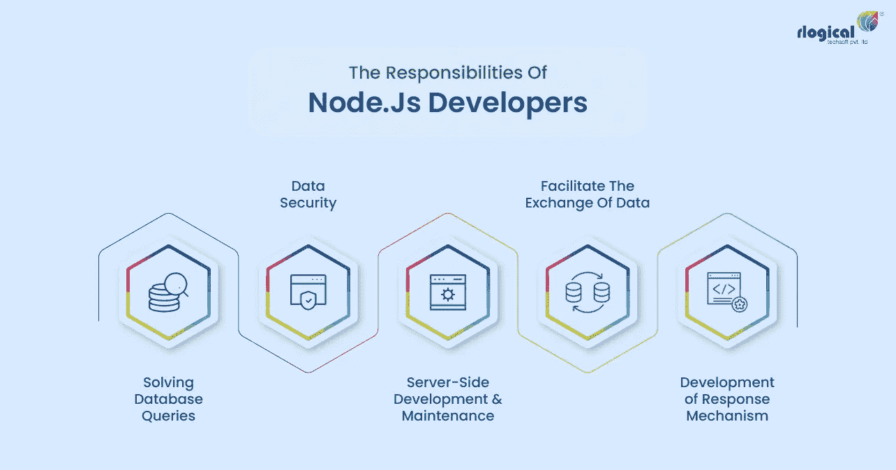
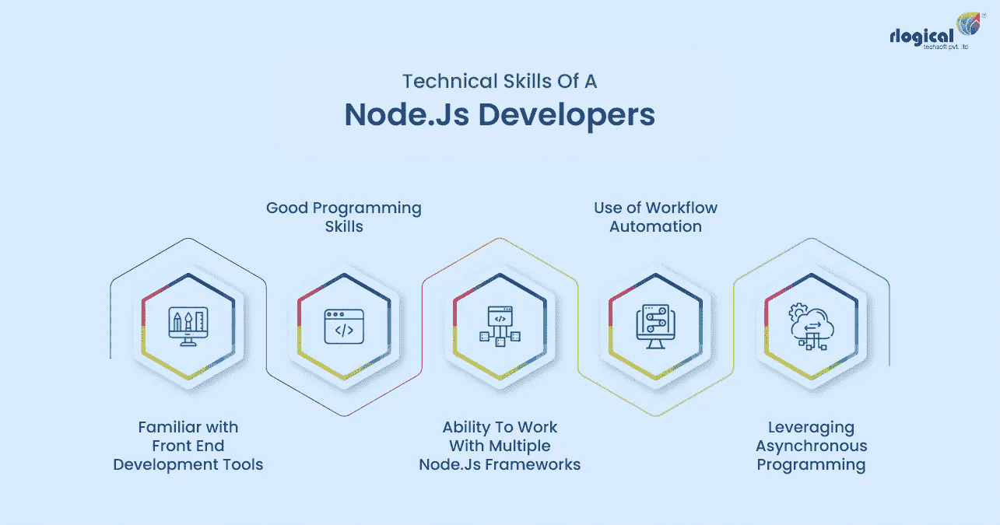

# 如何雇佣 Node.js 开发者

> 原文：<https://javascript.plainenglish.io/how-to-hire-node-js-developers-ad38ee1e37f2?source=collection_archive---------15----------------------->

## 雇佣 Node.js 开发人员的分步指南

Node.js 平台在编码和开发应用程序方面非常受欢迎。Node.js 框架基于 JavaScript，JavaScript 是编码和软件开发最基本的语言之一。每当任何一家公司想要招聘开发人员的时候，Node.js 的能力总是被重点强调。

如果你的公司渴望 [**雇佣一个专门的 Nodejs 开发者**](https://www.rlogical.com/hire-dedicated-developers/hire-node-js-developer/) ，这篇文章将帮助你。毕竟，让合适的开发人员参与进来是创建一个强大、专注的开发团队的第一步。在文章中，我们讨论了 Node.js 开发人员的职责，以及为什么 Node.js 开发人员是许多应用程序开发公司中最受欢迎的角色。

# **node . js 开发者的职责**

在发布 Node.js 开发人员的空缺之前，您必须根据他们的角色和职责创建一个职位描述。你必须考虑 Node.js 开发人员的一些共同责任。比如说-

**促进数据交换**

Node.js 开发人员必须创建通道，以两种方式在服务器和用户之间传输数据。他们必须在应用程序的前端和后端之间建立桥梁。

**服务器端开发和维护**

Node.js 开发人员的职责还包括创建服务器端框架和通过管理维护中央数据库。Node.js 开发人员管理后端。

**响应机制的开发**

Node.js 开发人员必须创建一个接口来提高后端对前端请求和查询的响应能力。Node.js 开发人员必须开发前端和后端并发的高响应应用程序。

**数据安全**

大多数应用程序从用户那里获取个人数据，以改善个性化服务。Node.js 开发人员的职责还包括开发数据安全框架和安全的应用程序接口。创建一个安全的框架可以确保用户的数据不会泄露给其他来源。

**解决数据库查询**

Node.js 开发人员的角色还包括解决前端请求产生的数据库查询。开发人员还必须记录应用程序修复和维护的查询和解决方案。

# **node . js 开发者的技术技巧**

在雇佣 Nodejs 开发人员之前，你必须考虑专业人员的各种技能。Node.js 开发人员的技术技能如下:

**1。良好的编程技能**

Node.js 开发人员的角色是基础程序员之一。所以一个 Node.js 开发者需要的基本功就是编程技能。开发人员必须非常擅长 Node.js 编程。他的编码速度必须又快又准。他必须能够为应用程序想要解决的基本问题编写解决方案。代码应该足够简单，易于阅读、检查和实现。代码应该是经济的和有针对性的来解决问题。

**2。熟悉前端开发工具**

如今，公司正在寻找拥有平衡技能组合的多才多艺的开发人员。选择一个同样擅长前端开发的开发者总是比较好的。后端开发人员必须对前端开发有一定的了解，才能理解整个项目的需求。

他需要确定后端支持前端特性的空间，以便进行适当的开发和实现。前端开发工具的知识将在同一个团队的多个方面之间建立更好的沟通和协调。

**3。能够使用多个 Node.js 框架**

这是一个显而易见的。作为 Node.js 专家，开发人员必须根据项目需求使用多个 Node.js 框架。许多 Node.js 框架，如 Express、Meteor 和 DerbyJS，都使用 Node.js 来创建后端。一个框架可以为一个项目支持多个特定于项目的特性。开发人员将需要为一个单一的项目不同的框架。构建可扩展的应用侧重于雇佣专门研究多个 Node.js 框架的 node js 开发人员。

**4。利用异步编程**

作为一名经验丰富的 Node.js 开发人员，候选人应该使用异步编程。当代码的子线程独立工作并与应用程序的主线程一起工作时，异步编程是一种编程类型。因为这种半独立的形式，对于某个子线程来说，执行某个代码程序是非常容易的。

另一方面，如果子线程需要对最终代码进行小的调整，程序员可以毫无问题地更改单个代码块。这些更改不会改变进程中的整个主线程。因此，更改和维护过程更简单。一个优秀而聪明的 Node.js 开发人员知道如何进行异步编程并利用它。确保雇佣的 Node.js 开发人员擅长异步编程，能够管理实际任务。

**5。工作流程自动化的使用**

你也可以寻找关于工作流自动化的知识。目前项目规模非常大。对于这样的项目，你不仅需要一个努力工作的开发人员，还需要一个非常聪明的开发人员，他知道如何在不影响最终输出质量的情况下引入工作流自动化。此外，选择一个熟悉组织中现有自动化系统的 node js 开发人员。愿意学习的现代开发人员也会喜欢尝试市场上出现的新的工作流自动化解决方案。

除了这些工具和技能之外，您还应该研究其他能力。Node.js 开发领域是一个巨大的领域，它通过引入新的自动化工具和框架来提高技能。确保你雇佣了一个专门的 Node.js 开发人员，他已经准备好继续学习，为你的公司增加价值。

*更多内容请看*[***plain English . io***](https://plainenglish.io/)*。报名参加我们的* [***免费周报***](http://newsletter.plainenglish.io/) *。关注我们关于*[***Twitter***](https://twitter.com/inPlainEngHQ)*和*[***LinkedIn***](https://www.linkedin.com/company/inplainenglish/)*。加入我们的* [***社区不和谐***](https://discord.gg/GtDtUAvyhW) *。*