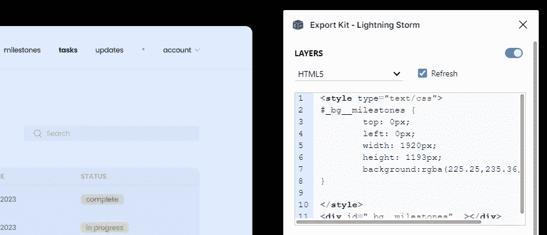
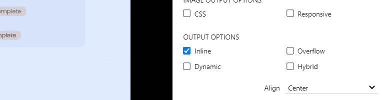
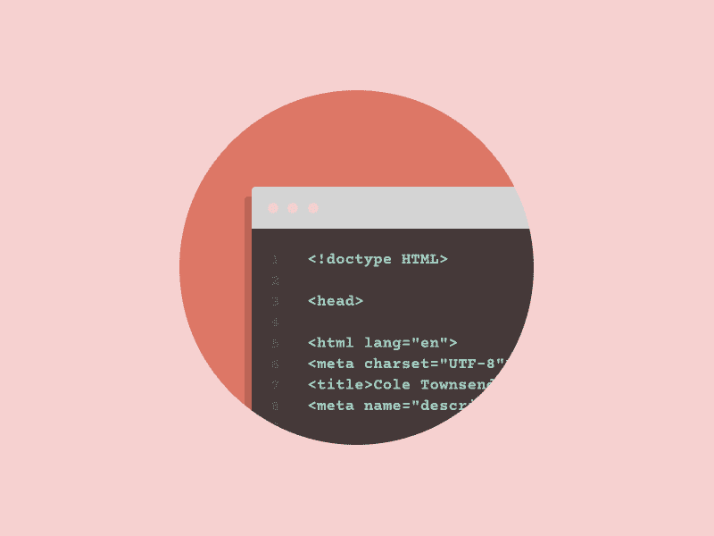
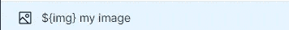

# 如何立即将您的 Figma/Adobe XD 设计转换为 HTML

> 原文：<https://javascript.plainenglish.io/how-to-immediately-convert-your-figma-adobe-xd-design-to-html-47501bf4123a?source=collection_archive---------7----------------------->

## 如何几乎立即将你的网页设计转换成 HTML 页面。

Photo by [Sigmund](https://unsplash.com/@sigmund?utm_source=medium&utm_medium=referral) on [Unsplash](https://unsplash.com?utm_source=medium&utm_medium=referral)

如果你没有时间将你的项目转换成 HTML、Android Studio、XCode、Python、PHP、WordPress 等等，这个工具可能正适合你。

## 这个工具是什么？

我们将使用一个免费的插件叫做导出工具包闪电风暴，这是一个插件，让你转换和导出你的设计到一个单一的网站。

Lightning Storm 插件在 Figma 或 Adobe XD 上都有，可以选择适合自己的平台使用。

figma.com

## 怎么用？

在这种情况下，我将使用 Figma 设计软件。现在，您可以前往社区页面，在那里您将安装闪电风暴插件。

现在，如果你选择了一个框架，一层或一段内容，插件会告诉你它使用的样式，你可以立即复制 HTML & CSS。

接下来，选择您想要处理和导出的帧。然后选择您想要选择的导出编程语言，在本例中，我将使用已经选择的语言— HTML5。

现在，当我们完成语言设置后，我们可以继续到自定义部分下的输出选项。

我在这一部分找到的最精确的输出选项是`inline`选项，但是如果它不符合你的设计，你也可以尝试`overflow`选项。

## 现在怎么办？

现在，您在本地设备上有了一个导出的 HTML 页面。结果可能并不完美，但它绝对是抄录设计的好帮手。如果在导出中发现小错误，只需在 CSS 文件中修改即可。

dribbble.com by [Cole Townsend](https://dribbble.com/ColeTownsend)

请记住，这个插件有很多我在本文中没有提到的选项，但是您可以自己探索它们。

## 限制

这个插件可以让你一次导出 1-5 帧，并且每帧不能超过 40 层的限制，这有时是非常有限的。

解决的办法是，如果你有许多 SVG 或图像，包含许多组和这些图像的一部分，你可以重命名层持有的图像在一起，并添加一个前缀——`${img}`。

image renaming

## 结论

这个插件可以把你的 Figma 或者 Adobe XD 设计转换成 HTML 或者这个插件支持的更多平台。我希望，你会对这篇文章和插件感兴趣，并在需要的时候开始使用它。

*更多内容请看*[***plain English . io***](https://plainenglish.io/)*。报名参加我们的* [***免费周报***](http://newsletter.plainenglish.io/) *。关注我们关于*[***Twitter***](https://twitter.com/inPlainEngHQ)*和*[***LinkedIn***](https://www.linkedin.com/company/inplainenglish/)*。查看我们的* [***社区不和谐***](https://discord.gg/GtDtUAvyhW) *加入我们的* [***人才集体***](https://inplainenglish.pallet.com/talent/welcome) *。*