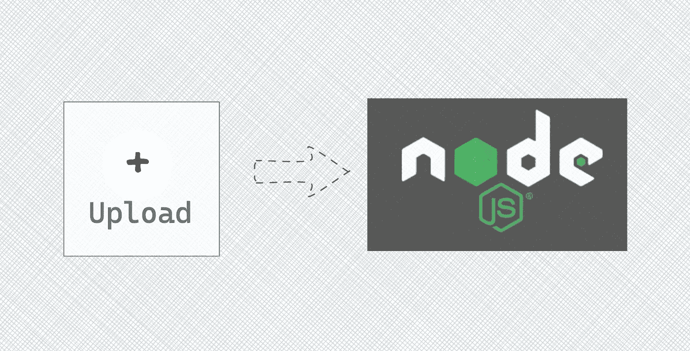
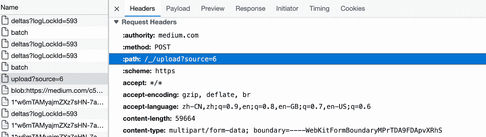
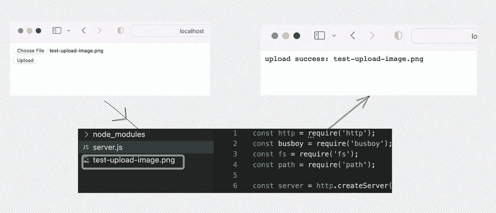

# 如何用 Node.js 实现文件上传服务器

> 原文：<https://javascript.plainenglish.io/how-to-implement-a-file-upload-server-with-node-js-83043bc180fc?source=collection_archive---------2----------------------->

## 使用 busboy 模块解析表单数据。



# 前言

无论我们看什么网站，都会有图片，比如 Medium，Twitter 等。在介质上书写时，支持上传图片。它将图片发布到`[https://medium.com/_/upload?source=6](https://medium.com/_/upload?source=6)`，响应包含图片的已保存的`fileId`，可用于生成 CDN URL。



虽然不知道 Medium 用哪种编程语言来实现上传服务器，但是我们可以用 Node.js 来实现文件上传服务器。

在本文中，我们将看看如何用 Node.js 中的`[busboy](https://github.com/mscdex/busboy)`模块实现文件上传服务器

# 用 Node.js 创建 HTTP 服务器

Nodejs 提供了 HTTP 模块，可以很容易的用来创建服务器，当然如果使用 [Koa](https://koajs.com/) 或者 [Express](http://expressjs.com/) 会更容易。虽然使用原生模块效率不高，但是可以帮助我们更好的掌握 Node.js .但是建议在生产环境中使用 [Koa](https://koajs.com/) 或者 [Express](http://expressjs.com/) 。

在创建 HTTP 服务器时，我们只需要使用 HTTP 模块提供的`createServer` API，同时绑定一个端口。

```
const http = require('http');
http.createServer((req, res) => {
  res.end('hello world');
}).listen(4000);
```

然后我们可以测试它并参观`http://localhost:4000`:


Test for Nodejs server

# 上传文件并保存在服务器上

我们可以使用 HTML 表单上传文件，在 Node.js 服务器中，我们可以使用 [busboy](https://www.npmjs.com/package/busboy) 包解析传入的 HTML 表单数据。如果要在生产环境中实现文件上传服务器，建议使用 [Multer](https://www.npmjs.com/package/multer) (依靠 busboy 解析表单数据)或者[Harvard](https://www.npmjs.com/package/formidable)。

我们需要优化 Node.js 代码，在访问根路径时响应一个 HTML 表单，用`/upload`路径上传文件。

在 Node.js 服务器中，当接收到客户端上传的文件时，使用 busboy 模块解析并保存到当前目录。



# 结论

在本文中，我们学习了如何使用 Node.js 实现一个非常简单的文件上传服务器。使用 [busboy](https://www.npmjs.com/package/busboy) 模块，我们可以轻松地处理传入的 HTML 表单数据。但是推荐使用 [Multer](https://www.npmjs.com/package/multer) (依靠卫生员解析表单数据)或者[威猛](https://www.npmjs.com/package/formidable)。

你想学习如何不使用任何 npm 模块解析 HTML 表单数据吗？你可以跟着我，我会在以后的文章中分享如何做。

*更多内容看* [***说白了就是 io***](https://plainenglish.io/) *。报名参加我们的* [***免费周报***](http://newsletter.plainenglish.io/) *。关注我们关于*[***Twitter***](https://twitter.com/inPlainEngHQ)**和*[***LinkedIn***](https://www.linkedin.com/company/inplainenglish/)*。查看我们的* [***社区不和谐***](https://discord.gg/GtDtUAvyhW) *加入我们的* [***人才集体***](https://inplainenglish.pallet.com/talent/welcome) *。**