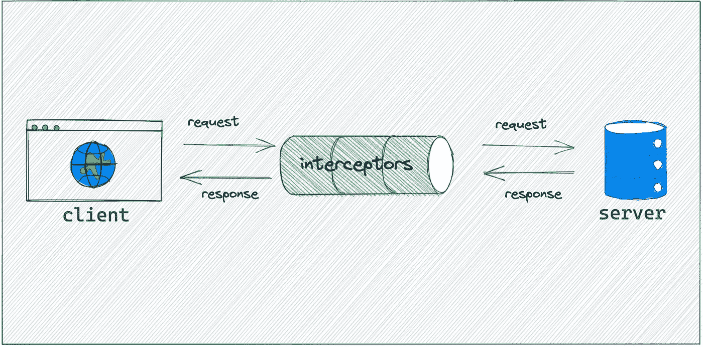
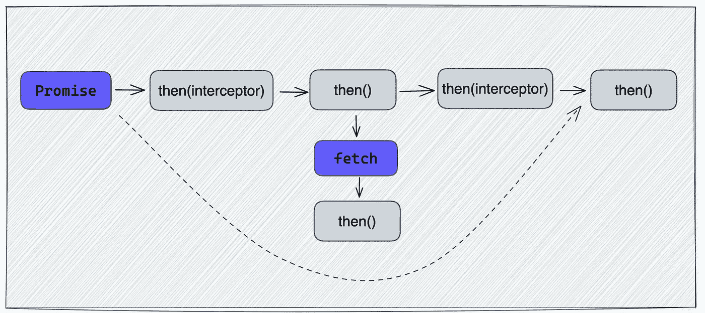
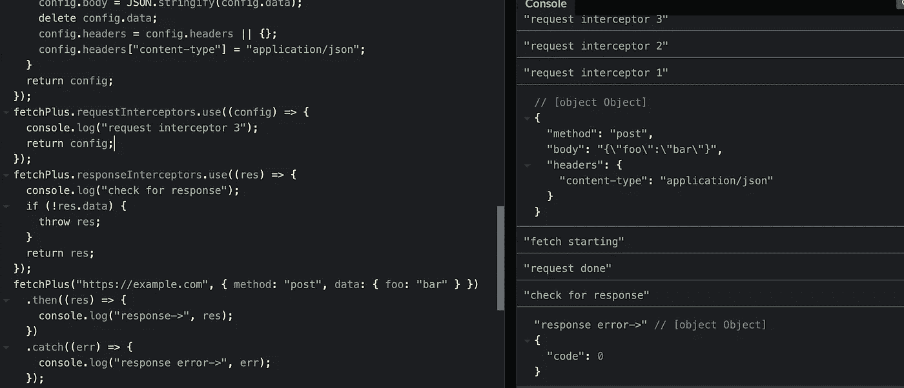

# 如何实现像 Axios 这样的请求拦截器

> 原文：<https://javascript.plainenglish.io/how-to-implement-a-request-interceptor-like-axios-896a1431304a?source=collection_archive---------4----------------------->

## 在处理请求或响应之前拦截它们



# 介绍

正如在这篇文章“为什么我更喜欢在 Web 应用中使用 Axios”中提到的:

[](/why-i-prefer-axios-in-web-app-9a78d655fd1d) [## 为什么我更喜欢在 Web 应用程序中使用 Axios

### 同构和基于承诺的代码使开发更加高效

javascript.plainenglish.io](/why-i-prefer-axios-in-web-app-9a78d655fd1d) 

Axios 的拦截器是我喜欢在我的项目中使用 axios 的原因之一，它使与请求相关的代码更有凝聚力。例如，在我的项目中，我通常在请求阶段根据请求调整请求参数，并在响应阶段使用 toast 提示用户是否有异常。

```
// intercept request to transform config.
axios.interceptors.request.use(function(config) {
  if (config.method === 'get') {
    config.params = config.data;
    config.data = undefined;
  }
  return config;
})//intercept response to check the data
axios.interceptors.response.use(function(config) {
  if (!config.data || config.data.code !== 200) {
    toast('there something error');
    throw config;
  }
  return config;
})
```

在本文中，我们将模拟 axios 实现，并基于`fetch`逐步实现拦截器。

# 步骤 1:拦截器管理器

我们需要拦截请求和响应，两者的用法是一样的。因此，可以完成拦截器管理器类来生成拦截器实例。拦截器管理器的主要功能是维护拦截器，并提供获取所有注册拦截器的方法。

是的，拦截器管理器实际上就是这么简单。只是用来注册拦截器，甚至不需要知道拦截器是请求还是响应。

# 第二步:包装提取

`fetch`提供了一种简单、合理的方式来通过网络异步获取资源，但它不支持插件或附加扩展。所以我们需要包装一个基于`fetch`的请求方法，这样我们就可以实现拦截器功能。方法名我没什么好主意，就叫`fetchPlus`吧。给它添加两个属性`requestInterceptors`和`responseInterceptors`，用于注册拦截器。

```
// create method based on fetch
function fetchPlus(url, init) {
  return fetch(url, init);
} 
// use for registering request interceptor
fetchPlus.requestInterceptors = new InterceptorManager();// use for register response interceptor
fetchPlus.responseInterceptors = new InterceptorManager();
```

现在主流程基本完成，接下来需要实现最重要的部分。

# 步骤 3:拦截请求

拦截器可能是异步的，我们不能直接迭代拦截器并执行函数。对于异步函数，我们可以通过使用 promise 来链接调用。



当我们有多个请求拦截器时，我们需要设置一个优先级。实用的办法是让后面注册的优先级高一些。我们可以改进 fetchPlus 函数，增加拦截功能。

# 步骤 4:测试拦截器

为了测试方便，我们来模拟一下`fetchPlus`中的`dispatchRequest`方法。

```
const dispatchRequest = init => {
  console.log('fetch starting');
  return new Promise((resolve) => {
    setTimeout(() => {
      console.log('request done');
      resolve({code: 0});
    }, 500);
  })
}
```

让我们再写几个拦截器:

```
// request interceptors
fetchPlus.requestInterceptors.use(config => {
  console.log('request interceptor 1');
  console.log(config);
  return config;
})
fetchPlus.requestInterceptors.use(config => {
  console.log('request interceptor 2');
  if (config.method === 'post') {
    config.body = JSON.stringify(config.data);
    delete config.data;
    config.headers = config.headers || {}
    config.headers['content-type'] = 'application/json';
  }
  return config;
});
fetchPlus.requestInterceptors.use(config => {
  console.log('request interceptor 3');
  return config;
})// response interceptors
fetchPlus.responseInterceptors.use(res => {
  if (!res.data) {
    console.log('error');
    throw res;
  }
  return res;
});
```

然后，使用`fetchPlus`发送请求:

```
fetchPlus('[https://example.com'](https://example.com'), {method: 'post', data: {foo: 'bar'}}).then(res => {
  console.log('response->', res);
}).catch(err => {
  console.log('response error->', err);
});
```



test for interceptors

我写一个 demo，你可以在 [codepen.io](https://codepen.io/bitbug/pen/mdxrgjG) 上测试一下。

# 结论

在本文中，用三个步骤实现一个类似 axios 的拦截器功能。首先，创建拦截器管理器，然后包装 fetch 函数进行扩展，最后使用 promises 来链接拦截器。

希望它能帮助你，我期待你**跟随**我学习更多实用技巧，成为一名更好的开发者。

*更多内容看* [***说白了。报名参加我们的***](https://plainenglish.io/) **[***免费周报***](http://newsletter.plainenglish.io/) *。关注我们关于* [***推特***](https://twitter.com/inPlainEngHQ)**和*[***LinkedIn***](https://www.linkedin.com/company/inplainenglish/)*。查看我们的* [***社区不和谐***](https://discord.gg/GtDtUAvyhW) *加入我们的* [***人才集体***](https://inplainenglish.pallet.com/talent/welcome) *。****