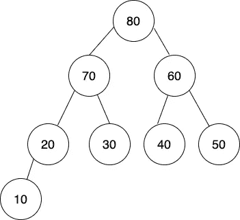
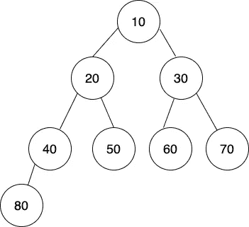
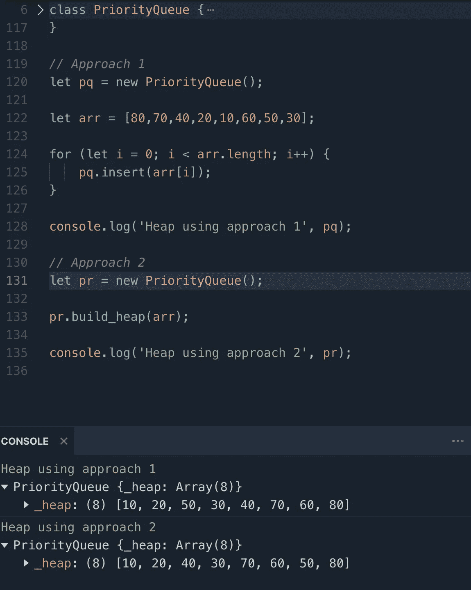
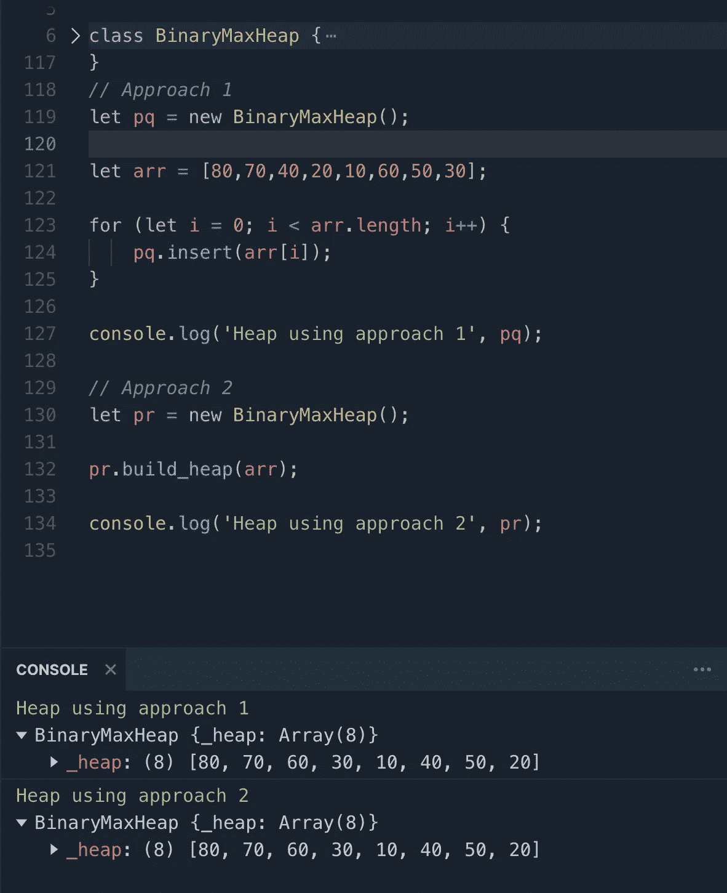

# 2022 年如何用 JavaScript 实现二进制堆？

> 原文：<https://javascript.plainenglish.io/how-to-implement-binary-heap-in-javascript-in-2022-6069402351d1?source=collection_archive---------10----------------------->

## 二进制堆数据结构完全指南


image by weekendtutorial.com

## 二元堆

二进制堆是一种树形数据结构，它有两个属性

1.  应该是一棵*完美二叉树* ***(又名结构-属性)***
2.  树的每个节点应该≥或≤其子节点。换句话说，应该是**不是最小堆就是最大堆。** ( ***又名堆属性*** )

## 完美二叉树

一个几乎完成的二叉树，树的最后一层从左到右填充。

例如，在最大堆和最小堆中给出的树是一个完美的二叉树的例子。

***注意:如果你之前没有看过二叉树，请查看***

1.  [如何用 JavaScript 实现二叉树？](https://weekendtutorial.com/binary-tree-and-its-traversal-in-javascript/)
2.  [二叉树中的前 5 个基本必答题](https://weekendtutorial.com/binary-tree-the-best-5-coding-questions-you-must-solve/)

## 二进制堆的类型

二进制堆有两种类型—

1.  最大堆
2.  最小堆

## 最大堆

一种二进制堆，其中树的每个节点都大于或等于它的两个子节点。因此，树的根在所有节点中是最大的。

例如，下面的树是最大堆的示例:



Binary Max Heap

## 最小堆

一种二进制堆，其中树的每个节点都小于它的两个子节点。因此，树的根将是所有节点中最小的。

例如，下面的树是一个最小堆的例子:



Binary Min Heap

## 二元堆的表示

二进制堆可以由树节点列表和数组来表示。在本文中，我们将只关注二进制堆的数组表示。

这里需要注意的要点是—

1.  树的根是 Arr[0]
2.  对于任何指数 I，

```
Parent index = (i-1)/2Left child index = 2 * i + 1Right Child index = 2 * i + 2
```

## 二元堆的应用

1.  堆排序
2.  优先队列
3.  图形算法(Dijkstra—最短路径算法，Prims — MST)
4.  你需要在每次迭代后寻找最小值的问题，例如

a) [数组中第 k 个最大的元素](https://leetcode.com/problems/kth-largest-element-in-an-array)

b) [任务调度器](https://leetcode.com/problems/task-scheduler)

c) [数组中两个元素的最大乘积](https://leetcode.com/problems/maximum-product-of-two-elements-in-an-array)

这是完整的列表— [堆问题](https://leetcode.com/tag/heap-priority-queue/)

## JavaScript 中的二进制最小堆实现

**用法(**两种方法都产生有效的二进制最小堆 **)**

**方法 1:** 在堆中逐个插入数组元素。Heap **insert** 函数内部调用函数 **heapifyUp** 。

```
let pq = new PriorityQueue();let arr = [80,70,40,20,10,60,50,30];for (let i = 0; i < arr.length; i++) {
    pq.insert(arr[i]);
}console.log('Heap using approach 1', pq);
```

**方法 2:** 在堆中插入完整的数组元素(通过调用 **build_heap** 函数)。堆函数 **Build_heap** 调用函数 **heapify** 将堆整个堆。

```
let pr = new PriorityQueue();pr.build_heap(arr);console.log('Heap using approach 2', pr);
```

**结果**



Binary Min Heap

## JavaScript 中的二进制最大堆实现

**用法(**两种方法都会产生有效的二进制最大堆 **)**

**方法一:**将数组元素逐个插入堆中。Heap **insert** 函数内部调用函数 **heapifyUp** 。

```
let pq = new BinaryMaxHeap();let arr = [80,70,40,20,10,60,50,30];for (let i = 0; i < arr.length; i++) {
    pq.insert(arr[i]);
}console.log('Heap using approach 1', pq);
```

**方法 2:** 在堆中插入完整的数组元素(通过调用 **build_heap** 函数)。堆函数 **Build_heap** 调用函数 **heapify** 将堆整个堆。

```
let pr = new BinaryMaxHeap();pr.build_heap(arr);console.log('Heap using approach 2', pr);
```

**结果**



Using Binary Max Heap

## 摘要

有许多实际问题可以通过二进制堆数据结构轻松解决。这是所有计算机科学毕业生的必修课。

在许多编程语言中，二进制堆是本机提供的，但了解核心实现并构建一个自定义实现是真正的学习。

本文中的代码(用 JavaScript 编写)可以导入到您选择的其他编程语言中。

试着用你喜欢的编程语言来构建它。

所有最新的帖子和文章，请访问网站[https://weekendtutorial.com/](https://weekendtutorial.com/)

继续学习，保持安全。

*更多内容看* [***说白了. io***](https://plainenglish.io/) *。报名参加我们的* [***免费周报***](http://newsletter.plainenglish.io/) *。关注我们关于*[***Twitter***](https://twitter.com/inPlainEngHQ)*和*[***LinkedIn***](https://www.linkedin.com/company/inplainenglish/)*。加入我们的* [***社区***](https://discord.gg/GtDtUAvyhW) *。*