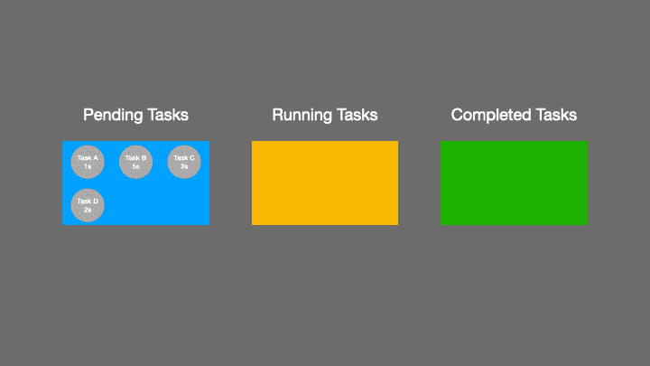

# 如何在 JavaScript 中实现并发控制

> 原文：<https://javascript.plainenglish.io/how-to-implement-concurrency-control-in-javascript-df4da29f81c4?source=collection_archive---------4----------------------->

## 以有限的并发性运行多个承诺返回&异步函数。


# 什么是并发控制？

在日常开发中，可能会遇到并发控制的场景，比如控制并发请求的数量。那么如何在 JavaScript 中实现并发控制呢？在回答这个问题之前，我们先简单介绍一下并发控制。

假设有 6 个待办任务要执行，我们想限制同时执行的任务数量，即只能同时执行 2 个任务。当执行任务列表中的任一任务完成后，程序会自动从待办任务列表中获取一个新的待办任务，并将该任务添加到执行任务列表中。

具体执行过程如下图所示:


接下来，我们将以 Github 上的 [tiny-async-pool](https://github.com/rxaviers/async-pool) 库为例，分析异步任务并发控制的具体实现。

# 如何实现并发控制？

[微型异步池](https://github.com/rxaviers/async-pool)库提供了 3 个不同版本的 ES7、ES6 和 ES9 的实现。在分析它的具体实现之前，我们先来看看它是如何使用的。

## 1.如何使用异步池

首先，通过 npm 安装异步池

```
$ npm install tiny-async-pool
```

然后从**微型异步池**模块导入异步池函数

```
import asyncPool from "tiny-async-pool";
```

asyncPool 函数的签名如下所示:

`asyncPool(concurrency, iterable, iteratorFn)`

*   并发性:并发限制数(> = 1)
*   iterable:输入的可迭代对象，如 String、Array、TypedArray、Map 和 Set。
*   iteratorFn:接受两个参数的迭代器函数:每次迭代的值和 iterable 对象本身。迭代器函数应该返回一个承诺或者是一个异步函数。

```
import asyncPool from "tiny-async-pool";const timeout = i => new Promise(
  resolve => setTimeout(() => resolve(i), i)
);await asyncPool(2, [1000, 5000, 3000, 2000], timeout);
```

让我们来看看上面例子的执行过程:



```
*// Call iterator (i = 1000)*
*// Call iterator (i = 5000)*
*// Pool limit of 2 reached, wait for the quicker one to complete...*
*// 1000 finishes*
*// Call iterator (i = 3000)*
*// Pool limit of 2 reached, wait for the quicker one to complete...*
*// 3000 finishes*
*// Call iterator (i = 2000)*
*// Itaration is complete, wait until running ones complete...*
*// 5000 finishes*
*// 2000 finishes*
*// Resolves, results are passed in given array order `[1000, 5000, 3000, 2000]`.*
```

看了上面的评论，你应该对 asyncPool 函数实现的功能有个大概的了解了。接下来，让我们分析 asyncPool 函数的 ES7 实现。

## 2.如何使用 ES7 特性实现 asyncPool？

async-pool-es7.js

在上面的代码中，充分利用了`[Promise.all](https://developer.mozilla.org/en-US/docs/Web/JavaScript/Reference/Global_Objects/Promise/all)`和`[Promise.race](https://developer.mozilla.org/en-US/docs/Web/JavaScript/Reference/Global_Objects/Promise/race)`的功能特性，结合 ES7 中提供的 **async await** 特性，最终实现了并发控制的功能。使用 await `Promise.race(executing);`语句，我们将等待执行任务列表中更快的任务完成，然后再继续下一个循环。

asyncPool ES7 的实现相对简单。接下来，让我们看看如何在不使用异步 await 特性的情况下实现相同的功能。

## 3.如何使用 E6 特性实现 asyncPool？

async-pool-es6.js

在 ES6 实现版本中，核心控制逻辑是通过内部封装的`enqueue`函数实现的。当`Promise.race(executing);`返回的 Promise 对象完成时，将调用`enqueue`函数从数组中获取一个新的待办任务。

# 如何实现简单的 Promise.all 和 Promise.race 函数

在 asyncPool 函数 ES7 和 ES6 的具体实现中，我们使用了`Promise.all`和`Promise.race`函数。它们在异步流控制场景中都非常有用，所以让我们实现更简单的`Promise.all`和`Promise.race`函数。

## 1.承诺。所有

调用`Promise.all(iterable)`方法后会返回一个 promise 对象。当所有输入 promise 对象的状态变为 resolved 时，返回的 promise 对象将以数组的形式返回每个 promise 对象的解析结果。当任何输入承诺对象的状态变为拒绝时，返回的承诺对象将拒绝相应的错误消息。

promise.all.js

需要注意的是，对于`Promise.all`的标准实现，其参数是一个可迭代的对象，如数组、字符串或集合等。

## 2.承诺.种族

调用`Promise.race(iterable)`方法后会返回一个 promise 对象。一旦迭代器中的 promise 对象被解析或拒绝，返回的 promise 对象将解析或拒绝相应的值。

promise.race.js

本文为您分析 tiny-async-pool 异步任务并发控制的具体实现，同时，为了让您更好地理解 tiny-async-pool 的核心代码。最后，我们还实现了一个简单版本的`Promise.all`和`Promise.race`函数。其实除了`Promise.all`功能，还有一个功能——`[Promise.allSettled](https://developer.mozilla.org/en-US/docs/Web/JavaScript/Reference/Global_Objects/Promise/allSettled)`，用来解决`Promise.all`的问题。

# **资源**

[](https://github.com/rxaviers/async-pool) [## GitHub - rxaviers/async-pool:用有限的资源运行多个承诺返回和异步函数…

### 这个库的目标是使用本地异步迭代器(ES9)，本地异步函数和本地承诺来实现…

github.com](https://github.com/rxaviers/async-pool) [](https://developer.mozilla.org/en-US/docs/Web/JavaScript/Reference/Global_Objects/Promise/all) [## Promise.all() - JavaScript | MDN

### Promise.all()方法接受一个可迭代的承诺作为输入，并返回一个解析为…

developer.mozilla.org](https://developer.mozilla.org/en-US/docs/Web/JavaScript/Reference/Global_Objects/Promise/all) [](https://developer.mozilla.org/en-US/docs/Web/JavaScript/Reference/Global_Objects/Promise/race) [## Promise.race() - JavaScript | MDN

### race 函数返回一个承诺，该承诺以与第一个承诺相同的方式结算(并采用相同的值),即…

developer.mozilla.org](https://developer.mozilla.org/en-US/docs/Web/JavaScript/Reference/Global_Objects/Promise/race) 

*更多内容看* [***说白了。报名参加我们的***](https://plainenglish.io/) **[***免费周报***](http://newsletter.plainenglish.io/) *。关注我们关于* [***推特***](https://twitter.com/inPlainEngHQ)**和*[***LinkedIn***](https://www.linkedin.com/company/inplainenglish/)*。查看我们的* [***社区不和谐***](https://discord.gg/GtDtUAvyhW) *加入我们的* [***人才集体***](https://inplainenglish.pallet.com/talent/welcome) *。****