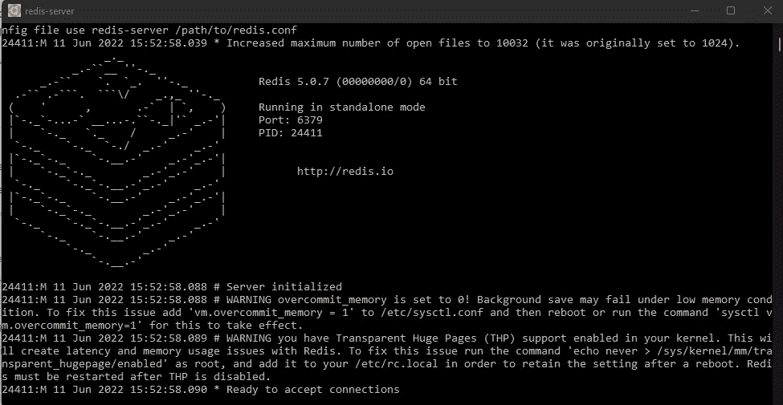
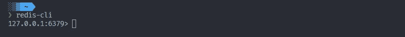
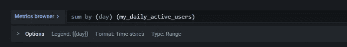

# 如何使用 Redis 实现每日活跃用户指标

> 原文：<https://javascript.plainenglish.io/how-to-implement-daily-active-users-metric-using-redis-4a7d7c4aca8f?source=collection_archive---------3----------------------->


使用 Redis 可以做很多事情，但是何时何地使用它对一些人来说可能有点困惑。远程词典服务器(是的，没错，这就是 Redis 这个词的意思😉)将会令人难以置信地提高你的应用程序的性能，通过每秒数百万次的操作，将你的应用程序的读写操作的延迟减少到不到一毫秒——是的，这不是一个打字错误。

Redis 有大量您熟悉的数据结构来满足您的应用程序需求。它允许你将应用程序的数据存储为字符串、列表、散列、集合、JSON…等等。你猜怎么着？Redis 超级好用。使用 Redis，您可以编写更少的代码来在应用程序中存储、访问和使用数据。此外，您可以使用 Redis API，而不必担心管理单独的缓存、数据库或底层基础设施。

但是嘿！Redis 如何使我的应用程序受益已经说得够多了。我已经恋爱了。请告诉我，Redis 到底是什么？放松…😉

根据官方文档，Redis 是一个开源的、内存中的[键-值]数据结构存储，用作数据库、缓存、消息代理和流引擎。您可以使用大多数编程语言的 Redis，如 JavaScript、Java、Python、C++、C#、Swift、PHP 等。

> *Psst:这只是 Redis 的一个高级概述。欲了解更多，请访问* [*官方网站*](https://redis.io/docs/) *。*

好了，现在请告诉我，我能为雷迪斯·🥺.做些什么当然，没问题！✌️Redis 用例如下:

*   缓存可以减少数据访问延迟，增加吞吐量，减轻关系或 NoSQL 数据库和应用程序的负担。
*   聊天、消息传递和队列，利用各种数据结构，如列表、排序集和散列。
*   会话存储用于管理会话数据，如用户配置文件、凭据、会话状态和特定于用户的个性化设置。
*   通过利用 Redis 排序集数据结构的游戏排行榜。
*   使用 GEOADD、GEODIST、GEORADIUS 和 GEORADIUSBYMEMBER 等命令管理实时地理空间数据，以实时存储、处理和分析地理空间数据。
*   快速内存数据存储支持实时流媒体。
*   快速内存数据存储，用于快速构建、训练和部署机器学习模型。
*   社交媒体分析、广告定位、个性化和物联网等实时分析用例。

还有更多！

# 如何利用 Redis 缓存特性的强大功能，从 Prometheus 指标中获取每日活跃用户

现在，让我向您展示如何最大化 Redis 缓存特性，以解决从现实应用程序中实时获取唯一活跃用户的业务问题。这可能就是你在这里的原因，不是吗？

# 问题是

让我们再次强调这个问题。您需要从集成到 Node.js 应用程序中的 Prometheus 客户端获取一个指标。这个指标是每日活跃用户的计数，即每天至少浏览您的网站一次的每个用户。所以，无论用户一天打开你的网站 100 万次还是 100 万次，他在网站上的活动当天都记录为 1。

# 这个计划

我们将创造一个普罗米修斯计数器。如果唯一用户打开网站并使用受保护的路由，计数器将累计 1。该增量将保持不变，并且在那天结束之前不会因同一用户而改变。这种机制将适用于当天打开网站的每个唯一用户。因此，计数器在一天中为每个不同的用户不断增加。然后，在第二天，对于每个相同的唯一用户，计数器将增加 1，并一直保持到当天结束。简而言之，用户访问网站的每一天，计数器将为每个独立用户增加 1。

# 阻挡者

为了识别用户已经在一天中至少打开过一次站点，并且因此不会在他在同一天迟早打开另一个受保护的路由时增加计数器，我们必须存储用户的信息，下次我们的应用程序接收到另一个对受保护的路由的请求时，我们可以使用这些信息来验证。我们不想将这些信息存储在我们的数据库中。不会吧！🙅‍♂️:我们需要的是一个缓存系统。👍

# Redis 来救援了！

Redis 是完美的解决方案。使用 Redis 缓存，我们将在受保护的路由上执行以下操作:

*   使用用户的 ID 作为密钥。
*   检查是否有基于键的缓存数据。
*   如果没有数据，那一定是用户当天第一次打开网站。因此，将用户的 ID 与…的结果一起存储
*   以秒为单位计算从他打开站点到一天结束还剩多少时间，并将其用作 Redis 的到期时间。
*   然后，将每日活跃用户计数器增加 1

# 先决条件

*   普罗米修斯:因为这是关于雷迪斯的，我假设你至少已经知道了普罗米修斯的基本知识。如果你没有，我建议你先参加一个速成班。
*   Grafana:对 Grafana 略知一二是理想的。但是如果你不知道 Grafana，看看他们的[文档](https://grafana.com/docs/)。这很简单。
*   Redis:你应该知道 Redis 的一些基本概念。但这不是问题——我已经在一开始就向你介绍了其中的一些。此外，我将用 [redis-cli](https://redis.io/docs/manual/cli/) 带您完成安装和一些基本的 Redis 命令。
*   现有 Node.js 项目:在本文中，我将只分享 Redis、Prometheus 和 Grafana 实现的代码片段和截图，以实现主题目标，即获取日常活跃用户。

好了，我们开始吧！✌️

# 安装 Redis

如何安装 Redis 取决于您的操作系统。点击此处查看最符合您需求的指南[。](https://redis.io/docs/getting-started/)

# 让我们用 CLI 来探索 Redis

成功安装 Redis 后，打开您的终端并执行以下命令来启动 Redis 服务器。

```
❯ redis-server
```

这应该会产生如下所示的输出:



如果您得到一个错误，那么您可能没有安装 Redis，或者对于 Windows 用户，您不是在 WSL 终端上。确保按照此处的安装指南[安装 Redis。如果您使用的是 Windows，请确保打开 WSL 终端。然后，再次尝试该命令。](https://redis.io/docs/getting-started/)

请注意，您的终端上打印的部分信息表明 Redis 正在您的本地机器上的端口 6379 上运行。这是 Redis 服务器的默认端口号。

现在，当 Redis 服务器正在运行时，打开一个新的终端并执行以下命令来启动 CLI 并访问 Redis。

```
❯ redis-cli
```

这将打开一个指向`127.0.0.1:6379`的命令提示符。



现在，让我们使用一些 Redis 命令。键入并执行以下命令，获取与某个模式匹配的所有键。

```
127.0.0.1:6379 ❯ KEYS *
```

Redis 在存储点将数据映射到您指定的键。将键视为数据的 id。要检索存储的数据，必须通过一个`key`。在上面的命令中，如果在`KEYS`关键字后指定的模式匹配一个键，如果模式是`*`，表示“所有键”，则返回一个或多个键。

上面的命令应该会返回一条`empty list or set`消息…除非你已经存储了一些过去的数据。所以，让我们创建一个新的。执行以下命令:

```
127.0.0.1:6379 ❯ SET name Kenneth
```

`SET`是设置新数据的关键字。它需要一个键`name`和值`Kenneth`。注意，像这样存储的数据是作为字符串存储的。现在检查您的密钥`name`是否存在。

```
127.0.0.1:6379 ❯ KEYS name
```

您应该会看到包括您的新密钥`name`在内的密钥列表。但是，如果我对`value`感兴趣呢？我想看看用键存储的值。对此的命令是:

```
127.0.0.1:6379 ❯ GET name
```

`GET`是获取数据的关键字。它需要一个键，在本例中是`name`。这将输出该键存储的值。所以，你应该看看`Kenneth`。

我们的密钥(和值)将被永久存储，因为我们在创建时没有指定过期时间。但是，我们可以使用以下命令删除它:

```
127.0.0.1:6379 ❯ DEL name
```

这将返回`(integer) 1`,表示它被成功删除。但是，如果我们想在创建时为新数据设置一个到期时间呢？其语法是:

```
127.0.0.1:6379 ❯ SETEX name 15 Kenneth
```

`SETEX`设置一个新的密钥和值，并在该值之前使用过期时间作为参数。到期时间必须以秒为单位。因此，上面的命令将设置一个名为`name`的新键，并为其分配一个名为`Kenneth`的值，并启动一个 15 秒的计时器。要获得关于还剩多少时间过期的信息，语法是:

```
127.0.0.1:6379 ❯ TTL name
```

`TTL`代表“生存时间”。它需要密钥的名称，它应该确定它的生存时间。反复执行上面的代码将会产生不同的输出，因为键(名称)的生存时间正在倒计时。一旦到了-2，就说明钥匙没了。

#普罗米修斯

如前所述，我将只关注 Prometheus 代码中实现度量逻辑的部分。在实现 Prometheus 时，我通常会创建一个`metrics.js`文件来定义我的度量。将以下代码片段复制并粘贴到您的指标文件中:

```
import client from 'prom-client'; export const dailyActiveUsersGauge = new client.Gauge({
  name: 'my_daily_active_users',
  help: 'Active users metrics on a daily basis.',
  labelNames: ['user_id', 'year', 'month', 'day'],
 });
```

通常，您会有一个验证请求`jwt`令牌的中间件。为此，我将创建一个`protect.js`中间件文件。它将包含我的`jwt`验证逻辑。如果验证通过，我将从解码的令牌中获得用户的`id`(它将被用作发布`jwt`令牌时所需的 id)。然后，我会找到其`id`与解码的令牌`id`匹配的用户，并将用户的详细信息附加到请求对象上名为`user`的新属性中(因此，`req.user`)。最后调用栈中的`next()`中间件。

好吧，这只是我的看法。但是，无论您如何设计您的身份验证逻辑，只要您可以从请求对象中获得用户的`id`,就可以挂载下面的代码片段:

```
import { dailyActiveUsersGauge } from 'path/to/metrics.js';

 dailyActiveUsersGauge.inc(
    {
       user_id: currentUser.uid,
       year,
       month,
       day,
    },
    1,
 );
```

这将创建一个名为`my_daily_active_users`和一些标签(`year`、`month`和`day`)的新度量指标，累积样本值为 1。

##Redis

如果没有 Redis 的帮助，我们不能依赖于我们当前的实现，因为每次相同的用户使用受保护的路由和调用`dailyActiveUsersGauge`度量时，样本值都会不断增加。这将在一天结束时产生不准确的结果。所以，我们用 Redis 来缓存用户的`id`。

让我们安装`redis npm`包

```
❯ npm i redis
```

在项目文件夹中创建一个文件(我称之为 redisCacheHandler.js ),并将以下代码粘贴到其中:

```
import { createClient } from 'redis';

 let client;

 if (process.env.NODE_ENV === 'production') {
  client = createClient({
    url: `redis://${process.env.REDIS_USER}:${process.env.REDIS_PASSWORD}@${process.env.REDIS_HOSTNAME}:${process.env.REDIS_PORT}`,
   });
 } else {
  // You should install redis and run the service command ----> redis-server
   client = createClient();
 }

 client.on('error', (err) => console.log('Redis Client Error', err));

 async function connectRedis() {
   await client.connect();
 }

 connectRedis();

 const defaultExpirationTime = 60 * 10; // 60 seconds times 10 -> 10 minutes

 const getOrSetCache = (cb) => cb();

 export const getCache = (key) =>
   new Promise((resolve, reject) => {
     try {
       getOrSetCache(async () => {
        const data = await client.get(key);
        if (data) {
          console.log('SENDING CACHE...🍫');
        }
        resolve(JSON.parse(data));
      });
    } catch (error) {
      reject(error);
    }
 });

 export const setCache = (key, data, expTime) => {
  if (typeof expTime === 'undefined') {
    expTime = defaultExpirationTime;
 }

  return new Promise((resolve, reject) => {
    try {
      getOrSetCache(async () => {
        const isOk = await client.set(key, JSON.stringify(data), {
          EX: expTime,
        });
        if (isOk) {
          console.log('CACHED! ✅');
        }
        resolve();
      });
    } catch (error) {
      reject(error);
    }
  });
 };
```

简要解释代码:

*   导入 redis 库。
*   检查应用程序运行的环境。如果在开发中，使用本地 redis 服务器(确保它正在运行)。如果在生产中，连接到 [Redis 云](https://redis.info/3NBGJRT)。
*   导出两个函数:
*   `getCache`:通过给定的键检查存储的数据。返回数据的承诺(可能未定义)。
*   `setCache`:设置新的键值数据，返回承诺。需要密钥、数据和以秒为单位的过期时间参数。如果未提供到期时间，则使用默认的到期时间 10 分钟。

现在，回到我们实现`dailyActiveUsersGauge`函数的地方，修改您的代码如下:

```
import { dailyActiveUsersGauge } from 'path/to/metrics.js';
import { getCache, setCache } from 'path/to/redisCacheHandler.js';

// .. ..
  const cacheKey = currentUser.uid;
    const date = new Date();

    const year = date.getFullYear();
    const month = date.getMonth();
    const day = date.getDate();

    const now = Date.now();
    const endOfDay = date.setUTCHours(23, 59, 59, 999);

    const secondsLeftTillEndOfDay = Math.floor((endOfDay - now) / 1000);

    const cachedData = await getCache(cacheKey);

    if (!cachedData) {
      dailyActiveUsersGauge.inc(
        {
          user_id: currentUser.uid,
          year,
          month,
          day,
        },
        1,
      );

      // cache
      await setCache(cacheKey, '_', secondsLeftTillEndOfDay);
   }

// .. ..
```

简要解释代码:

*   导入我们的自定义 redis 模块。获取日、月和年，并将它们传递给 dailyActiveUsersGauge 函数。我们将需要这些信息，尤其是“日期”,以便与 Prometheus 一起对我们的指标进行分组。这正是我们最终想要获得每日计数的方式。
*   使用用户的 ID 作为密钥
*   检查是否有基于键的缓存数据
*   如果没有数据，那一定是用户当天第一次打开网站。因此，将用户的 ID 与…的结果一起存储
*   以秒为单位计算从他打开站点的时间到一天结束还剩多少时间作为到期时间
*   然后，将每日活跃用户量增加 1

上述实现将确保我们有一个准确的每日用户计数，因为只有在 Redis 下有新用户或新密钥时，计数器才会增加。

# 格拉夫纳

在 Grafana 仪表板上，创建一个新面板，并按如下方式构建 Prometheus metrics 浏览器:



# 结论

Redis 是一个强大的工具，几乎可以在 web 应用程序的任何地方使用。希望这篇文章是有帮助的，更重要的是对 Redis 的力量大开眼界。

这篇文章是与 Redis 合作的。

要了解更多信息，请浏览以下参考链接:

*   [免费试用 Redis 云](https://redis.info/3NBGJRT)
*   [观看此视频，了解 Redis 云相对于其他 Redis 提供商的优势](https://redis.info/3Ga9YII)
*   [Redis 开发者中心—工具](https://redis.info/3LC4GqB)
*   [RedisInsight 桌面 GUI](https://redis.info/3wMR7PR)

*更多内容看* [***说白了。报名参加我们的***](https://plainenglish.io/) **[***免费周报***](http://newsletter.plainenglish.io/) *。关注我们关于*[***Twitter***](https://twitter.com/inPlainEngHQ)*和*[***LinkedIn***](https://www.linkedin.com/company/inplainenglish/)*。查看我们的* [***社区不和谐***](https://discord.gg/GtDtUAvyhW) *加入我们的* [***人才集体***](https://inplainenglish.pallet.com/talent/welcome) *。***