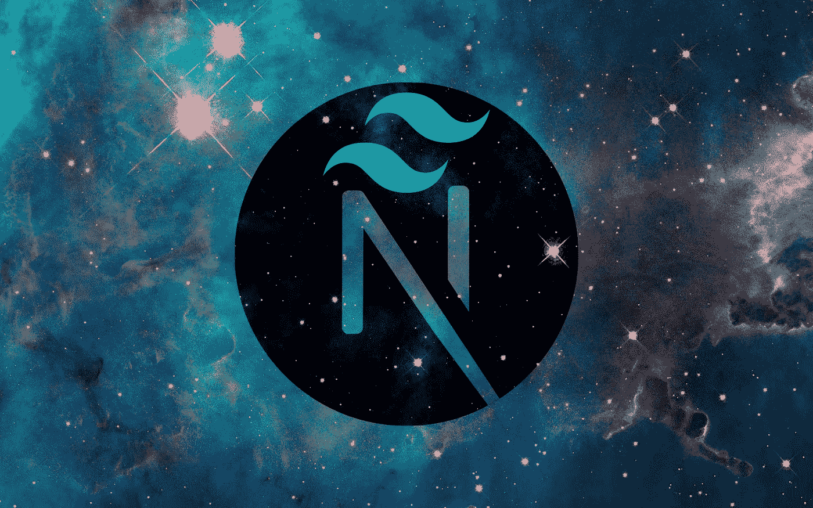
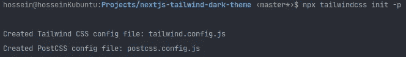
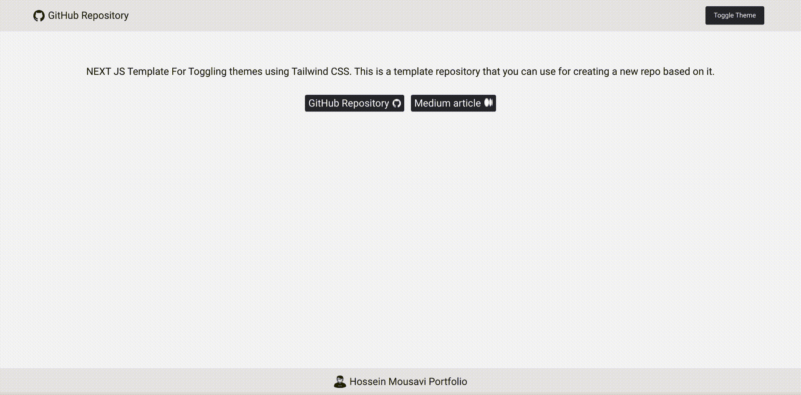

# 如何使用上下文挂钩在 Next.js 应用程序中实现暗/亮主题

> 原文：<https://javascript.plainenglish.io/how-to-implement-dark-light-themes-in-a-next-js-app-using-context-hook-tailwindcss-336558dd4579?source=collection_archive---------2----------------------->

## 初始化一个 Next.js 应用程序，然后使用上下文钩子和 TailwindCSS 实现暗/亮主题切换

任何合适的 web 应用程序的用户最需要的特性之一是在亮暗模式之间切换。在本文中，我们将构建一个模板 Next.js 应用程序，在 TailwindCSS 的帮助下，我们将实现暗主题和亮主题之间的切换机制。我已经为这个模板使用了 React 的钩子，比如 *useContext、useState 和 useEffect* 。那么事不宜迟，我们开始吧。



Partial image of **Carina Nebula**

***TL；博士，*** *你可以找到该项目的* [*GitHub 库*](https://github.com/hossein13m/nextjs-tailwind-dark-theme) *。它是一个模板存储库，您可以使用它来创建一个基于它的新项目。如果你喜欢，你可以给它一个⭐！你也可以点击* *查看该项目* [*的现场演示。*](https://nextjs-tailwind.hmousavi.dev/)

# 目录:

*   初始化 Next.js 应用程序
*   改变项目的结构(*可选*)
*   将 TailwindCSS 添加到项目中并进行配置
*   实现项目的布局(代码在 GitHub repo 中可用)
*   使用 useContext 挂钩在应用程序中广泛更改主题，并将首选主题存储在 localStorage 中
*   将我们的 themeContext 添加到主组件中，以便在应用程序中广泛使用它
*   创建带有按钮的导航栏以在主题之间切换

# 初始化 Next.js 应用程序并将 TailwindCSS 添加到项目中

第一步是初始化一个新的 Next.js 应用程序。为此，确保您已经在机器上安装了 *node.js* ，然后使用以下命令:

```
npx create-next-app@latest --typescript
# or
yarn create next-app --typescript
# or
pnpm create next-app --typescript
```

`--typescript`选项规定您将受益于项目中的 TypeScript，我强烈建议您使用它。

# 项目结构(可选)

我个人更喜欢把我项目的文件和文件夹放在一个单独的目录里，叫做 ***src*** *。*但是这一步完全取决于你想不想做。唯一的区别是，当我们想要配置顺风配置文件时，以及当我们想要寻址我们的文件时，我们马上就会看到。为此，我将创建一个新目录，并将`*pages*`和`*styles*`文件夹转移到那里。在整个开发过程中，项目的结构也会发生变化。例如，我们将创建一个名为`*components*` 的新目录来存储我们的组件，或者创建另一个名为`*store*` *的目录来存储我们的*上下文*。*下面所有的目录都将保存在 *src* 文件夹中。


Photo by [Evgeniy Surzhan](https://unsplash.com/@followtherabbit?utm_source=medium&utm_medium=referral) on [Unsplash](https://unsplash.com?utm_source=medium&utm_medium=referral)

# 将 TailwindCSS 添加到项目中

初始化完成后，我们可以将 TailwindCSS 添加到项目中。首先，我们需要使用以下命令安装三个软件包:

```
npm install -D tailwindcss postcss autoprefixer
```

因为我们使用了`-D`选项，所以下面所有的包都将作为 **devDependencies** 安装。下一步是为 *tailwind* 和 *postcss* 创建两个配置文件。

```
npx tailwindcss init -p
```



As you can see, two configuration files will be made once we run the above command!

出于我们的目的，我们不需要对`postcss.config.js`文件进行任何更改，我们将保持原样。
另一方面，`*tailwind.config.js*`文件负责在我们的应用程序中配置顺风选项。我们将在另一篇文章中更深入地探讨它，但是为了这篇文章，我们只需要调整一些东西来实现黑暗/光明主题。下面的配置文件是我们在应用程序中需要的文件。

配置文件的主要要点如下:

*   如果您已经更改了项目的结构，您需要在路径开头的内容数组中包含 ***src*** 。
*   您需要将第五行添加到配置中，并通过使用 ***类*** 显式指示黑暗模式。如果我们将 ***深色*** 类添加到我们的 HTML 主体中，这个项目将使用深色主题。

现在你需要**将顺风导入到你项目的主 CSS** 文件中。在您的`***global.css***`文件中添加以下代码行。

```
// import tailwind to global.css file
@tailwind base;
@tailwind components;
@tailwind utilities;
```

# 创建项目布局

为了简单起见，我们在布局中添加了一个导航条和一个在主题间切换的按钮。我们将把我们的*布局*和*标题*存储在`*components*` 目录中。
我不打算介绍布局实现，因为这是一个 HTML 和 CSS 任务。您可以在 GitHub 资源库中找到它。但是我将深入讨论标题的实现，我们有一个按钮可以在几秒钟内切换主题。

## [链接到 GitHub 知识库](https://github.com/hossein13m/nextjs-tailwind-dark-theme)
[链接到现场演示](https://nextjs-tailwind.hmousavi.dev/)


Photo by [Lautaro Andreani](https://unsplash.com/@lautaroandreani?utm_source=medium&utm_medium=referral) on [Unsplash](https://unsplash.com?utm_source=medium&utm_medium=referral)

# 切换主题的上下文

创建另一个名为`*store*`的目录，然后创建一个包含以下内容的`.tsx`文件:

下面的文件切换主题，将`dark`添加到类的主体中，这样 tailwind 就可以使用它了。它还在本地存储上存储您喜欢的主题，所以您不会在重新加载时错过它。`initialThemeHandler`函数根据本地存储器是否为空来设置适当的设置。默认情况下，我们希望我们的应用程序处于黑暗模式。

现在我们已经编写了上下文，让我们在组件上访问并使用它。

# 向主组件添加上下文。

由于我们想从整个应用程序的 ***上下文*** 中获益，我们需要将它添加到`_app.tsx`文件中，如下所示:

请注意，我们的布局应该是我们的自定义挂钩的子，因为我们希望它与我们的上下文一起工作。

# 在标题组件上切换主题

我们想实现一个按钮来切换主题，但是这个按钮不会在我们的上下文代码所在的同一个组件中。我们需要在我们的 header 组件中导入`***useContext***`钩子，它将我们的上下文作为一个参数。并且在负责切换按钮的 click 事件的函数上，我们需要调用我们的自定义上下文来更改主题。这个解释可能看起来很混乱，但是让我们看看代码，你就会明白了！

正如你所看到的，我大量使用了 Tailwind 类来定制按钮的样式。如果我们将一个名为`dark`的类附加到页面主体，那么`dark:<className>`是 Tailwind 识别并使用`dark:`之后的类的语法。

# 最终输出

最终输出将是这样的:



我已经提供了一个 GitHub 库，并使用 [Netlify](https://netlify.com/) 发布了最终产品，你可以在下面找到它们的链接:

## [**GitHub 资源库**](https://github.com/hossein13m/nextjs-tailwind-dark-theme) **|** [**现场试玩**](https://nextjs-tailwind.hmousavi.dev/)

# 分享给你的朋友！拍手声👏高达 50 倍，并给一个明星⭐到其 GitHub 库

请不要犹豫与我分享你的想法和主意。你可以在 Twitter 上找到我，或者通过访问我的作品集在其他社交媒体上找到我。

[](https://www.hmousavi.dev/) [## 侯赛因穆萨维-软件开发人员

### 你好。👋🏻发现侯赛因穆萨维的空间，找出我的作品。请随时与我联系，还有更多！

www.hmousavi.dev](https://www.hmousavi.dev/) 

**阅读更多来自我:**

[](/take-a-good-look-at-filter-map-and-reduce-in-javascript-18d72f483ada) [## 详细了解 JavaScript 中的 filter()、map()和 reduce()

### 深入了解 JavaScript 中的 filter()、map()和 reduce()方法。

javascript.plainenglish.io](/take-a-good-look-at-filter-map-and-reduce-in-javascript-18d72f483ada) [](https://itnext.io/a-complete-guide-to-the-api-first-approach-ecd796dd0f10) [## API-优先方法完全指南

### 在您的软件开发生涯中，开发应用程序可能采用的许多方法之一是…

itnext.io](https://itnext.io/a-complete-guide-to-the-api-first-approach-ecd796dd0f10) [](https://medium.com/codex/multiple-interceptors-in-angular-e0880b2f7d91) [## 角形多拦截器

### Angular 提供的一个令人惊奇的特性是拦截器，但是拦截器能做什么，我们能不能…

medium.com](https://medium.com/codex/multiple-interceptors-in-angular-e0880b2f7d91) [](https://medium.com/angular-in-depth/husky-6-lint-prettier-eslint-and-commitlint-for-javascript-project-d7174d44735a) [## 用于 JavaScript 项目的 husky 6 Lint(appellite+eslint)和 commitlint

### 编程是一项团队工作，所以我们必须确保我们的代码库是干净的，对团队中的每个人都是可用的…

medium.com](https://medium.com/angular-in-depth/husky-6-lint-prettier-eslint-and-commitlint-for-javascript-project-d7174d44735a) [](https://medium.com/angular-in-depth/angular-forms-reactive-form-including-angular-material-and-custom-validator-9ef324cc3b08) [## 角形(反应式)包括角形材料和自定义验证器

### 表单是每个角度项目的主要部分，在这篇文章中，我们想实现一个反应式的角度表单，带有一个…

medium.com](https://medium.com/angular-in-depth/angular-forms-reactive-form-including-angular-material-and-custom-validator-9ef324cc3b08)