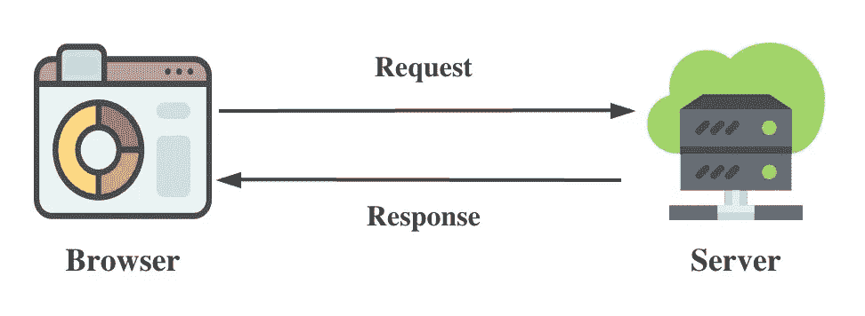
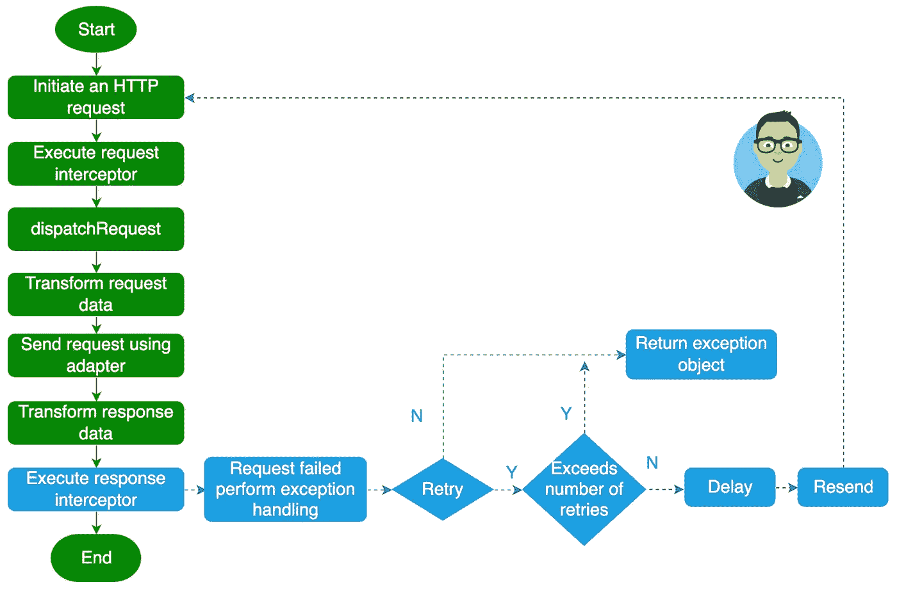
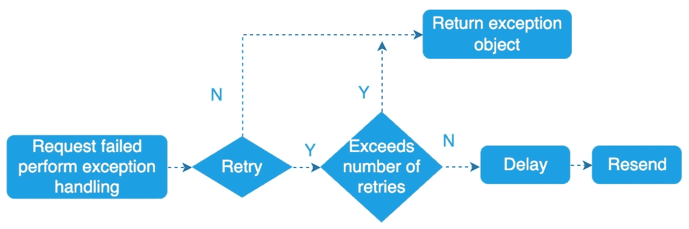
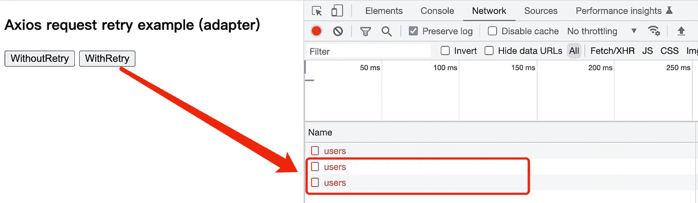

# 如何使用 Axios 实现请求重试

> 原文：<https://javascript.plainenglish.io/how-to-implement-request-retry-using-axios-8c5551740781?source=collection_archive---------3----------------------->

## 如何使用 Axios 提供的`interceptor`和`adapter`实现请求重试功能的教程。


Photo by [Conny Schneider](https://unsplash.com/es/@choys_?utm_source=medium&utm_medium=referral) on [Unsplash](https://unsplash.com?utm_source=medium&utm_medium=referral)

在浏览器中，通过 [XMLHttpRequest](https://developer.mozilla.org/en-US/docs/Web/API/XMLHttpRequest) 和 [Fetch](https://developer.mozilla.org/en-US/docs/Web/API/Fetch_API) API，我们可以发出 HTTP 请求从服务器获取数据。但是在实际操作中，为了更方便的处理 HTTP 请求，我们会使用一些成熟的 HTTP 客户端，比如 [**Axios**](https://axios-http.com/) 、jQuery 等。

在请求过程中，可能会出现请求超时或服务器异常。当请求失败时，对于一些特殊的 API 接口，我们希望能够重试。那么应该如何实现请求重试的功能呢？接下来我将以广泛使用的 [**Axios**](https://axios-http.com/) 为例，介绍如何使用 Axios 提供的`interceptor`和`adapter`来实现请求重试的功能。

# 1.使用 Axios 拦截器请求重试

[**Axios**](https://axios-http.com/) 是一个基于承诺的 HTTP 客户端，HTTP 协议基于请求和响应:



因此，Axios 提供了一个请求拦截器和一个响应拦截器来分别处理请求和响应，其工作方式如下:

*   **请求拦截器**:这类拦截器的作用是在发送请求之前统一执行某些操作，比如在请求头中添加一个 token 字段。
*   **响应拦截器**:这类拦截器的作用是在收到服务器的响应后，统一执行某些操作，比如发现响应状态码为 401 时，自动跳转到登录页面。

在 Axios 中设置拦截器非常简单。通过`axios.interceptors.request`和`axios.interceptors.response`对象提供的使用方法，可以分别设置请求拦截器和响应拦截器:

**添加请求拦截器**

```
axios.interceptors.request.use(function (config) {
    // Do something before request is sent
    return config;
  }, function (error) {
    // Do something with request error
    return Promise.reject(error);
});
```

**添加响应拦截器**

```
axios.interceptors.response.use(function (response) {
    return response;
  }, function (error) {
    return Promise.reject(error);
});
```

对于请求重试的功能，我们希望用户不仅可以设置重试次数，还可以设置重试延迟时间。当请求失败时，如果请求的配置对象配置了重试次数，Axios 将重新发起请求以重试操作。为了能够全局重试请求，我们将在响应拦截器上实现请求重试功能。具体代码如下:

上面的代码并不复杂，对应的处理流程如下图所示:



在介绍了如何使用拦截器实现请求重试的功能后，下面我们来介绍一下适配器实现请求重试的方案。

# 2.使用 Axios 适配器请求重试

[**Axios**](https://axios-http.com/) 引入了适配器，允许它支持浏览器和 Node.js 环境。对于浏览器环境，它通过包装`XMLHttpRequest` API 发送 HTTP 请求，对于 Node.js 环境，它通过包装 Node.js 的内置`http`和`https`模块发送 HTTP 请求

在介绍如何增强默认适配器之前，我们先来看看 Axios 内置的 xhrAdapter 适配器，它是在`[lib/adapters/xhr.js](https://github.com/axios/axios/blob/v1.x/lib/adapters/xhr.js#L45)`文件中定义的:

```
// lib/adapters/xhr.js
module.exports = function xhrAdapter(config) {
  return new Promise(function dispatchXhrRequest(resolve, reject) {
    var requestData = config.data;
    var requestHeaders = config.headers; var request = new XMLHttpRequest();
    // omit most of the code
    var fullPath = buildFullPath(config.baseURL, config.url);
    request.open(config.method.toUpperCase(), buildURL(fullPath,    
     config.params, config.paramsSerializer), true);
    // Set the request timeout in MS
    request.timeout = config.timeout; // Listen for ready state
    request.onreadystatechange = function handleLoad() { ... } // Send the request
    request.send(requestData);
  });
};
```

显然，`xhrAdapter`适配器是一个函数对象，它接受一个配置参数并返回一个承诺对象。在`xhrAdapter`适配器内部，XMLHttpRequest API 最终用于发送 HTTP 请求。为了实现请求重试的功能，可以考虑通过高阶函数来增强`xhrAdapter`适配器的功能。

## 2.1 定义 retryAdapterEnhancer 函数

为了给用户更多的灵活性来控制请求重试的功能，我们定义了一个`retryAdapterEnhancer`函数，它支持两个参数:

*   适配器:预增强的 Axios 适配器对象；
*   选项:缓存配置对象，支持 2 个属性，用于配置不同的特性:**次数(请求重试次数)和延迟(请求延迟时间，单位为毫秒)**。

上述代码对应的处理逻辑如下图所示:



## 2.2 使用 retryAdapterEnhancer 函数

2.2.1 创建一个 Axios 对象并配置适配器选项

```
const http = axios.create({
  baseURL: "[http://localhost:3000/](http://localhost:3000/)",
  adapter: retryAdapterEnhancer(axios.defaults.adapter, {
    retryDelay: 1000,
  }),
});
```

2.2.2 使用 http 对象发送请求

```
// Request fails without retrying
function requestWithoutRetry() {
  http.get("/users");
}// Request fails with retrying
function requestWithRetry() {
  http.get("/users", { retryTimes: 2 });
}
```

接下来，让我们实际看看请求重试的效果:



从上图可以看出，当对`/users` API 的请求失败时，会按照配置的重试次数进行重试。

如果你想阅读完整的代码，你可以访问这个[链接](https://gist.github.com/semlinker/8331c7f86f1a09e5847ed8cbe5146028)。如何使用 Axios 拦截器和适配器实现请求重试的功能已经介绍过了，如果您在阅读中有任何问题，请给我留言。

如果你想学习打字，那么不要错过**掌握打字**系列。

*   [**TypeScript 泛型中的 K、T、V 是什么？**](https://medium.com/frontend-canteen/what-are-k-t-and-v-in-typescript-generics-9fabe1d0f0f3)
*   [**使用 TypeScript 像 Pro 一样映射类型**](/using-typescript-mapped-types-like-a-pro-be10aef5511a)
*   [**使用 TypeScript 条件类型像亲**](/use-typescript-conditional-types-like-a-pro-7baea0ad05c5)
*   [**使用 TypeScript 交集类型像亲**](/using-typescript-intersection-types-like-a-pro-a55da6a6a5f7)
*   [**使用打字稿推断像亲**](https://levelup.gitconnected.com/using-typescript-infer-like-a-pro-f30ab8ab41c7)
*   [**使用 TypeScript 模板字面类型像亲**](https://medium.com/javascript-in-plain-english/how-to-use-typescript-template-literal-types-like-a-pro-2e02a7db0bac)
*   [**可视化打字稿:15 种最常用的实用类型**](/15-utility-types-that-every-typescript-developer-should-know-6cf121d4047c)
*   [**关于类型脚本类你需要知道的 10 件事**](https://levelup.gitconnected.com/10-things-you-need-to-know-about-typescript-classes-f58c57869266)
*   [](/purpose-of-declare-keyword-in-typescript-8431d9db2b10)**中‘declare’关键字的用途**
*   **[**不再混淆打字稿的“任何”和“未知”**](/no-more-confusion-about-typescripts-any-and-unknown-98c4b53f8924)**

**

[Bytefer](https://medium.com/@bytefer?source=post_page-----8c5551740781--------------------------------)** 

## **掌握打字稿系列**

**[View list](https://medium.com/@bytefer/list/mastering-typescript-series-688ee7c12807?source=post_page-----8c5551740781--------------------------------)****47 stories**************

**在[媒体](https://medium.com/@bytefer)或[推特](https://twitter.com/Tbytefer)上关注我，阅读更多关于 TS 和 JS 的内容！**

***更多内容看* [***说白了就是 io***](https://plainenglish.io/) *。报名参加我们的* [***免费周报***](http://newsletter.plainenglish.io/) *。关注我们关于* [***推特***](https://twitter.com/inPlainEngHQ) ， [***领英***](https://www.linkedin.com/company/inplainenglish/) *，*[***YouTube***](https://www.youtube.com/channel/UCtipWUghju290NWcn8jhyAw)*[***不和***](https://discord.gg/GtDtUAvyhW) *。对增长黑客感兴趣？检查* [***电路***](https://circuit.ooo/) *。****