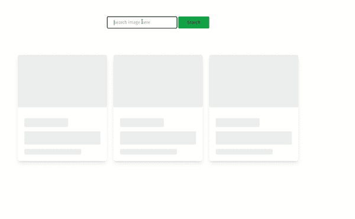

# 如何在页面组件中实现骨架加载动画

> 原文：<https://javascript.plainenglish.io/how-to-implement-skeleton-loading-animation-in-page-components-3fbeff5a6ecb?source=collection_archive---------9----------------------->

## 了解加载动画以及如何在页面组件中构建骨架加载动画效果

Loading the truck from [ZillioDesigns](https://www.zilliondesigns.com/blog/wp-content/uploads/loading-the-truck.gif)

在页面元素中加载动画如今在网络上随处可见，更不用说其中一些很无聊。它们主要在页面元素中实现，在页面元素中需要指示一些数据正在被加载。这可能是从外部来源获取数据或处理一些可能需要一些时间的信息的情况。

在某些情况下，您需要在页面上呈现一些数据。在这种情况下，你的用户在加载这些信息时盯着一个空白屏幕会很无聊。如果页面元素的渲染阶段需要更长的时间，一些用户可能会认为你的网站是坏的或有问题的。根据谷歌的一项研究，用户更有可能离开一个加载时间超过 3 秒的网站。

在大多数情况下，在加载数据时显示空白页是一种不好的做法。您可以利用吸引人的加载动画来吸引用户的注意力，并为您提供足够的时间来获取和呈现页面。这样就足够高效了，而不是枯燥的空白页。

加载页面动画已经在进度屏幕中大量实现，以显示文件上传、下载百分比和软件更新的大概时间。虽然在加载动画时指出大概的等待时间是个好习惯，但是我们将只实现一个没有大概等待时间的加载器。

**加载屏幕动画应该能够:**

*   提供大概的等待时间。

这为用户提供了一些继续等待的理由，并减少了点击的挫败感。

*   传达为什么用户需要等待。

这可以包括在所有数据完全可用并对用户可见之前用百分比或分钟来显示进度。

*   应该仅在必要时显示。

不必要的显示加载屏幕会让用户很烦。它的实现应该只与加载时间过长的部分相关。

*   尽可能多地参与

引人入胜的加载程序能够抓住用户的注意力，并提供足够的时间让你获取和显示信息，而不会让他们点击离开。

此外，加入一个相关的品牌故事可以足够吸引人，让它给人留下深刻印象，并迅速抓住注意力。这在树立你的品牌形象方面也是独一无二的(例如，上面的封面图片动画)。

## 为什么您应该关心加载页面动画

*   改善您的用户体验
*   向用户提供等待的理由。
*   让加载过程不那么烦人，尤其是当你使用吸引人和引人注目的动画图形时。

## 用 Vue.js 和 Tailwind CSS 构建骨架加载动画效果

今天骨架加载线框几乎无处不在。它们已经在 YouTube、LinkedIn、Medium 和 Twitter 上实现，这只是其中几个流行的网站。

骨架加载线框提供了惊人的用户体验，而没有牺牲太多的性能。

这里，我们将实现一个骨架加载效果。我们将在 [Vue.js](https://vuejs.org/) 和 [Tailwind CSS](https://tailwindcss.com/) 中实现 UI。

Skeleton Loading Card animation

*   配置骨骼加载屏幕动画

Skeleton Loading Card Component

*   打开/关闭骨骼加载动画。

骨架加载机制示例

Skeleton Card Loading effect

**最后的想法**

当你想在获取或处理数据的时候吸引用户的注意力，让他们停留在你的页面上，加载动画是非常重要的。同样，它也可以改善你的用户在浏览你的页面时的体验。

使用加载动画的正确平衡可以改变你的游戏规则。虽然使用加载器页面组件可能是正确的，但是您应该在使用它们的位置和频率之间取得平衡。

感谢您花时间通读这篇文章。祝您在构建推动惊人用户体验的网站时过得愉快。

每周三，我都会发送一封独家邮件，里面有我发现的有用的、与技术写作相关的技巧、文章、应用、书籍和想法。

加入那些像你一样想提高写作技巧的人。

**更多阅读内容**

 [## 如何配置 Commitlint 并从 Git 提交消息中生成有用的 CHANGELOGs

### 从 git 提交消息中配置和生成有用的变更日志

javascript.plainenglish.io](/how-to-configure-commitlint-and-generate-useful-changelogs-from-git-commit-messages-baa50764da4b)  [## 如何创建 API 文档

### 第 2 部分:设置您的第一个 API 文档

javascript.plainenglish.io](/how-to-create-api-documentation-eb4561ab6f4f) 

*更多内容请看*[***plain English . io***](https://plainenglish.io/)*。报名参加我们的* [***免费周报***](http://newsletter.plainenglish.io/) *。关注我们关于*[***Twitter***](https://twitter.com/inPlainEngHQ)**和*[***LinkedIn***](https://www.linkedin.com/company/inplainenglish/)*。查看我们的* [***社区不和谐***](https://discord.gg/GtDtUAvyhW) *加入我们的* [***人才集体***](https://inplainenglish.pallet.com/talent/welcome) *。**