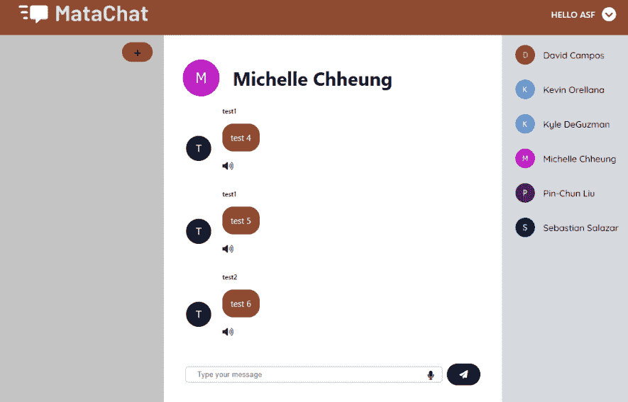

# 如何快速简单地实现语音转文本(用 JavaScript)

> 原文：<https://javascript.plainenglish.io/how-to-implement-speech-to-text-quickly-and-easily-in-javascript-d9804ddd2a49?source=collection_archive---------1----------------------->

## 让我们用大约 12 行代码完成它？



嘿朋友们，

今天我们有一个快速而有趣的任务。使用语音识别 Web API，我们希望捕获用户的声音，将他们的语音转换成文本，并将文本显示到控制台。

在我们开始之前，我还有一篇关于如何轻松实现文本到语音转换的文章。请检查一下。这很简单。

现在我们可以开始了。

# 将语音识别功能引入我们的项目

开始时，我们不需要安装任何时髦或复杂的东西。我们只需要在我们的项目中引入语音识别。我们使用下面的代码片段来实现这一点:

```
const GetSpeech = () => {
        const SpeechRecognition =  window.SpeechRecognition || window.webkitSpeechRecognition;

        let recognition = new SpeechRecognition();}
```

让我们一行一行地分析。

首先，我们将所有的语音识别功能封装在一个名为`GetSpeech()`的函数中。我只想在调用这个函数时捕获语音。如果您没有将语音识别封装在函数中，当您打开网页时，语音将被捕获。这不是我们想要的。

接下来，我们创建一个名为`SpeechRecognition`的常量变量。这将保持[语音识别接口](https://developer.mozilla.org/en-US/docs/Web/API/SpeechRecognition)。这是一个界面，它将提供我们捕捉语音所需的工具。所以基本上就是说，根据你使用的浏览器(比如 Safari 或者 Google Chrome)，获得合适的界面。

在最后一行中，我们基本上是在实例化一个 SpeechRecgonition 对象。我们需要这样做，以便我们可以访问语音识别接口的方法/功能。您将在下一个代码片段中看到这些方法。

```
recognition.onstart = () => {
         console.log("starting listening, speak in microphone");
} 
```

`onStart`是 SpeechRecognition 接口的一种方法。使用这种方法，当开始捕获语音时，您可以提供您希望程序做什么的指令。在上面的例子中，我想将我的网站正在监听语音输入的信息打印到控制台上。

在我的聊天应用程序中，用户必须点击麦克风来触发语音识别。默认情况下，麦克风是黑色的。所以在这个`onStart`函数中，我将麦克风的颜色改为红色，表示麦克风当前正在使用中。

有许多理由说明`onStart`方法是有用的。做任何对你的应用有意义的事情。

```
recognition.onspeechend = () => {
                console.log("stopped listening");
                recognition.stop();
            }
```

接下来，我们有语音识别界面的`onspeechend`方法。当界面识别出用户不再说话时，将自动调用此方法。在上面的例子中，我们做了两件事:[1]打印到控制台麦克风不再监听和[2]关闭识别。所以别听了。

同样，在我的聊天应用程序中，这是将我的红色麦克风的颜色改为黑色的时候。这是为了向用户指示麦克风不再是活动的。

```
recognition.onresult = (result) => {
        let vocalInput = result.results[0][0].transcript;
         console.log(vocalInput);
}
```

接下来，我们有了`onresult`方法，注意它有一个名为`result`的参数。`result` 为我们提供了关于声音输入的信息。使用上面代码片段中的第二行代码，您可以访问声音输入的完整文本。

如您所见，我们刚刚将它打印到控制台上。

在建立了所有这些函数之后，我们完成了以下工作:

```
recogniiton.start()
```

这一行告诉浏览器开始监听并激活语音识别。请注意，这不同于`onstart`方法。`onstart`方法定义了激活语音识别时应该发生什么的指令。它实际上并不激活语音识别本身。

# 最终代码

总之，这就是你的函数应该看起来的样子。

```
const GetSpeech = () => {
        console.log("clicked microphone");
        const SpeechRecognition =  window.SpeechRecognition || window.webkitSpeechRecognition;

        let recognition = new SpeechRecognition();recognition.onstart = () => {
                console.log("starting listening, speak in microphone");
            }
            recognition.onspeechend = () => {
                console.log("stopped listening");
                recognition.stop();
            }
            recognition.onresult = (result) => {
                console.log(result.results[0][0].transcript);
             }

             recognition.start();
    }
```

如果你正在寻找一个麦克风图标，看看 [Font Awesome 的麦克风图标](https://fontawesome.com/icons/microphone?s=solid)。

查看运行中的代码:

感谢阅读！不要忘记看看[如何在下一个 JavaScript 项目](/how-to-easily-implement-text-to-speech-functionality-in-your-next-javascript-project-16f0d14432f0)中轻松实现文本到语音转换。

在不久的将来，我将谈论更多的本地 Web APIs，比如地理定位 API，所以请不要离开。

祝你有美好的一天和快乐的编码！

*更多内容请看*[***plain English . io***](https://plainenglish.io/)*。报名参加我们的* [***免费周报***](http://newsletter.plainenglish.io/) *。关注我们关于*[***Twitter***](https://twitter.com/inPlainEngHQ)*和*[***LinkedIn***](https://www.linkedin.com/company/inplainenglish/)*。加入我们的* [***社区不和谐***](https://discord.gg/GtDtUAvyhW) *。*