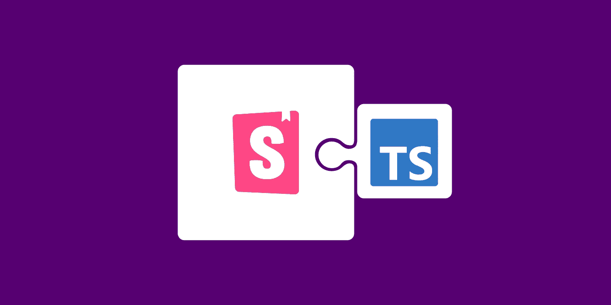
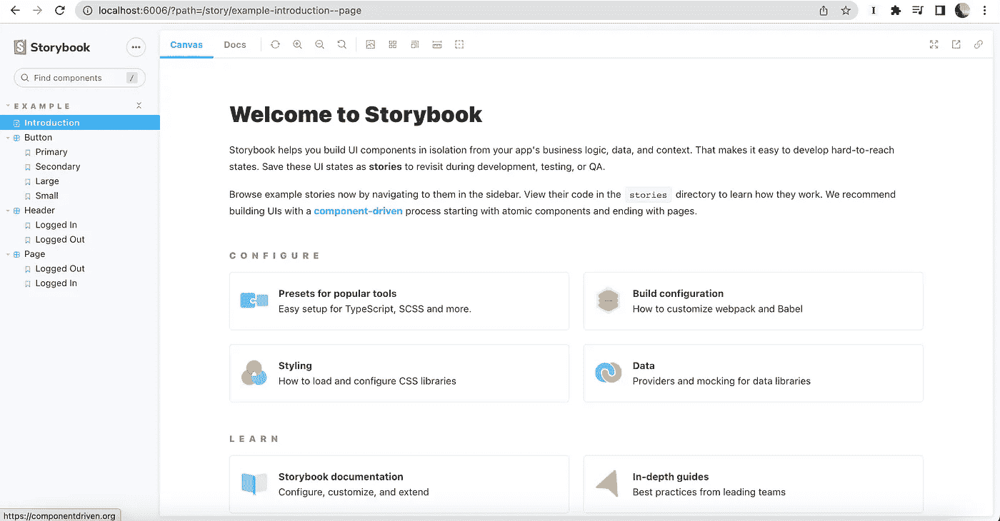
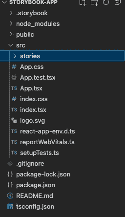
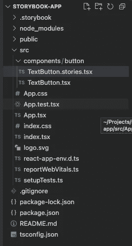
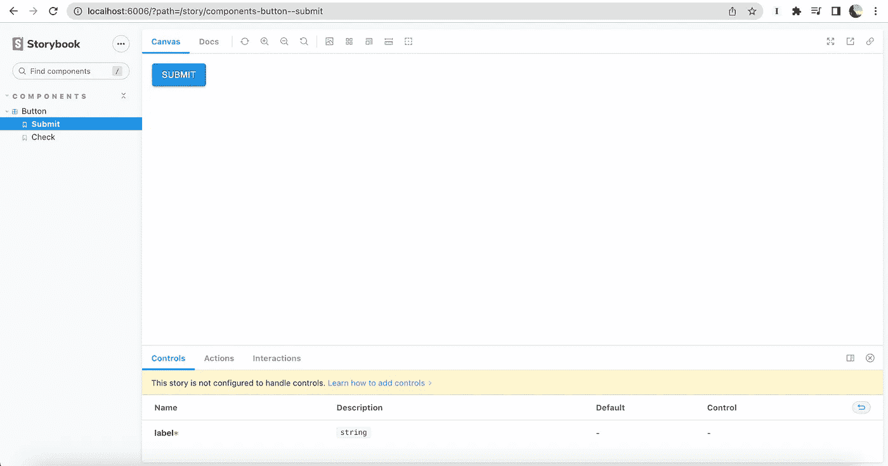
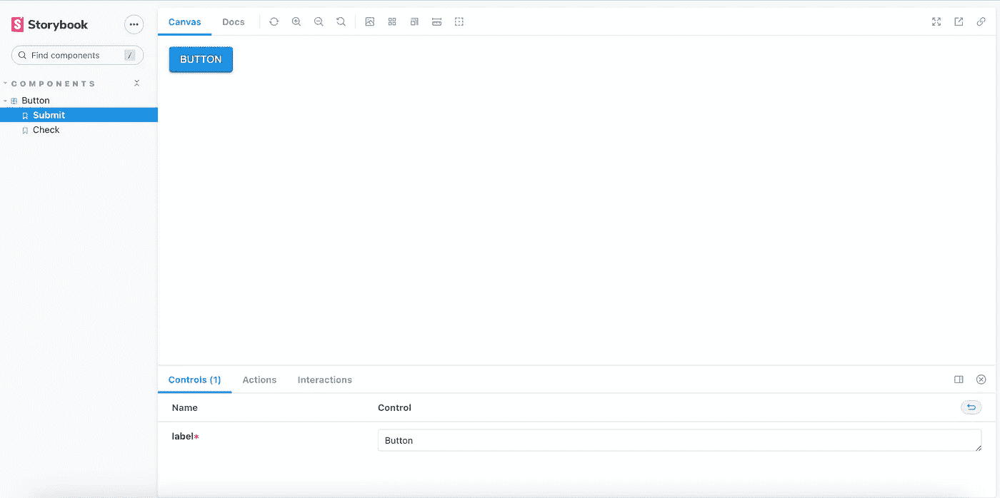

# 如何在 React + TypeScript + Material UI 应用中实现故事书

> 原文：<https://javascript.plainenglish.io/how-to-implement-storybook-for-react-typescript-material-ui-application-f2dcbdca2ce3?source=collection_archive---------1----------------------->

Storybook 是一个 UI 开发工具，它可以让你在一个非常丰富的库设计中预览你的组件，这将帮助你改变组件的所有道具，并在不同的场景中测试你的组件。故事书现在越来越受欢迎，在产品开发周期中非常有帮助。



这篇博客讨论了如何在 React + TypeScript 应用程序中实现 Storybook。

让我们从创建一个 React + TypeScript 应用程序开始，然后向其中添加 storybook。

```
npx create-react-app storybook-app --template typescript
cd storybook-app
npx storybook init
```

我们已经准备好了应用程序，现在可以运行故事书了。

```
npm run storybook
```

上面的命令将运行故事书。您应该会在浏览器中看到类似下面的内容。将 Storybook 添加到您的应用程序中会将样板文件添加到您的存储库中。



向我们的应用程序添加材质 UI。

```
npm install [@mui/material](http://twitter.com/mui/material) [@emotion/react](http://twitter.com/emotion/react) [@emotion/styled](http://twitter.com/emotion/styled)
```

现在让我们开始为我们的 MUI 组件编写一个故事。我将从我的申请中删除样板文件夹`stories`。



我正在为 MUI 组件创建一个名为`components`的文件夹，并在文件夹 button 中编写一个按钮故事和按钮组件。



现在我们已经创建了文件，让我们为按钮编写模板。按钮标签是作为道具添加的。

让我们为我们的按钮写一个简单的基本故事。

我们可以在故事书里看到我们的故事，但是我们没有看到任何控件。



现在我们知道如何编写基本的故事，让我们使用 args 重写我们的故事。使用参数练习写故事总是好的。一个原因是我们组件中的道具被转换成故事书中的控件。

我们现在可以在故事书里看到控件了。



我们现在已经成功地为我们的按钮编写了一个故事。

## 结论:

这是一个简单的将 Storybook 添加到 React + TypeScript 应用程序的例子。你可以在这里找到完整的代码。

## 参考资料:

1.  [https://medium . com/@ annycarolinegnr/storybook-with-react-typescript-1c 15 a1 CBC 26 a](https://medium.com/@annycarolinegnr/storybook-with-react-typescript-1c15a1cbc26a)
2.  [https://storybook.js.org/docs/react/writing-stories/args](https://storybook.js.org/docs/react/writing-stories/args)
3.  [控件](https://storybook.js.org/docs/react/essentials/controls) -故事书

*更多内容请看*[***plain English . io***](https://plainenglish.io/)*。报名参加我们的* [***免费周报***](http://newsletter.plainenglish.io/) *。关注我们关于*[***Twitter***](https://twitter.com/inPlainEngHQ)[***LinkedIn***](https://www.linkedin.com/company/inplainenglish/)*[***YouTube***](https://www.youtube.com/channel/UCtipWUghju290NWcn8jhyAw)*[***不和***](https://discord.gg/GtDtUAvyhW) *。对增长黑客感兴趣？检查* [***电路***](https://circuit.ooo/) *。***