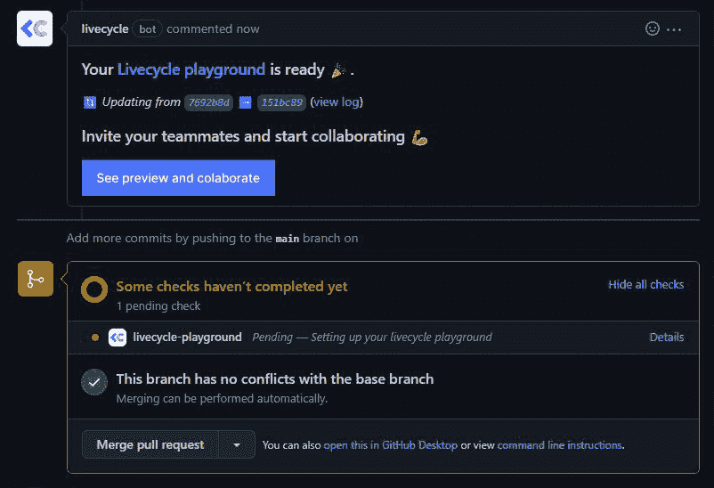

# 如何利用 Livecycle 改进设计人员和开发人员的协作

> 原文：<https://javascript.plainenglish.io/how-to-improve-designer-developer-collaboration-with-livecycle-d9c8bbfa9e3d?source=collection_archive---------15----------------------->

## 将 GitHub Pull 请求转化为最终的设计交付，以改善协作。

[Photo by fauxels](https://www.pexels.com/photo/top-view-photo-of-people-discussing-3182774/)

随着远程/在家工作作为新的现状的出现，人员和预算紧缩，以及现代 webdev 的永恒进步，代码和设计之间的界限变得越来越模糊。

越来越多的设计师在学习编程和 GitHub 基础知识；在另一个阵营，设计敏感性正在成为开发人员的进入壁垒，在 Indeed.com 的[上有超过 250，000 个提到 UI/UX 设计的编码工作结果。资源是有限的，期限是紧迫的，这些角色经常分享技能和责任来创建和支持产品的内聚设计。](https://www.indeed.com/jobs?q=developer%2C%20UI%2FUX)

*终于，适当的合作！嗯……不完全是。更糟糕的是:两党说着两种根本不同的语言。设计师在 Figma、Sketch 等中可视化构建 UI/UX。而开发人员用 ide 中的代码像 VS 代码来构建。*

那我们该怎么办？我们有一些 band aid，如移交工具和阶段环境，但也许[Livecycle](https://livecycle.io/?utm_source=inplainenglish&utm_medium=post&utm_campaign=dev_design_collab)—**低代码、异步协作即服务**平台——提出了正确的问题:*代替 band aid，为什么* *不解决真正的问题？*

# 真正的问题是

基本上老的协作方式太*部落*。

因为预算/时间的限制迫使开发人员在没有咨询他们的情况下更新设计，设计师很快就感觉被挤出了项目。在另一个阵营中，开发人员通常从一开始就没有参与进来，所以他们不能参与前期制作决策，或者把他们的宝贵经验带到桌面上来。

现在，我们有像 Sketch 或 Figma with Invision 这样的设计协作工具，以及像 GitHub、GitLab、AzureDevops 这样的开发协作工具……但没有一个工具将整个产品团队作为一个生态系统来处理*。双方都在自己的小岛上，做着自己的事情，把里程碑交给对方，并抱着最好的希望。结果，反馈缺乏上下文，分散在电子邮件、松弛/不和谐消息和 GitHub 中。*

去同步化总是会存在的，因为如果你不理解为什么有人会做出他们所做的设计选择，如果你经常必须向另一方解释设计/开发 101，如果你经常必须反复检查六个反馈来源以了解他们真正的意思，你就无法让**和**进行跨领域的合作。

# 简化协作，一次一个拉取请求

如果您在开发周期的早期拥有一个用于**异步协作**和内容审查**的工具会怎么样？不仅仅是像 [Zeplin](https://zeplin.io/) 这样帮助开发人员解释线框和设计令牌的东西，而是将所有利益相关者聚集在一起，将他们从孤岛中解放出来，进入一个透明的反馈循环，重视每个人的**投入——告别频繁、令人疲惫、打断实际工作的会议？

进入 Livecycle——利用 GitHub(或 GitLab) Pull Requests (PRs)提供单一的事实来源，所有的**利益相关者——不仅仅是**的**开发人员，或者**的**设计人员——可以在此基础上协作，创建一致性并提供上下文。**

*挺住！你刚才不是说 GitHub 之类的是开发者专用工具吗？就他们自己而言，他们的确是！但以下是 Livecycle 如何发挥其魔力的两个部分。*

# 1.无代码的短暂环境

Livecycle 方法的第一部分是与平台无关的低代码 DevOps。您将 Livecycle 连接到您的项目 GitHub/GitLab repo，它会自动旋转无限数量的可轻松共享的短暂环境(部署预览)，您打开的每个新 PR 都有一个，当您关闭 PR 时，它们会优雅地消失。

产品团队中的每个人都可以看到当前的开发状态，没有任何代码冲突，或者需要等待一个供应的、静态的、“官方的”阶段环境。

# 2.协作覆盖图

一套工具覆盖在每个预览环境之上，在这里，您可以获得提供可操作的反馈所需的一切，而不管背景或行业工具方面的专业知识如何。

1.  视频记录工具，用于记录您想要报告的特定序列。
2.  HTML/CSS 元素编辑器，用于对副本进行更改并将其作为更改请求提交
3.  截屏工具，用于对产品中的某些内容进行截屏，并用笔进行标记。
4.  为每个拉请求提供松散的集成，这样相关的协作者就可以从他们的团队成员那里获得最新活动的信息。
5.  一个“时间机器”,让你回到过去，只需点击一下鼠标就可以恢复旧版本的代码(非常适合差异和回归测试)。
6.  在 GitHub 中直接访问这个特定的 PR。
7.  一种在自己的网页中弹出这种短暂环境的方式，以便更好地检查和测试，而没有反馈覆盖。
8.  用于响应测试的多种设备布局。
9.  一种邀请所有相关合作者的快捷方式——开发者、UI/UX 设计师、文案、QA 测试人员、**甚至**客户。

由于 **a)** 每一个拉取请求都可以在它自己短暂的环境中被立即审查，并且 **b)** 每一条反馈都是*上下文相关的，*并在 Livecycle UI *和*GitHub PR 线程中反映出来，团队中的每个人都确切地知道每个人 *else* 指的是什么。不要再为了让所有人意见一致而召开破坏生产力的会议。

# 典型的工作流程，通过 Livecycle 得到增强

为了更好地了解 Livecycle 如何为您服务，让我们来看一个示例场景。*生活中的一天，*可以这么说，对于你的团队来说。

假设你的产品是自由职业者的资源门户。市场营销得出的结论是，你将把开发者、设计师和文案作为这个细分市场中三个最大的人群。然后，设计团队为登陆页面设计了 Figma 草图和线框…

The finished product.

…包括这个英雄单位，就在这里。一个自动播放的 carousel 组件，有三个页面，每个页面迎合一个人口统计，列出每周的热门资源。

不久之后，您的开发人员将这个组件的基本实现推送到主分支，Livecycle 被链接到项目 repo，团队成员被添加为协作者。

然后，Livecycle 根据所选的模板构建一个初始的短暂环境——一个游戏场，每个协作者都会收到一个通知，要求他们进来查看当前的构建。

You get the link to the preview environment right in the GitHub PR thread itself.

设计团队将检查实现、字体选择、边距、填充等。而文案人员检查内容、打字错误并提出修改建议，QA 则摆弄内置的设备面板，检查各种设备模板的响应性，以及可能错过单元测试的边缘案例。

在我们的例子中，项目经理认为旋转木马看起来很棒，正是客户想要的。只是，我们可能需要不同的库存图片给*开发者*部分。

很简单。用更新的代码创建一个新的 PR——还有一个由 Livecycle 动态构建的新的短暂环境。

下一轮反馈来自内容和设计团队，他们会发布自己的观点和建议。又一轮修复，又一个新的公关，又一个自动部署预览。

一切看起来都很好，但是… *啊哦*。在这个过程中确实有一些东西被破坏了，QA 人员已经发现了一个回归；导航按钮在第一次加载后消失，即使转盘的自动播放仍然工作。

这是一个仅靠截图无法充分捕捉和表达的 bug 但不用担心，Livecycle 还提供了视频录制作为反馈，其中有浏览器元数据的幕后记录。有了这个额外的技术环境，调试变得非常容易,因为您的开发人员现在可以更好地检查单次提交的短暂环境，重现行为，并在修复当前 PR 的错误时将生产回滚到更早的 PR。完成后，每个人都会收到新公关短暂环境的通知，反馈循环继续。

Livecycle automatically converts recorded videos to GIFs and attaches them to the PR thread.

最精彩的部分？所有这些**上下文**反馈都作为**代码建议**返回到 GitHub PR 线程中，**而不是侵入性的新 PR**本身，这意味着您的开发人员很高兴。完全双赢！

不同于*孤立的开发*——这可能会也可能不会让未来几周的每个人都满意，谁知道会做出多少改变——Livecycle 从*第一次提交自己*起就让每个人都参与进来。有了 Livecycle，您可以让您的团队能够使用原子工作单元在开发的每个阶段向*的所有*利益相关者提供预览，从而推动真正的**迭代开发。**

# *集成和许可*

*Livecycle 不受平台限制，对于 CI/CD 或托管提供商的选择没有任何限制。它支持 GitHub 和 GitLab repos，为(当前)React/Next.js/Gatsby、Dockerfiles 和纯静态资产提供快速启动模板——所有这些都具有反向代理设置和环境变量配置，以防您的前端需要与一些后端进行通信。*

*它可以为[多个用例](https://livecycle.io/use-cases/?utm_source=inplainenglish&utm_medium=post&utm_campaign=dev_design_collab)和不同形状和规模的团队带来价值，包括可以使用 [Livecycle free，forever](https://livecycle.io/blogs/oss/?utm_source=inplainenglish&utm_medium=post&utm_campaign=dev_design_collab) 来改进他们的维护者/贡献者工作流的开源项目。*

# *邀请所有人参与的协作*

*运送产品很难。你不仅需要设计和开发步调一致，参与产品的整个生命周期，还需要营销和财务代表、QA 团队、项目经理和客户。他们都有自己的观点和限制，真的，但也有独特的知识，可以使每个人的工作更容易。*

*Livecycle 将 PRs——[GitHub 工作流程](https://docs.github.com/en/get-started/quickstart/github-flow)的基本原子单位——作为通用交接点**和**协作机会，将**每一个**动作转变为迭代开发的机会，在**每个人都被邀请**。*

*与 Livecycle 的快速、有关联的社交协作简化了团队中所有利益相关者之间的反馈循环，使发布周期有组织、包容且无压力。*

**更多内容看* [***说白了。报名参加我们的***](https://plainenglish.io/) **[***免费周报***](http://newsletter.plainenglish.io/) *。关注我们*[***Twitter***](https://twitter.com/inPlainEngHQ)*和*[***LinkedIn***](https://www.linkedin.com/company/inplainenglish/)*。查看我们的* [***社区不和谐***](https://discord.gg/GtDtUAvyhW) *加入我们的* [***人才集体***](https://inplainenglish.pallet.com/talent/welcome) *。****