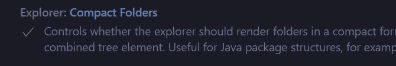

# 如何用设置改善你的 VS 代码的外观

> 原文：<https://javascript.plainenglish.io/how-to-improve-your-vs-codes-appearance-with-settings-cf30cb1de5ba?source=collection_archive---------0----------------------->

## VS 代码

## 通过使 VS 代码的外观更令人愉快来提高您的速度、生产率和信心。

Photo by [Mohammad Rahmani](https://unsplash.com/@afgprogrammer?utm_source=medium&utm_medium=referral) on [Unsplash](https://unsplash.com?utm_source=medium&utm_medium=referral)

让你的 VS 代码看起来更令人愉快可能会对你在这种环境下的生产力、速度和信心产生积极的影响。你会确信这是为你准备的软件，它是为你准备的。

我已经写了关于 [VS Code 的主题](https://medium.com/javascript-in-plain-english/10-best-vs-code-themes-in-2022-7d44594a31e3)和 [VS Code 的扩展](https://medium.com/p/e2c617033857)以及更多的文章，所以如果你想的话，你可以看看。

我们可以通过在 Windows 设备和 Mac 电脑上分别输入`Ctrl + ,`来打开 VS Code 的设置。

# 1.字体设置

不同的字体对我们的大脑产生不同的心理影响，改变我们对某种产品的看法。

我们可能认为使用衬线字体的网站更严肃，使用曲线字体的网站更有趣。所以，选择一种你日常使用起来足够舒服的字体是很重要的。

Photo by [Brands&People](https://unsplash.com/@brandsandpeople?utm_source=medium&utm_medium=referral) on [Unsplash](https://unsplash.com?utm_source=medium&utm_medium=referral)

## 字体系列

搜索`font family`这个词，这个设置就会出现。您可以将它设置为您喜欢的任何字体，但请记住，由于被用作 IDE 字体的原因，存在几种字体(Fira Code、Cascadia Code、Consolas)。

还有一个调整编辑器使用的字体粗细的设置。

font-family setting

## 字体连字

字体连字由多个文本字符组成，以创建更具说明性的复合符号。代表比较的符号就是一个很好的例子。

例如，没有连字的`does not equal`符号应该看起来像`!=`，但是有了连字的符号应该看起来像`≠`。

我们可以在术语`font ligatures`下找到这个设置，然后点击`edit in settings.json`选项并将值设置为`true`。

font ligatures setting

# 2.面包屑设置

面包屑位于每个文件的顶部，显示光标当前所在位置的文件路径。它会遍历所有的类、变量类型、构造函数、方法等等。

an example of a breadcrumbs path

我们可以在术语`breadcrumbs`下找到这个设置，你可以检查你是否想要使用这个特性并调整每个路径。

breadcrumbs settings

# 3.保存时格式化

“保存时格式化”对于大规模开发人员来说是一个很好的特性，因为这个特性允许您在每次保存文件时自动格式化它。格式化你的代码是一个至关重要的特性，因为它帮助你阐明你写的代码。

我们可以通过键入术语`format on save`并勾选复选框来找到这个特性。

format on save setting

# 4.光标闪烁设置

在 VS 代码中，我们有几种类型的光标可以使用— `blink`、`smooth`、`phase`、`expand` 和`solid`。

dev.to by Chris Sev

我们可以通过搜索术语`cursor blinking`，然后选择一种光标类型来找到该设置。

cursor blinking setting

# 5.压缩文件夹设置

压缩文件夹是指那些只有一个文件夹的文件夹。如果是这种情况，该文件夹将为其创建一个缩短的路径。

如果你在你的项目中使用 Java 语言，你应该检查这个设置，否则，它只是在你的目录中分散注意力。

an example of compact folders on

an example of compact folders off

我们可以通过键入术语`compact folders`然后勾选复选框来找到这个设置。

compact folders setting

# 6.标尺设置

标尺允许您在文件中设置一条垂直线，建议每行的最大字符数。这对于保持代码简洁非常有用。

an example of a ruler

我们可以在术语`rulers`下找到该设置，然后点击`edit in settings.json`按钮。我们甚至可以定义它们的数组，但是标准的应该在`90`左右。

rulers setting

# 7.窗口标题设置

我们可以随心所欲地命名 VS 代码的软件名称&这样很方便。这是一个不太明显的设置功能，但仍然是一个很好的调整。

an example of a window title

我们可以通过键入术语`window title`来找到这个设置，然后我们可以通过一些预定义的属性来选择我们希望标题显示的内容。

window title setting

## 结论

拥有一个按你的喜好设计的软件对你使用它的信心有很大的帮助。这些是 VS 代码必须提供的更高级的特性。我希望这篇文章对您有用，并且您将开始使用它的许多新特性。

*更多内容请看*[***plain English . io***](https://plainenglish.io/)*。报名参加我们的* [***免费周报***](http://newsletter.plainenglish.io/) *。关注我们关于*[***Twitter***](https://twitter.com/inPlainEngHQ)*和*[***LinkedIn***](https://www.linkedin.com/company/inplainenglish/)*。查看我们的* [***社区不和谐***](https://discord.gg/GtDtUAvyhW) *加入我们的* [***人才集体***](https://inplainenglish.pallet.com/talent/welcome) *。*