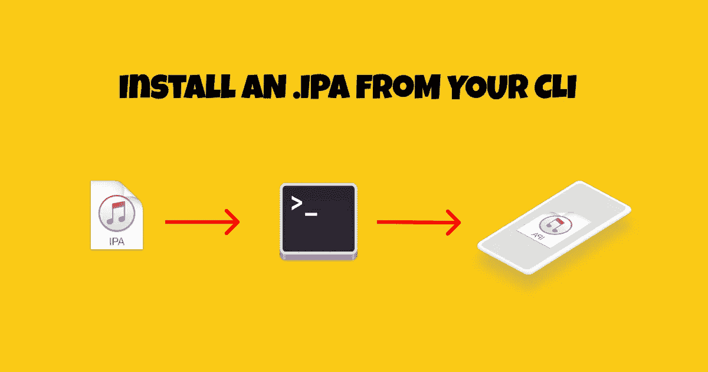

# 如何在 macOS 上使用 CLI 安装. IPA 文件？

> 原文：<https://javascript.plainenglish.io/how-to-install-a-ipa-file-using-the-cli-on-macos-18b7ddedd6b8?source=collection_archive---------10----------------------->

## IOS 快速提示

## 以及如何在玩手机应用时节省你大量的时间



[**想读一读这篇文章的法文🇫🇷版吗？**](https://www.codingspark.io/blog/installer-un-ipa-depuis-la-cli)

最初的方法是拖动。ipa 存档到苹果音乐。这有点重复，尤其是在 Android 上，你可以输入`adb install <apk_path>`。

为了减少麻烦，也许我们可以做得更好，更简单。

在 IOS 上，你可以把它安装在你的 MacBook 上`ideviceinstaller`

```
brew install ideviceinstaller
```

然后，只需插入您的手机，运行以下命令

```
ideviceinstaller -i <ipa_path>
```

输出应该接近于

```
16:02:28 in stride-new-mobile-app on  main [$?] is 📦 v1.0.0 via ⬢ v16.14.2 
➜ ideviceinstaller -i ./dev-SDK-45.ipa 
WARNING: could not locate iTunesMetadata.plist in archive!
WARNING: could not locate Payload/StrideStaging.app/SC_Info/StrideStaging.sinf in archive!
Copying './dev-SDK-45.ipa' to device... DONE.
Installing 'com.stride.power.staging'
Install: CreatingStagingDirectory (5%)
Install: ExtractingPackage (15%)
Install: InspectingPackage (20%)
Install: TakingInstallLock (20%)
Install: PreflightingApplication (30%)
Install: InstallingEmbeddedProfile (30%)
Install: VerifyingApplication (40%)
Install: CreatingContainer (50%)
Install: InstallingApplication (60%)
Install: PostflightingApplication (70%)
Install: SandboxingApplication (80%)
Install: GeneratingApplicationMap (90%)
Install: Complete
```

*更多内容看* [***说白了就是 io***](https://plainenglish.io/) *。报名参加我们的* [***免费周报***](http://newsletter.plainenglish.io/) *。关注我们关于*[***Twitter***](https://twitter.com/inPlainEngHQ)*和*[***LinkedIn***](https://www.linkedin.com/company/inplainenglish/)*。查看我们的* [***社区不和谐***](https://discord.gg/GtDtUAvyhW) *加入我们的* [***人才集体***](https://inplainenglish.pallet.com/talent/welcome) *。*