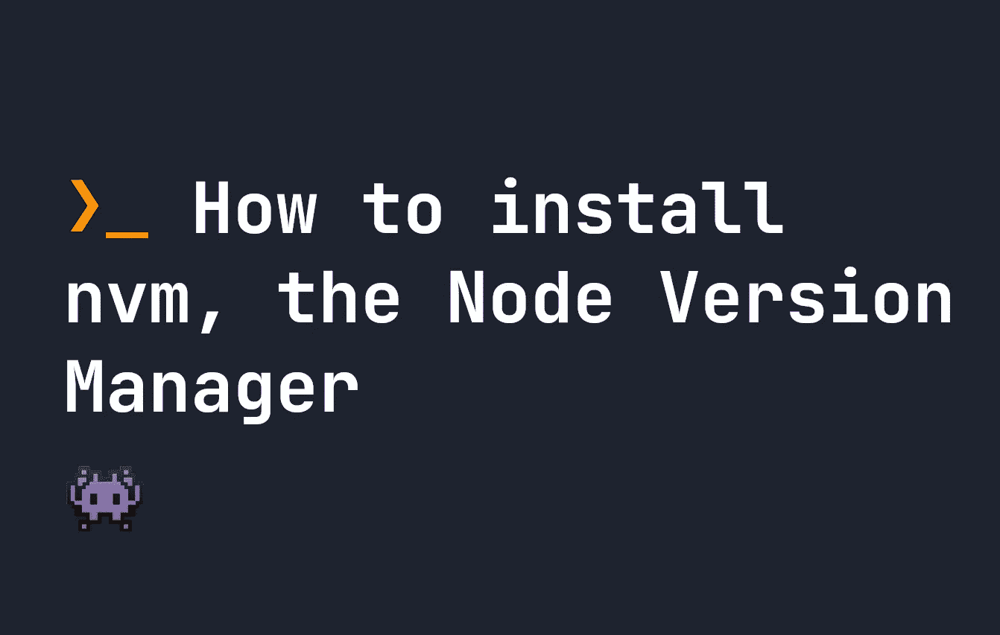

# 如何安装 NVM，节点版本管理器

> 原文：<https://javascript.plainenglish.io/how-to-install-nvm-the-node-version-manager-4254744cbd57?source=collection_archive---------13----------------------->

## NVM 对于管理安装在计算机上的 Node.js 版本是一个非常有用的工具。在本指南中，我们将向您展示如何安装它。



NVM 代表**节点版本管理**。如果你还没有安装，在这个快速指南中，我们将告诉你如何安装。NVM 用于管理安装在计算机上的 Node.js 的版本，因此它是一个非常有用的工具。使用它，您可以升级和更改您的计算机上运行的 Node.js 版本[，并更改 Node.js 版本](https://fjolt.com/article/javascript-change-nodejs-version)。

# 如何安装 nvm

在 Linux 或 Mac 上，要安装`nvm`，可以使用`curl`命令:

```
curl -o- https://raw.githubusercontent.com/nvm-sh/nvm/v0.39.1/install.sh | bash
```

如果你想安装不同版本的`nvm`，你可以用你想用的任何版本替换`v0.39.1`。或者，您可以使用`wget`来安装`nvm`:

```
wget -qO- https://raw.githubusercontent.com/nvm-sh/nvm/v0.39.1/install.sh | bash
```

运行其中一个命令后，您需要将 NVM 添加到 bash 配置文件中。因此，接下来运行这个命令，以便您可以立即开始使用它:

```
export NVM_DIR="$([ -z "${XDG_CONFIG_HOME-}" ] && printf %s "${HOME}/.nvm" || printf %s "${XDG_CONFIG_HOME}/nvm")"
[ -s "$NVM_DIR/nvm.sh" ] && \. "$NVM_DIR/nvm.sh" # This loads nvm
```

# 如何在 Windows 上安装 nvm

和大多数东西一样， **Windows** 有点不一样。如果你想在 windows 上使用类似 NVM 的功能，你需要使用类似 nvm-windows 的软件包。[您可以在这里](https://github.com/coreybutler/nvm-windows)、[了解更多关于 nvm-windows 的信息，并查看此链接](https://github.com/coreybutler/nvm-windows/wiki#manual-installation)获取最新的安装说明。

# 结论

我希望你喜欢这个快速指南。[如果你想和我联系，我在 Twitter](https://twitter.com/smpnjn) 和 [LinkedIn](https://www.linkedin.com/in/jonathon-simpson-464278a3/) 。

*更多内容请看*[***plain English . io***](https://plainenglish.io/)*。报名参加我们的* [***免费周报***](http://newsletter.plainenglish.io/) *。关注我们关于*[***Twitter***](https://twitter.com/inPlainEngHQ)[***LinkedIn***](https://www.linkedin.com/company/inplainenglish/)*，以及* [***不和***](https://discord.gg/GtDtUAvyhW) *。*