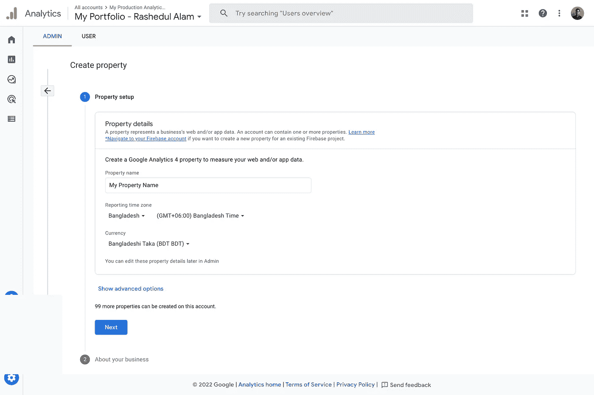
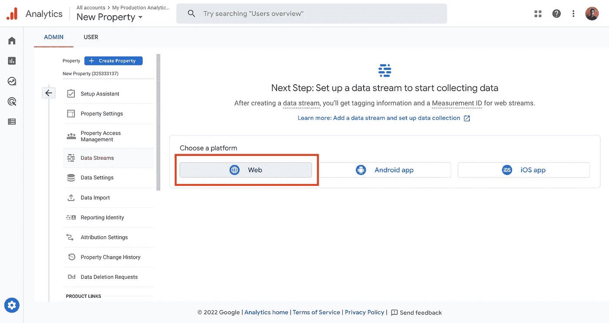
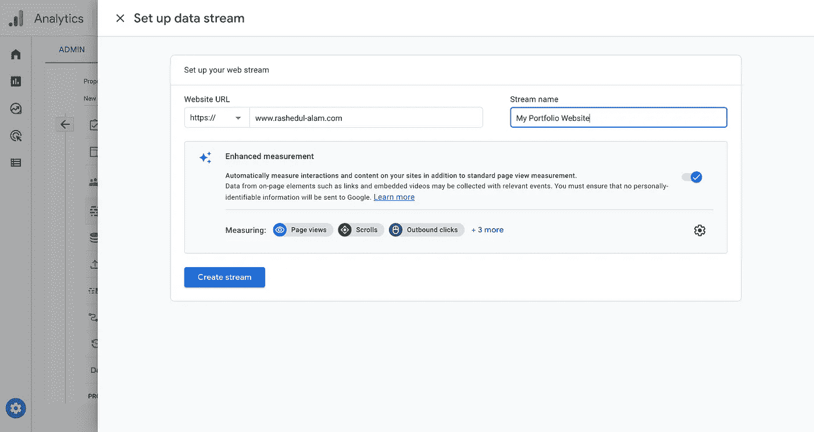
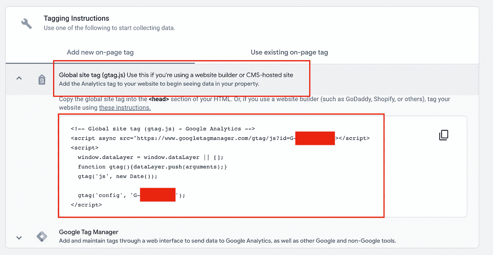
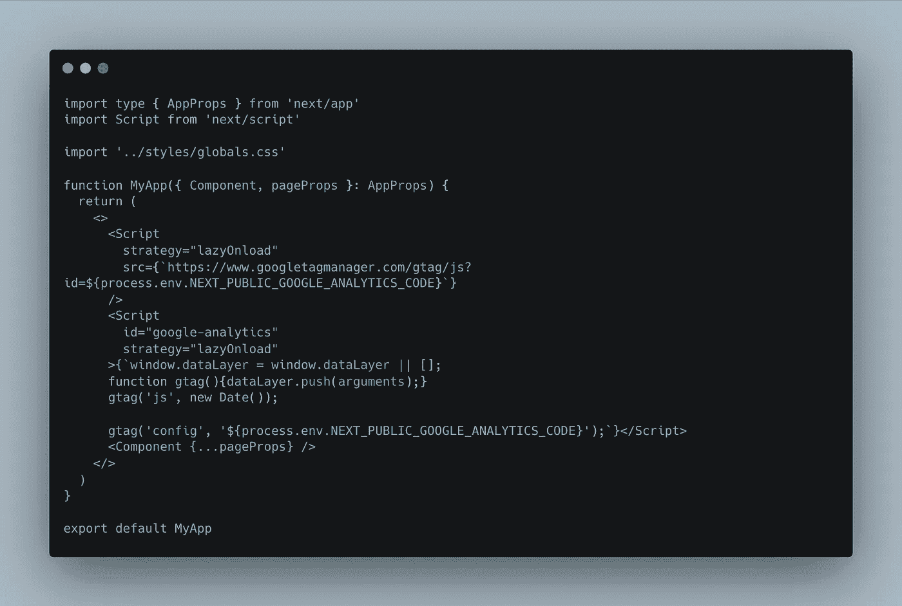
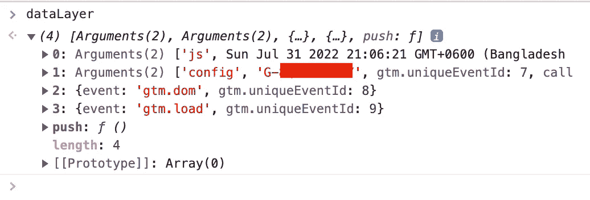

# 如何将谷歌分析整合到你的 Next.js 网络应用中

> 原文：<https://javascript.plainenglish.io/how-to-integrate-google-analytics-into-your-next-js-web-app-2b8ad7283ad5?source=collection_archive---------5----------------------->

## 在线追踪你的访客。


Photo by [Isaac Smith](https://unsplash.com/@isaacmsmith?utm_source=medium&utm_medium=referral) on [Unsplash](https://unsplash.com?utm_source=medium&utm_medium=referral)

今天在这篇文章中，我们将看到如何将 Google Analytics 添加到我们的 Next.js 应用程序中。所以事不宜迟，让我们直接开始吧。

## 步骤 1:创建新的 Next.js 应用程序

首先，让我们通过在终端中运行命令来创建一个新的 Next.js 应用程序:

```
npx create-next-app demo-app
```

如果您已经有一个现有的 Next.js 应用程序，并希望添加 Google Analytics，则不需要这一步。

## 步骤 2:在谷歌分析中创建新的属性

现在，让我们进入[谷歌分析网站](https://analytics.google.com/)。创建你的谷歌分析账户，如果你还没有的话。

创建谷歌分析帐户后，点击左下角的“管理”部分，然后点击“创建属性”给这个属性起一个名字，并填写表单要求的所有其他人员。



## 步骤 3:在谷歌分析中创建数据流

接下来，我们需要为 Next.js 应用程序设置数据流。在这里，我们可以为三种类型的平台设置数据流。当我们将分析添加到 Next.js 应用程序时，我们将选择“Web”



然后，我们应该给出我们的网站网址和流名称。完成后，点击“创建流”



## 步骤 4:将谷歌分析脚本添加到你的 Next.js 应用程序中

创建流之后，您将获得 web 流详细信息页面。展开“Global site tag (gtag.js)”，您应该会看到一些脚本代码。



现在，将这个脚本添加到 Next.js 应用程序的`_app.tsx`中。



我们使用 Next.js 的脚本组件来呈现脚本标签。我们在脚本组件中添加了`strategy=”lazyOnload”`。我们还将谷歌分析代码放在我们的环境变量中(在`.env`文件中)，命名为`NEXT_PUBLIC_GOOGLE_ANALYTICS_CODE`。剩下的和我们从 Google Analytics 网站复制的差不多。

## 第五步:测试你的网络应用是否正确设置了谷歌分析

我们已经在 Next.js web 应用程序中完成了 Google Analytics 的设置。现在我们需要测试谷歌分析是否设置正确。

让我们连接到我们的 web 应用程序，并从浏览器打开控制台。在控制台上，让我们写下`dataLayer`,然后按回车键。如果 Google Analytics 在我们的 web 应用程序上设置正确，我们应该会看到类似底部的东西。



## 结论

我们已经成功地将 Google Analytics 集成到我们的 Next.js web 应用程序中。我们现在可以从谷歌分析图表中分析我们的网络访问者。

*通过*[***Linkedin***](https://www.linkedin.com/in/ludehsar/)*或* [***与我联系我的网站***](https://rashedul-alam.com/) *。*

*更多内容看* [***说白了。报名参加我们的***](https://plainenglish.io/) **[***免费每周简讯***](http://newsletter.plainenglish.io/) *。关注我们* [***推特***](https://twitter.com/inPlainEngHQ) *和*[***LinkedIn***](https://www.linkedin.com/company/inplainenglish/)*。查看我们的* [***社区不和谐***](https://discord.gg/GtDtUAvyhW) *加入我们的* [***人才集体***](https://inplainenglish.pallet.com/talent/welcome) *。***