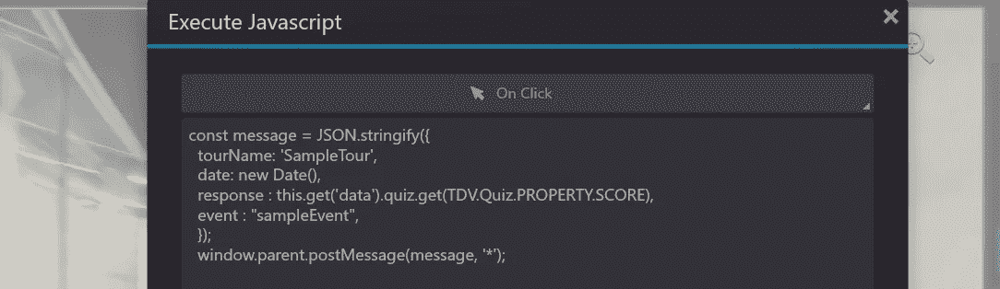

# 如何将 3D-Vista 与角度组件集成

> 原文：<https://javascript.plainenglish.io/how-to-integrate-interact-3d-vista-into-angular-component-9a8519af280b?source=collection_archive---------14----------------------->

## 关于如何让 3D-Vista 与 Angular 交互或将 3D-Vista 与 Angular 集成的教程。

我决定写这篇博客，因为我在那里找不到一个好的资源来找到将 3D-Vista 与 Angular 集成并让它们进行交互的最佳方式。希望对你有帮助。

假设您有一个 Angular 应用程序和 3D-Vista 构建资产。以下是如何从巡视中获取输出并在 Angular 中使用它。

## ***第一步:***

***添加事件发射器*** *(可选):* *如果您不想从巡视中发射数据，即您的巡视目的只是为了查看，您可以跳过这一步。在需要发出数据的地方，将下面的代码粘贴到“* ***执行 JavaScript*** *”中，并根据需要修改键值对。*

在发布时组织好一切之后，选择 **Web/Mobile** ，然后选择 **publish** ，并选择需要创建构建的目的地。

应该是这样的**(构建资产)**:

通过上面生成的 index.html 可以访问 Tour。为了打开它，因为“CORS”政策，我们需要通过服务器来提供服务。现在我们已经准备好进行整合，我们已经从服务器和 angular 应用程序中构建了资产，所以，**让我们开始吧**！

## **第二步(Iframe)** :

在*中创建一个 ***Iframe*** ，并提供托管构建资产 index.htm 路径，该路径被提供给 **source** 属性。到目前为止，您将能够成功地访问该旅程，但无法获得它的响应。*

**

## *步骤 3(添加事件监听器):*

*只有在事件发射器发出数据的步骤 1 之后，这一步才起作用。打开 **index.ts** 并添加事件监听器，如下所述。事件对象包含您可以根据需要使用的数据。*

**

*确保事件名称是一条消息，因为我们使用的是窗口发布消息。在 3D-Vista 中编写 JavaScript 时，要小心注释，因为现在注释在 3D-Vista 中不被识别，错误被抛出。*

****那就一包了。我希望这对你有所帮助。****

**更多内容请看*[***plain English . io***](https://plainenglish.io/)*。报名参加我们的* [***免费周报***](http://newsletter.plainenglish.io/) *。关注我们关于*[***Twitter***](https://twitter.com/inPlainEngHQ)[***LinkedIn***](https://www.linkedin.com/company/inplainenglish/)*[***YouTube***](https://www.youtube.com/channel/UCtipWUghju290NWcn8jhyAw)*[***不和***](https://discord.gg/GtDtUAvyhW) *。对增长黑客感兴趣？检查* [***电路***](https://circuit.ooo/) *。****