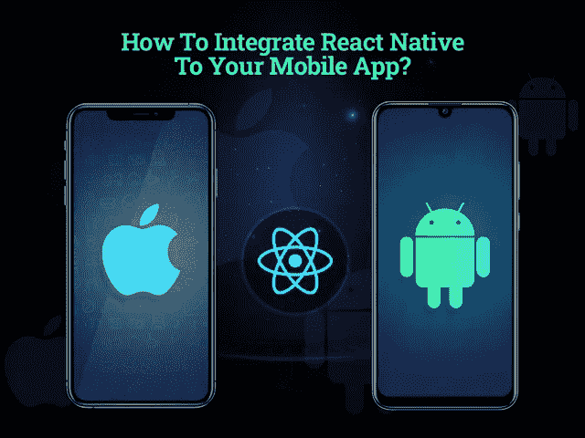
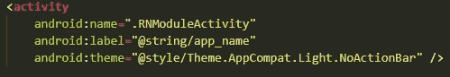
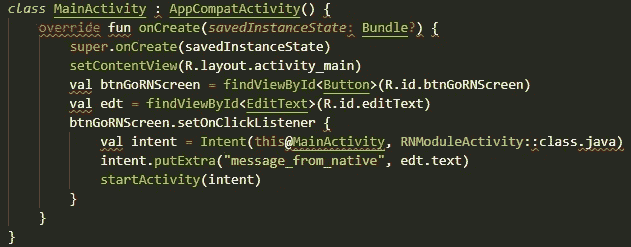
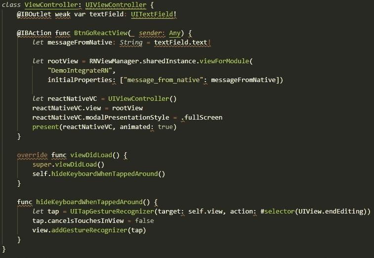
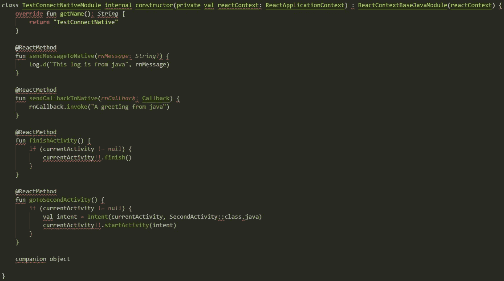
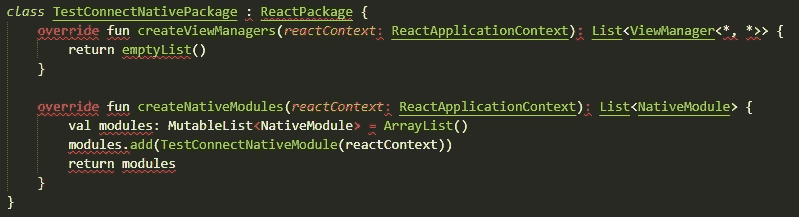
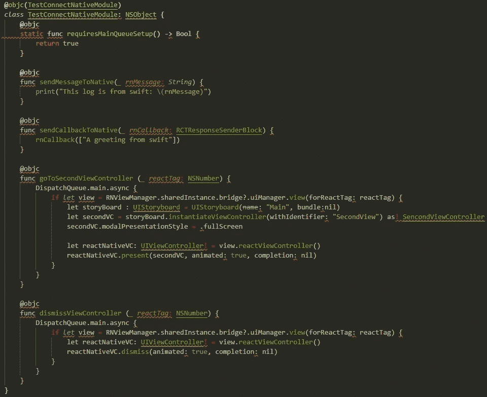
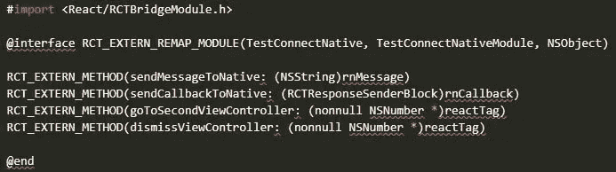
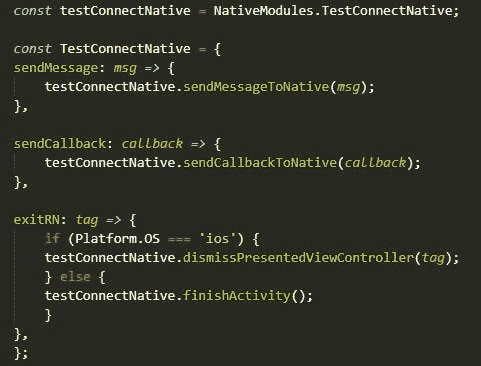
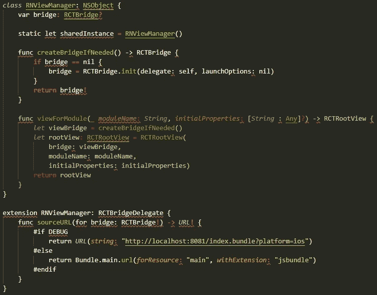

# 如何将 React Native 集成到您的 Android 移动应用程序中

> 原文：<https://javascript.plainenglish.io/how-to-integrate-react-native-into-your-android-mobile-app-1f36458d8b05?source=collection_archive---------6----------------------->

## 将 React Native 集成到现有 Android 应用程序的指南

React 原生跨平台框架的高人气和进步没有瞒过任何人。很久以前，我的一个同事告诉我关于 React Native 的事情，但是我认为它是另一个跨平台的框架，实际上不会工作。但是有经验的和初学者开发者使用它的组件来加速他们的开发过程的方式，我的观点已经完全改变了。

如果你是一家初创公司或商业爱好者，那么原生应用程序开发无疑是你的首要任务。我们大多数人认为用本地编程语言创建的应用程序更健壮。然而，如果您正在寻找加快应用程序开发流程的方法，那么将 React Native 的组件集成到您现有的应用程序中将是一个完美的选择。

然而，如果你正处于如何入门和为什么选择 React Native 的两难境地，那么这里我们已经为你收集了所有相关信息。

**目录**

*   *你为什么要选择在现有的 Android 应用中集成 React Native？*
*   *如何将 React 原生集成到你的 Android 应用中？
    -将 React Native 与现有应用集成的 9 个步骤*
*   *将 React Native 集成到您现有的应用程序中需要多少成本？*
*   *需要专业的应用程序开发团队将 React Native 集成到应用程序中*
*   *结论*

为了更好地理解，让我们深入了解每一点的细节…

## **为什么您应该选择在现有的 Android 应用中集成 React Native？**

说到开发原生应用，毫无疑问，大多数移动应用开发者要么在寻找 Kotlin，要么在寻找 Objective C 原生编程语言。但是，如果你已经有了一个原生的 Android 应用程序，并且想为 iOS 操作系统创建相同的应用程序，该怎么办呢？

与从头开始编写代码不同，将 React 原生模块集成到现有的应用程序中，将有助于您创建一个在两个平台上都能工作的解决方案。最初，将 React Native 集成到原生应用程序的过程很复杂，但如果通过雇佣 react-native 开发公司来谨慎处理，您可以节省大量时间和成本。在我们开始讨论将 React Native 集成到现有应用程序中的过程之前，让我们来看看集成的原因。

> **为什么要将 React Native 集成到您现有的应用程序中？**

让我们来看看将 React Native 集成到现有应用程序中的好处。

1.  **快速上市**

与其从头开始编写代码来创建另一个本机应用程序，不如将 React Native 集成到现有的应用程序中，以便快速

推广你的应用。原因是，与简单的方法相比，React Native 使用单一代码库，确保了更快的调试、更快的测试和更容易的应用程序维护。此外，热重新加载、支持第三方插件、无缝定制等功能使得应用程序与 React Native 的集成更加容易。

**2。代码可重用性**

使用 React Native，为两个平台创建应用程序变得更加容易、快捷和简单。如果在令人兴奋的 Android 或 iOS 应用程序中加入 React Native，预计 90%的代码库可以重用。此外，React Native 提供预开发组件和共享代码库，因此，开发人员可以加快应用程序开发过程的速度。

**3。节省预算**

无论是创建相同的 iOS 原生应用，还是将 React Native 集成到现有应用中，使其在两个平台上都可用，其开发成本始终是最大的关注点。虽然构建原生应用程序总是一件昂贵的事情，因此，将 React Native 集成到您现有的应用程序中可以降低应用程序构建成本。通过雇佣一个 [**的 app 开发公司**](https://www.xicom.biz/services/mobile-app-development/) ，你可以用很低的预算开发一个面向商业的 app。由于它是一个开源框架，你只需要维护一个单一的代码库，因此它节省了应用程序开发的巨大成本。你所需要的就是与一个有能力的小开发团队合作来完成这项任务。

将 React Native 集成到您现有应用程序中的理由可以继续下去，但让我们回到本博客的主要话题。从这里我们直接进入本博客的下一步，了解如何创建 React 原生 Android 应用？

# **如何将 React 原生集成到你的 Android 应用中？**

现在你知道了将 React Native 集成到现有应用中的原因和优势。而使用 React Native 开发应用程序是最好的交易，因为它可以确保更快的应用程序开发，应用程序的低维护，并确保 iOS 和 Android 中的相同功能。如果你正在从头开始创建一个应用程序，那么 React Native 无疑是一个不错的选择。但当涉及到向现有应用程序添加用户流、屏幕、视图或功能时，它是如何工作的呢？将 React Native 添加到您现有的应用程序中也可以节省大量时间和精力。你所需要的是学习正确的程序。

让我们开始吧…

> **将 React Native 与现有应用集成的 9 个步骤**

## **第一步:入门的先决条件**

首先，您需要为 React Native 设置一个系统，使您能够安装或配置工具，将任何本机代码写入您现有的应用程序。如果您还没有系统，那么请确保您已经设置了以下内容:

*   反应本地开发环境——NodeJS、CLI 等。
*   *Android 开发环境:Android Studio、Java 开发包等。*
*   *iOS 开发环境:Xcode，CocoaPods，more。*

如果您仍未准备好进行设置，请选择 React Native CLI 快速启动设置过程。

## **第二步:搭建独立平台**

在这里，您需要创建单独的平台来保持您的集成过程简单明了。

*   **反应原生**

在设置环境时，大多数文档会要求您创建 package.json，安装 react 和 react-native 包，init pod 文件等等。这些步骤是初始化 RN 需要的一些文件和目录所必需的，当初始化一个空的 RN 项目时，除了/android 和/ios 文件夹，它做同样的事情。这些文件夹充当 React 本地组件的容器。

因此，您可以使用下面的命令快速初始化 RN 项目，而不是手动创建、安装每个文件或包。

*react-native init your name 项目*

一旦你建立了项目，然后设计你的视图，添加字体，路由，获取 API 或者任何你想在 RN 上做的事情。

之后，您可以删除/android 和/ios 子文件夹中的所有文件，也可以选择在下一步替换现有的原生项目。

*   **安卓原生**

由 Android Studio 在/android 子文件夹下初始化 Android 项目。你也可以把这个作为你现有的 Android 原生项目，你需要把 RN 模块嵌入到/android 的子文件夹中。

接下来，你需要找到并编辑 *android/build。Gradle，android/app/build。Gradle，AndroidManifest.xml.* 要编辑文件，可以 [**雇佣一个 react 原生 app 开发者**](https://www.xicom.biz/offerings/hire-react-native-developers/) 。专家可以更好地将这些文件与源代码中的相应文件进行比较。允许开发人员向其中添加一些配置。

*   **iOS 原生**

通过/ios 文件夹中的 Xcode 初始化 iOS 项目。把它当做你现有的 iOS 原生项目，你需要把 RN 模块嵌入到一个子文件夹中。

要进一步进行，您需要在 iOS ***文件夹*** 中运行 ***pod init*** 来创建一个 pod 文件，并通过比较源代码中的相应文件来编辑该文件。专家也可以在其中添加一些配置。因此，一旦创建了 pod 文件，就可以安装 RN pod 了。

**步骤 3:将 React Native 嵌入到现有的本机代码中**

*   **在安卓系统上**

当涉及到将 RN 嵌入到原生代码时，不需要修改 MainApplication.kt，在 RN 开发过程中添加原生包时会考虑。然而，当涉及到将 React 本机模块集成到本机代码时，它的作用域比考虑本机作用域更重要。

接下来，创建另一个活动并将其命名为***rnmoduleactivity . kt***，其中包含一个 RN 应用程序。您需要将其设置为主内容视图。您可以通过将它与源代码中相应的文件进行比较来编辑它。

*通过 AndroidManifest.xml 添加来完成这一步*

*   **在 iOS 上**

您需要遵循相同的程序，这一步不需要进一步的操作。

## **步骤 4:导航以从本机代码反应本机代码**

访问本机代码屏幕，然后导航到 React 本机屏幕，然后发送一个参数。在这之后，你需要在 React 本机屏幕上吐司这个消息。为了避免这种复杂性，这里我们提到了 Android 和 iOS 的代码。

*让我们看看如何从 Android 和 iOS 原生代码导航到 React Native。*

*   **安卓系统**

这里我们从 Android 9 开始，默认情况下明文流量是禁用的。这种做法会阻止您的应用程序连接到 React 本机打包程序。虽然这项任务可以通过雇佣一家 [**软件开发公司**](https://www.xicom.biz/) 来轻松完成，但我们仍然提供源代码以供进一步参考。进一步的更改将在调试版本的明文流量中完成。

要清除文本流量，您可以将 *usesCleartextTraffic* 选项应用到您的 *AndroidManifest.xml* 中。这里是源代码，供您随时参考。

*   **在 iOS 上**

导航到 RN 屏幕的过程将保持不变。但是苹果曾经屏蔽过隐式明文 HTTP 资源加载。所以这里你需要考虑在 Info.plist 中加入 NSAppTransportSecurity，不要慌，这里我们提到源代码是为了让任务更简单。

**第五步:创建测试沟通能力的 React 原生模块**

既然您已经将 RN 代码嵌入并导航到本机代码中，那么是时候测试 js 和本机代码之间的通信能力了。因此，要开始并测试这些特性，您需要创建一个名为 TestConnectNative 的模块来执行两件事:

*向本地代码发送消息，然后显示来自它们的日志(Swift 或 Kotlin 代码)。*

*向本机代码发送回调，在 js 代码处接收返回值。*

*调用原生函数解除 RN 视图(iOS)。*

*   **在 Android 上测试**

为了测试 Android 原生代码，一个原生模块需要 2 个文件。

> 文件 1:模块:包含所有功能和逻辑代码。

> **文件 2:包:从 JS 注册模块**

*   **在 iOS 上进行测试**

而 iOS 的话，一个原生模块也像 Android 一样需要 2 个文件。

> 文件 1: Swift:包含所有的功能和逻辑代码。

> **文件二:。m: Objective-C 文件向 JS 公开您的方法。**

## **步骤 6:在 React Native 上创建一个包装器特性，以便从 JS 代码中调用**

虽然创建这些特性并不是强制性的，但它有助于让库的使用者不必每次都从 NativeModules 中取出库。JavaScript 文件也被认为是添加任何 JavaScript 附带功能的好地方。

*//如果 TestConnectNative 是来自 npm 的包，你可以认为这是 index.js 文件
从‘react-native’导入{NativeModules，Platform }；*

*导出默认的 TestConnectNative
现在，从你的另一个 js 文件中，你可以像这样调用这个方法:*

*//发送消息到本机代码
testconnectnative . sendmessage(this . state . messagetonative)；*

*//向本机代码发送回调并接收消息
testconnectnative . Send callback((native message)=>{*

*console.log(`此日志来自带有本机消息的 js 代码回调:" $ { native message } " `)；
})；
//退出 RN 返回 native
testconnectnative . Exit RN(root tag)；*

**第七步:退出 RN 返回本机**

*   **安卓原生**

在 Android 中，您可以通过构建 BackHandler.exitApp()来轻松退出 RN 屏幕。否则，您可以寻求专业帮助来使用 getCurrentActivity()。在 Kotlin 代码处完成()。

*   **从 iOS 本机退出 RN 屏幕**

在这里，建议您创建一个桥，以便稍后可以重用此桥来关闭或导航 ***视图控制器*** 。所以创建一个名为***rnviewmanager . swift***的文件来处理 load root react 视图并控制桥。

**步骤 8:从 RN 导航新的本地视图**

*   **在安卓原生系统中导航**

您需要使用 *getCurrentActivity()* 然后在*testconnectnativemodule . kt*文件中启动一个 intent 并检查代码。

*   **在 iOS 原生系统中导航**

您可以使用 *RNViewManager* 来获取当前的视图控制器，然后创建另一个视图控制器。此外，使用*testconnectnative . swift*文件测试代码。

**步骤 9 启动应用**

最后，在 android studio 上，使用 npm start 或 React-native start 启动您的项目。此外，点击绿色播放按钮打开一个模拟器，并启动一个应用程序。

现在的问题是，将 React Native 集成到您现有的原生应用程序需要多少成本？由于应用程序开发是一个复杂的过程，将 RN 集成到您现有的项目中或考虑将应用程序迁移到另一个平台可能会让您囊中羞涩。所以在你 [**雇佣一个手机 app 开发者**](https://www.xicom.biz/offerings/hire-mobile-developers/) 之前，你一定很好奇，想知道把 RN 集成到 native 需要多长时间，以及它的成本。无论您运行的是基本应用程序还是复杂应用程序，将 RN 集成到现有应用程序中的成本始终是企业迫切关注的问题。让我们进一步了解成本…

## **将 React Native 整合到你现有的应用中需要多少成本？**

通常，对于单个平台，开发一个原生应用程序的成本在 17，500 美元到 20，000 美元之间浮动，但是将 React Native 集成到原生应用程序可以节省您大量的时间和成本。而开发两个本地应用的基本版本需要大约 9 个多月的开发时间，成本在 30，000 美元到 35，000 美元之间。在这种情况下，开发一个集成 RN 到你现有的本地代码可能需要 3 到 4 个月的时间，并使你的应用程序兼容两个平台。

然而，当涉及到估计集成到本机代码的成本时，您需要评估应用程序、特性、功能和设计的复杂性。更复杂的应用程序需要更长的时间进行 React 原生集成。但是，将 React Native 集成到原生应用程序的平均成本在 20，000 美元到 22，000+美元之间。但是，在您做出任何决定之前，建议您与专家预约一个免费的咨询时段。与专家讨论集成到您的原生应用程序的范围。

# **结论**

毫无疑问，随着跨平台框架的宣传越来越多，企业正在积极地将他们的本地应用程序转移到跨平台。React Native 就是这样一个开源的跨平台框架，它已经风靡全球。因此，如果你也计划将 React Native 集成到你现有的应用程序中，那么你可以聘请一家 [**移动应用程序开发公司**](https://www.xicom.biz/services/mobile-app-development/) 来节省时间、金钱和资源。将 React Native 与现有应用程序集成是一个明智之举，可以让您的应用程序兼容多个平台，提高速度并在最短的时间内满足客户需求。

因此，如果你准备将应用程序迁移到另一个平台，并寻求专家建议和专业帮助，那么你可以 [***联系我们***](https://www.xicom.biz/contact/) 或在下面提出疑问。

========================================

*更多内容看* [*说白了。报名参加我们的*](https://plainenglish.io/) [*免费每周简讯*](http://newsletter.plainenglish.io/) *。关注我们的*[*Twitter*](https://twitter.com/inPlainEngHQ)*和*[*LinkedIn*](https://www.linkedin.com/company/inplainenglish/)*。加入我们的* [*社区不和谐*](https://discord.gg/GtDtUAvyhW) *。*