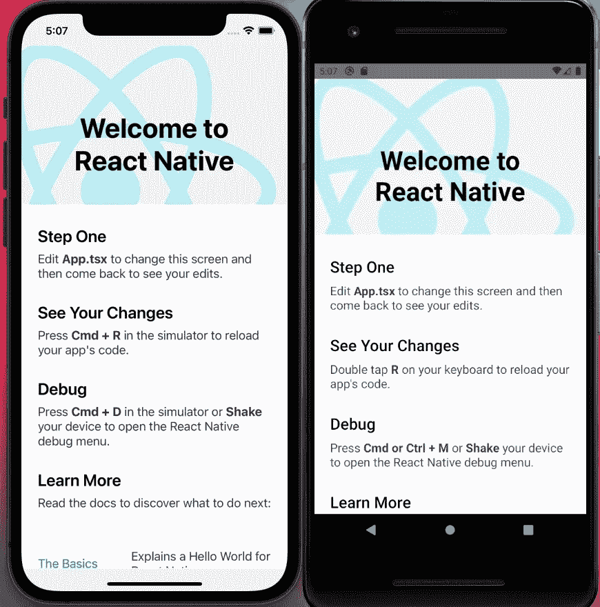
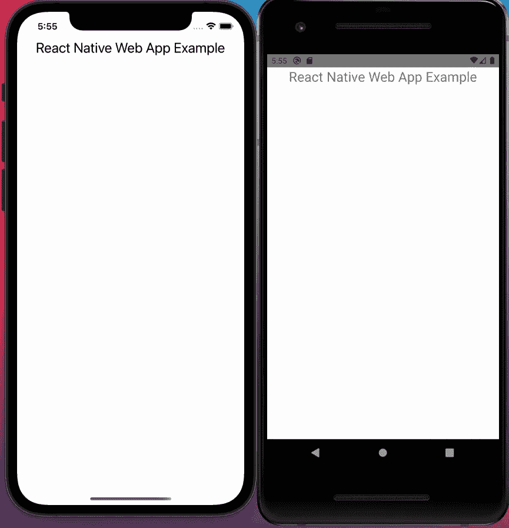
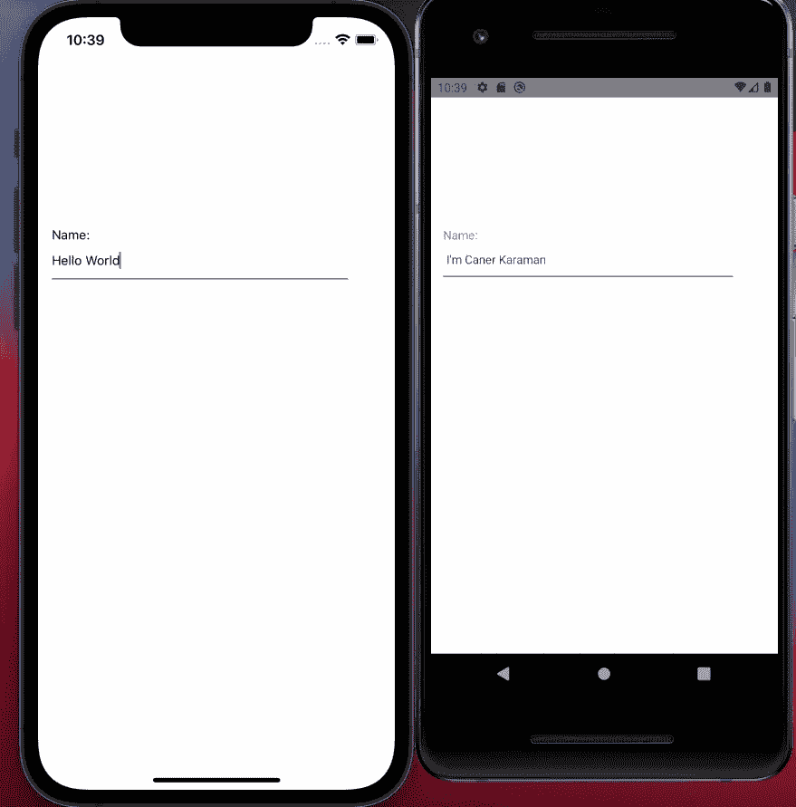
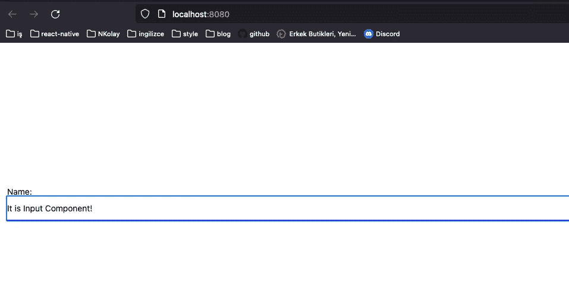

# 如何将 React 原生 Web 集成到 React 原生应用中

> 原文：<https://javascript.plainenglish.io/how-to-integrate-react-native-web-existing-react-native-apps-8e4964ad2f0b?source=collection_archive---------5----------------------->


Integration of React Native Web

我们将在本文中讨论的主题有:

1.  什么是 React Native Web？
2.  React Native for Web 是如何工作的？
3.  为什么我们应该使用 React Native for Web？
4.  实现 React Native Web

# 1.什么是 React Native Web？

**React Native** 是脸书创建的一个框架，用于开发原生 iOS 和 Android 应用。但是网络呢？这是 **React Native for Web** 解决的主要问题。它没有为 web 和移动应用程序创建两个不同的代码库，而是用一个代码库解决了这个问题。让我们快速看一下它是如何解决这个问题的

# 2.React Native for Web 是如何工作的？

基本上，移动应用程序和 web 应用程序有着非常不同的基础。它们有不同的 API 做同样的工作。比如渲染 UI。

好消息是我们使用 **React** 库来开发 **React Native** ，这个库是 web 应用程序开发中最流行的库之一。在用 **React** 开发 web 时，我们使用 HTML 标签如 **div** 、 **p** 、 **input** ，而在用 **react-native** 开发 mobile 时，我们使用 **react-native** 组件如 **View、Text、TextInput** 。在这里， **react-native-web** 在构建时获取这些 **react-native** 组件，并将它们转换成它们的 web 对应物。

# 3.为什么我们应该使用 React Native for Web？

*   **可访问的 HTML** 。支持不同设备和输入模式，渲染语义标签。
*   高质量的互动。支持手势和多种输入模式(触摸、鼠标、键盘)。
*   **款式可靠**。依赖于限定范围的样式和自动的供应商前缀。支持 RTL 布局。
*   **响应容器**。响应元素调整大小事件。
*   **增量采用**。与现有的 React DOM 组件互操作。仅捆绑您使用的内容。

这些都是写在文档网站上的理由。

# 4.实现 React Native for Web

首先，让我们像在链接中一样安装我们的 react 本机应用程序。[https://reactnative.dev/docs/environment-setup](https://reactnative.dev/docs/environment-setup)

安装所有环境包后，使用以下 TypeScript 脚本设置 React 本机应用程序:

```
npx react-native init MyApp — template react-native-template-typescript
```

安装完成后，让我们检查一下我们的应用程序是否正常工作。



React Native example.

它在 iOS 和 Android 上运行良好。现在，让我们从在我们的项目中安装这些包开始:

```
npm install react-dom react-native-webnpm install --save-dev babel-plugin-react-native-web
```

在这个项目中，我们使用 webpack 构建 web 应用程序，使用 Metro 构建 react-native。与 Webpack 相关的依赖项:

```
npm install --save-dev babel-loader url-loader webpack webpack-cli  webpack-dev-server html-webpack-plugin babel-plugin-react-native-web
```

完成所有这些安装后，在根文件夹中创建三个文件。

React Native Web - Webpack config

index.html

index.js

这里的代码片段所做的是通过 webpack bundler 建立一个 React 项目开发环境。在 webpack 配置文件中，我们在项目中使用了 babel loader、svg loader 和 image loaders，在这些加载器的帮助下编译代码。然后，我们为开发环境编译代码，并让它在 localhost 上工作。此外，还添加了生产环境的构建代码。

最后，像这样更改您的 App.tsx:

App.js react native web

耶！结束了。你可以在三个平台上运行这个项目——web、Android 和 iOS。为了开发 web 应用程序，在 package.json 上添加脚本

```
"web": "webpack serve --mode=development --config webpack.config.js"
```

让我们测试一下它是否能在所有平台上运行。


Hello World — Web



Example of React Native Web application for iOS & Android

# 5.为 3 个平台创建输入组件工作

首先，创建 src 文件夹并将 Input.tsx 文件添加到该文件夹中。

Input.tsx

是啊！在代码中创建了一个输入元素。这个输入组件已经可以在 android 和 ios 上使用 react-native 了。但是在实现了 React 本地 web 实现之后，它现在也可以在 Web 平台上工作了。让我们在 3 个不同的环境中快速测试一下。



Input component — Ios and Android



Input component — web

是的，如你所见，我们的输入组件可以在 3 个不同的平台上工作。您已经看到，即使仅在输入组件方面，我们也已经降低了多少开发成本。仅仅创建一个文件就足够了。

# 6.React Native Web 的使用建议

React Native Web 非常适合大公司。

## 组件库:

*   大公司创建一个设计系统，在品牌的名义下展示他们自己的品牌。在创建了这个设计系统之后，我们用 React Native Web 为这家公司编写了一个组件库，这大大降低了要在内部开发的应用程序的开发成本。
*   如果在该设计系统中进行更新或开发，通过确保在开发侧仅改变一个文件，将显著降低维护成本。

## 开发应用程序:

*   在开发应用的同时也大大降低了开发成本。例如，如果要对登录屏幕进行编码，那么只需要在一个文件中编写表单验证或登录时调用的服务。因此，开发成本将会降低。
*   同样，它也大大降低了维护成本。同样，当一个完全编码的登录页面出现错误时，只需在一个文件中解决这个错误就会反映到其他平台上，从而降低维护成本。

# 概述

我们学习了如何将 react-native-web 库集成到已安装的 react 本机应用程序中。我们调整了 webpack 来集成 react-native-web 库。我们已经创建了一个可以在 iOS、Android 和 web 平台上工作的应用程序，这只是一个代码库。

我希望这有助于将 react-native-web 库集成到您的项目中。如果您喜欢这篇文章并想了解更多关于 React Native 的内容，请关注。

*更多内容请看*[***plain English . io***](http://plainenglish.io/)*。报名参加我们的* [***免费周报***](http://newsletter.plainenglish.io/) *。在我们的* [***社区***](https://discord.gg/GtDtUAvyhW) *获得独家获得写作机会和建议。*