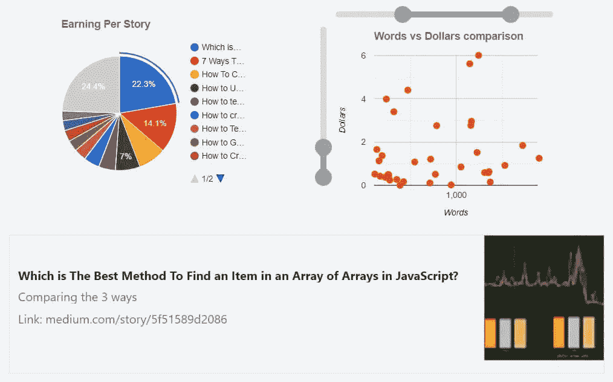
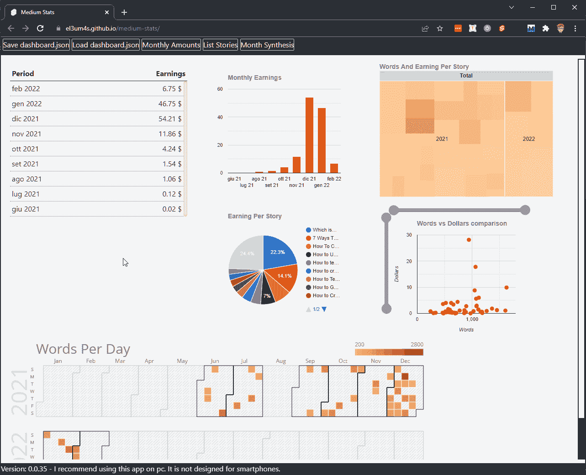
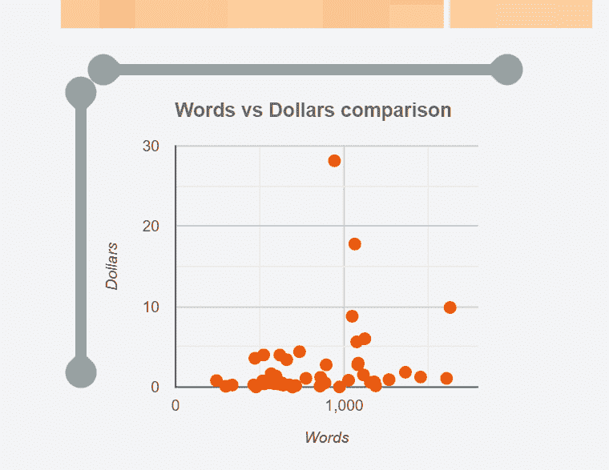
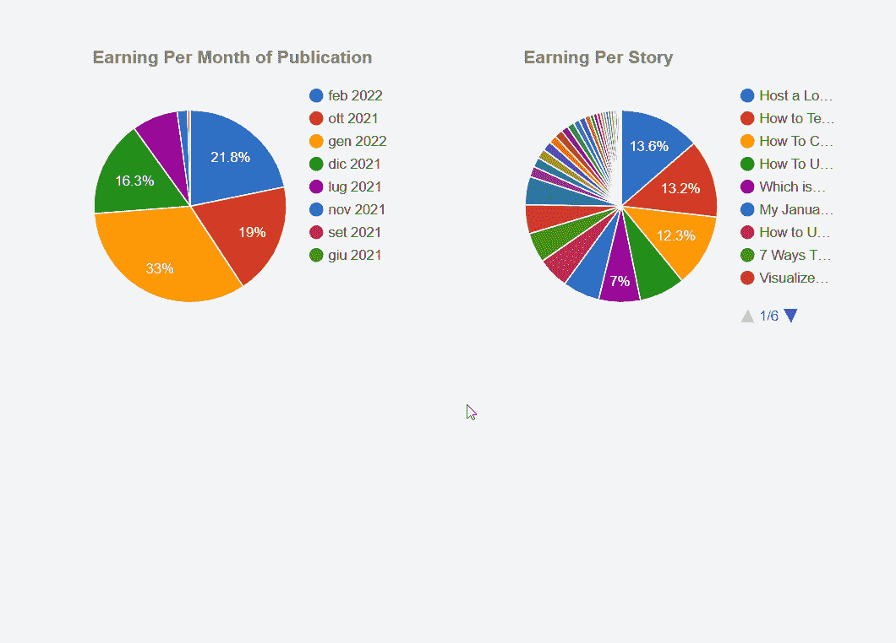

# 如何与谷歌图表互动

> 原文：<https://javascript.plainenglish.io/how-to-interact-with-google-chart-316942d1533a?source=collection_archive---------15----------------------->



几天前 [Corey Thompson](https://github.com/thompcd) 在我之前的教程中添加了事件。我承认我故意跑题了。然而，我利用这个问题更深入地研究了如何使各种图表更有趣。

首先，这是我想要达到的目标:



总而言之，这是两种不同的行动。第一个允许您使用两个滑块来更改散点图的缩放。第二个事件允许您检索所选项目的数据并显示一些附加信息。但是在你这样做之前，你需要清理代码。

# 清理代码

在这篇文章中，我继续几周前的教程:

[](https://betterprogramming.pub/visualize-your-medium-stats-with-svelte-and-javascript-eb1ef7c71a63) [## 用苗条和 JavaScript 形象化你的中等统计

### 构建 5 个图表示例来分析你的媒体写作

better 编程. pub](https://betterprogramming.pub/visualize-your-medium-stats-with-svelte-and-javascript-eb1ef7c71a63) 

本教程和之前教程中的所有代码都可以在资源库中找到

[](https://github.com/el3um4s/medium-stats) [## GitHub - el3um4s/medium-stats:如何用 JavaScript 和 Svelte 获得中等统计

### 现场直播:el3um4s.github.io/medium-stats/，我关于如何获得更好的中等统计数据的实验。我写博客是关于…

github.com](https://github.com/el3um4s/medium-stats) 

与第一部分相比，我改变了项目的结构以简化。

首先，我决定不通过`props`传递数据，而是使用一个[瘦存储](https://svelte.dev/docs#run-time-svelte-store)。通过这种方式，我可以更合理地对所有方法进行分组，简化它们的修改并消除重复。

我创建了`StorePartnerProgram.ts`文件，并开始导入我需要的 TS 类型，以及`writable`模块:

我创建了商店，并准备将其导出:

因此，我将我已经谈到的各种方法组合到新文件中，并导入它们:

最后，我将各种方法添加到存储中:

在合并了`partnerProgram`中的各种方法后，我可以从各种组件中直接调用它们。

例如，我可以通过简单地写下以下内容来获得每月文章列表:

# 更改散点图的缩放比例

清理完代码后，我可以开始思考如何改进各种图形。我需要的第一件事是更详细地了解各种帖子的长度与其产量之间的关系。我认为最好的解决方案可能是添加两个滑块，一个水平，另一个垂直。



首先要理解如何创建两个滑块。我们可以从零开始创造它们，或者依靠现成的东西。目前我选择了简单的方法。在网上，你可以找到几个有趣的组件。我决定使用西蒙·格尔纳的范围滑块。

我在我的项目中安装组件，使用:

```
npm install svelte-range-slider-pips --save-dev
```

然后我将组件导入到`GoogleChartScatter.svelte`:

我可以很容易地使用它:

有几点需要了解。我需要设置数字的范围。最好立即计算它们，以便稍后可以返回到原始视图:

第二点涉及如何截取两个输入。为此，我创建了一个只有两个元素的数组。第一个表示较小的值，第二个表示较大的值:

然后，我只需将这些部分连接起来，使用 [bind:property](https://svelte.dev/docs#template-syntax-element-directives-bind-property) 指令来…绑定这些值:

这是给滑块的。我还必须稍微修改一下图表。或者，更好的方法是，将`hAxis`和`vAxis`属性绑定到滑块的值。

# 当我们在图表中选择一个值时添加事件

第二个事件允许我在选择图表中的元素时看到一些附加信息。所以我切换到`GoogleChartPie.svelte`图表，并开始修改它，得到这个:



为了在一个瘦组件中生成事件，我使用了 [createEventDispatcher](https://svelte.dev/docs#run-time-svelte-createeventdispatcher) :

我可以创建一个链接到元素选择的事件，使用:

我使用 Google Chart [select 事件](https://developers.google.com/chart/interactive/docs/events#the-select-event)来检索要从组件中传递出去的值。

在继续之前，先说明一下 Google Charts 的事件。(几乎)任何图表都可以调用 3 个事件:

*   `select`
*   `error`
*   `ready`

但是如果我们想使用其他事件，我们必须注册它们。例如监听`on mouse over`事件:

还是那个`onmouseout`事件:

# 展示故事的预览

我想得到的是一个快速的方法来找出一个数据指的是哪个故事。为此，我还将故事的 ID 传递给图形:

然后我可以编辑`MonthlyAmounts.svelte`文件中的组件

为了从 ID 开始获取文章数据，我使用了`getStoryById`函数:

为了预览，我创建了一个`CardStory.svelte`组件:

我可以在各种页面上使用该组件，只需将历史数据传递给它即可显示:

好了，今天就到这里。

感谢阅读！敬请关注更多内容。

***不要错过我的下一篇文章—报名我的*** [***中邮箱列表***](https://medium.com/subscribe/@el3um4s)

[](https://el3um4s.medium.com/membership) [## 通过我的推荐链接加入 Medium—Samuele

### 阅读萨缪尔的每一个故事(以及媒体上成千上万的其他作家)。不是中等会员？在这里加入一块…

el3um4s.medium.com](https://el3um4s.medium.com/membership) 

*原载于 2022 年 2 月 10 日 https://blog.stranianelli.com*[](https://blog.stranianelli.com/how-to-interact-with-google-chart/)**。**

**更多内容请看* [***说白了就是***](http://plainenglish.io/) *。报名参加我们的* [***免费每周简讯***](http://newsletter.plainenglish.io/) *。在我们的* [***社区***](https://discord.gg/GtDtUAvyhW) *获得独家获得写作机会和建议。**