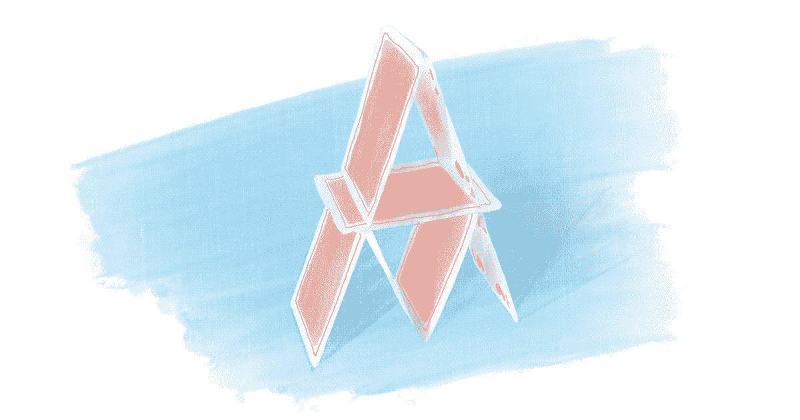

# 如何在使用 Git 时保持理智

> 原文：<https://javascript.plainenglish.io/how-to-keep-your-sanity-while-working-with-git-2e1be74dfb01?source=collection_archive---------9----------------------->



Illustration by the author

Git 很难。最重要的是，对于许多新开发人员来说，这是他们使用的第一个带有命令行界面(CLI)的工具。如果您同时学习以下所有内容，这可能有点太多了:

*   如何使用 CLI
*   如何使用 Git
*   最后但同样重要的是:编程

在本文中，我将向您展示一些技巧，让您的 Git 体验不那么痛苦，更有趣！

# 检查您的状态

Git 足够慷慨，可以提供许多命令来检查您的存储库的状态，但也足够谨慎，不会用冗长来淹没初学者。简而言之——你应该让 Git 给你你需要的细节。您有以下命令:

# git 状态

这是一个关键命令，可以让您了解自己在 Git 中的位置。输出示例:

```
$ git status
On branch main
Your branch is up to date with 'origin/main'.

nothing to commit, working tree clean
```

当你在一个干净的树枝上时

```
$ git status
HEAD detached at abc01e7
nothing to commit, working tree clean
```

当你处于[分离头状态](https://how-to.dev/the-detached-head-state-in-git-what-it-is-and-how-to-fix-it)时。

```
$ git status
On branch main
Your branch is up to date with 'origin/main'.

Untracked files:
  (use "git add <file>..." to include in what will be committed)
        lorem-ipsum.txt

nothing added to commit but untracked files present (use "git add" to track)
```

当您的工作副本中有一些新文件时。

# git show

这是一个允许您查看提交中发生的更改的命令。当不带参数运行时，它显示当前提交:

```
$ git show
commit abc01e761cb9cc14c4d5aecae2488810c834c0f9 (HEAD -> main, origin/main, 
origin/HEAD)
Author: Marcin Wosinek <marcin.wosinek@gmail.com>
Date:   Wed Nov 2 11:57:33 2022 +0100

    Add lorem ipsum to readme

diff --git a/README.md b/README.md
index 8ae0569..9dca8b4 100644
--- a/README.md
+++ b/README.md
@@ -1 +1,2 @@
 # Test
+Lorem ipsum
```

您可以获得关于提交的所有细节:作者、时间、消息和每个被更改文件的差异。

您可以指定想要查看的任何提交:

```
$ $ git show edd3504
commit edd3504f6edc722482fa4383443fa1729acc9a87
…rest of the output…
```

注意！该命令适用于**提交**。因此，如果您使用分支名称，它将显示来自该分支的最近提交:

```
$ git show main
commit abc01e761cb9cc14c4d5aecae2488810c834c0f9 (HEAD -> main, origin/main, origin/HEAD)
Author: Marcin Wosinek <marcin.wosinek@gmail.com>
```

# `git tree —` 一个我推荐给大家的自定义别名

为了查看所有分支的图形，我建议定义一个树别名——您可以在这篇文章[中了解更多。有了它，您可以运行:](https://how-to.dev/how-to-display-git-branches-as-a-tree-in-cli)

```
$ $ git tree
* 11f7f3c (test) add test.txt file
| * 2dbd30f (origin/test) add test.txt file
| * e7be203 (test-2) add new file
|/
* abc01e7 (HEAD -> main, origin/main, origin/HEAD) Add lorem ipsum to readme
* edd3504 Add readme
```

并获得整个存储库的概览。

# 检查您的默认编辑器是什么

在某些情况下，Git 希望您通过编辑它创建的临时文件向它提供输入。这个工作流程一开始可能会令人困惑，如果您不知道您的默认编辑器，情况会更糟。下面是如何通过列出 Git 的逻辑变量并过滤出包含`EDITOR`的变量来检查它。在我的 MacOS 上，它是`vi`:

```
$ git var -l | grep EDITOR
GIT_EDITOR=vi
```

同样，在 Ubuntu 上:

```
$ git var -l | grep EDITOR
GIT_EDITOR=editor
```

在 Ubuntu 上，`editor`是一个启动默认文本编辑器的命令。在我能使用的一台机器上，它是`nano`:

```
$ update-alternatives --display editor
editor - auto mode
  link best version is /bin/nano
  link currently points to /bin/nano
…
```

不管你的编辑是谁，确保你知道如何做以下事情:

*   编辑文件——由于界面的各种模式，这对于`Vim`的初学者来说是一个挑战
*   保存更改
*   退出编辑器

或者，把编辑器换成你知道怎么用的。

# 键入命令时使用 tab 键

Git 命令、所有属性和分支名称都很长；并且接口不接受任何错误。提高效率的关键是不要把它们全打出来。在大多数 shell 中，当您按 tab 键时，shell 会:

*   显示所有可用的命令自动完成
*   如果只有一个可用命令，则选择该命令

因此，例如，对于我使用的`zsh` shell，让我们在键入`git co<tab>`后看到这些选项:

```
$ git co
Completing main porcelain command
commit        -- record changes to repository
Completing ancillary manipulator command
config        -- get and set repository or global options
Completing ancillary interrogator command
count-objects -- count unpacked objects and display their disk consumption
Completing plumbing manipulator command
commit-graph  -- write and verify Git commit-graph files
commit-tree   -- create new commit object
Completing plumbing internal helper command
column        -- display data in columns
```

当我输入`git com<tab>`的时候完成这个单词:

```
$ git commit
```

同样，它为参数、分支名称等提供了自动完成功能。打字的时候差别很大。

# 使用箭头

看着某人重新输入他们刚才使用的整个命令是一种痛苦的经历。大多数 shells 允许您通过使用箭头键来重用最后一个命令。向上箭头键显示最近的命令，再次键入它将显示前一个命令，依此类推。找到您需要的后，您可以编辑它以匹配您正在执行的操作。

# 随时获取远程更改

我总是将我的本地存储库与远程存储库同步——甚至在我的私人存储库中，我知道我是一个人在工作。不注意别人在改变什么，很容易把事情搞砸。只需一个命令就能确保一切都是最新的:

```
$ git fetch
```

运行之后，您知道您在本地看到的每一个`origin/<branch-name>`引用都在与远程相同的位置。

解决冲突有时很痛苦，但没有什么比本可以轻松避免的冲突更令人痛苦。当人们引入不必要的冲突时，一个常见的场景是当他们在最近的提交之后开始一个新的分支。这可以通过以下方式轻松避免:

*   一直在捡东西
*   注意你在历史树中的位置

# 短命的树枝

快速合并分支有几个好处:

*   新特性会更快地集成到代码库中。如果它们没有完全准备好，它们总是可以被特征标志隐藏。
*   主分支和另一个分支中较少的变化意味着冲突的风险较小，
*   更小的分支意味着需要审查的代码更少。

短命的分支是通过小的交互来进步的一种方式——这是我在另一篇文章中推荐的。

# 要避免的事情

我经常看到初学者遇到我不需要处理的问题，因为我在 Git 中避免了以下事情:

# git 拉

在 Git 中，pull 将两个操作合并为一个:

我总是想在进行合并或重置之前仔细检查我的远程状态**。所以我的典型流程是:**

*   `git fetch`-从远程获取更新，
*   `git tree`-我上面提到的别名，为了确保回购处于我期望的状态，
*   `git rebase origin/<branch-name>`-当远程和本地发生变化时，或
*   ` git merge origin/-当远程上有更改而本地上没有时。也就是说，它可以作为快进合并来完成。

# Git 子模块

最后，子模块是将一个或多个 Git 存储库嵌入另一个存储库的一种方式。内部存储库维护其单独的历史记录，而包含它的存储库只保存对内部 repo 应该在的源和当前提交的引用。

我对于 Git 子模块的主要问题是，它们使已经很困难的问题——版本控制——变得更加复杂，并且增加了更多的复杂性。

Git 子模块为问题提供了另一种解决方案，可以通过以下方式更好地解决:

*   使用一些包管理器(比如 npm)来实现外部依赖
*   将多个存储库合并为一个以实现内部依赖性

# 下一步是什么

当您开始使用 Git 时，它有许多令人困惑的方面，但是一旦您理解了它，它就会变得简单得多。如果你有兴趣了解更多关于 Git 的知识，在这里注册[来获取我的 Git 相关内容的更新。](https://how-to-dev.ck.page/e92d2eb5d7)

*原发布于*[*https://how-to . dev*](https://how-to.dev/how-to-keep-your-sanity-while-working-with-git)*。*

*更多内容看* [***说白了。报名参加我们的***](https://plainenglish.io/) **[***免费周报***](http://newsletter.plainenglish.io/) *。关注我们关于* [***推特***](https://twitter.com/inPlainEngHQ) ，[***LinkedIn***](https://www.linkedin.com/company/inplainenglish/)*，*[***YouTube***](https://www.youtube.com/channel/UCtipWUghju290NWcn8jhyAw)*，以及* [***不和***](https://discord.gg/GtDtUAvyhW) *。对增长黑客感兴趣？检查* [***电路***](https://circuit.ooo/) *。***